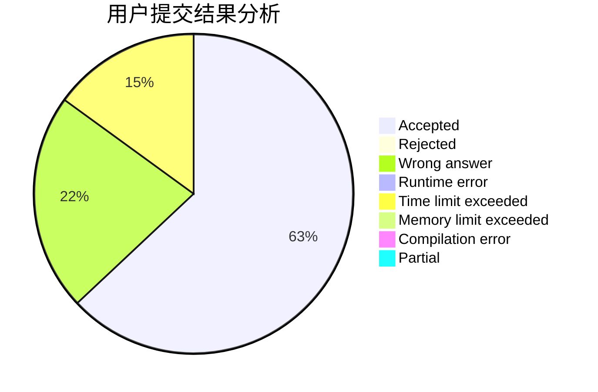
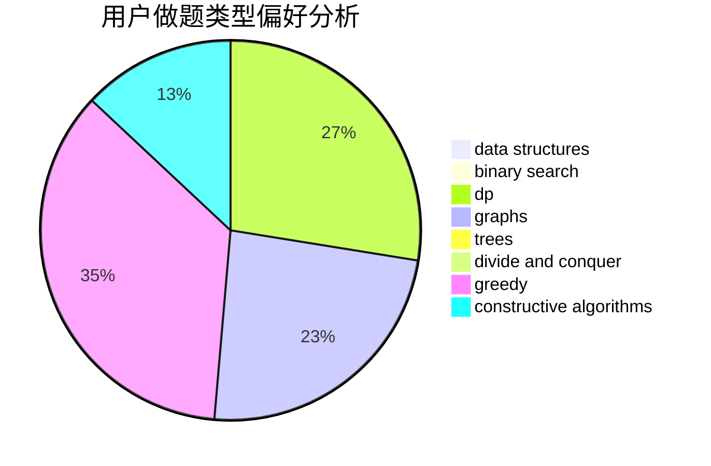
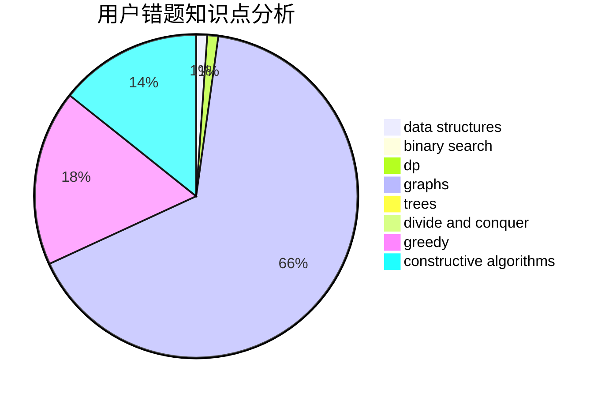

# shenmadongdong

<!-- tabs:start -->

#### **用户提交结果分析**

#### **用户做题类型偏好分析**

#### **用户错题知识点分析**

<!-- tabs:end -->
# 推荐题目
[1146B](https://codeforces.com/contest/1146/problem/B)		implementation,
                        strings		  
[1272E](https://codeforces.com/contest/1272/problem/E)		dfs and similar,
                        graphs,
                        shortest paths		  
[757E](https://codeforces.com/contest/757/problem/E)		brute force,
                        combinatorics,
                        dp,
                        number theory		  
[195B](https://codeforces.com/contest/195/problem/B)		data structures,
                        implementation,
                        math		  
[497B](https://codeforces.com/contest/497/problem/B)		dsu,graphs,sortings,trees		  
[39D](https://codeforces.com/contest/39/problem/D)		math		  
[283A](https://codeforces.com/contest/283/problem/A)		constructive algorithms,
                        data structures,
                        implementation		  
[213C](https://codeforces.com/contest/213/problem/C)		dp		  
[444D](https://codeforces.com/contest/444/problem/D)		binary search,
                        hashing,
                        strings,
                        two pointers		  
[1241A](https://codeforces.com/contest/1241/problem/A)		dsu,graphs,sortings,trees		  
