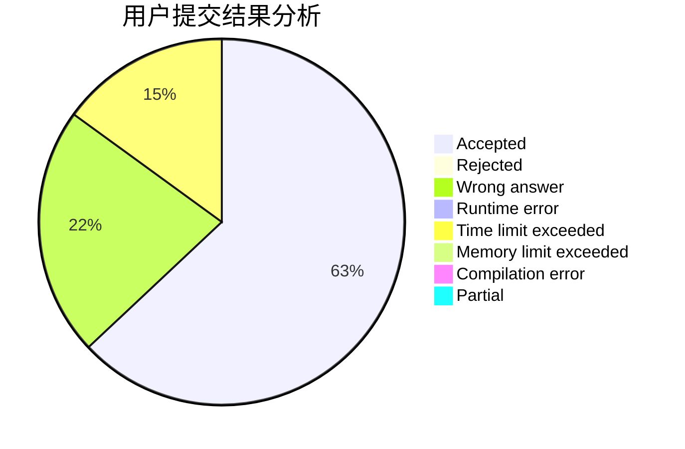
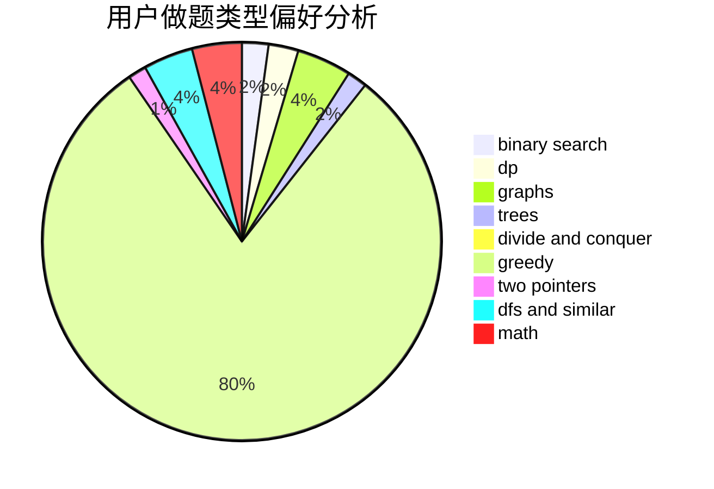

# shenmadongdong

<!-- tabs:start -->

#### **用户提交结果分析**

#### **用户做题类型偏好分析**

<!-- tabs:end -->
# 推荐题目
[1148B](https://codeforces.com/contest/1148/problem/B)
[12821](https://codeforces.com/contest/1282/problem/1)
[776D](https://codeforces.com/contest/776/problem/D)
[218B](https://codeforces.com/contest/218/problem/B)
[516C](https://codeforces.com/contest/516/problem/C)
[426B](https://codeforces.com/contest/426/problem/B)
[29A](https://codeforces.com/contest/29/problem/A)
[232E](https://codeforces.com/contest/232/problem/E)
[464C](https://codeforces.com/contest/464/problem/C)
[1246D](https://codeforces.com/contest/1246/problem/D)
