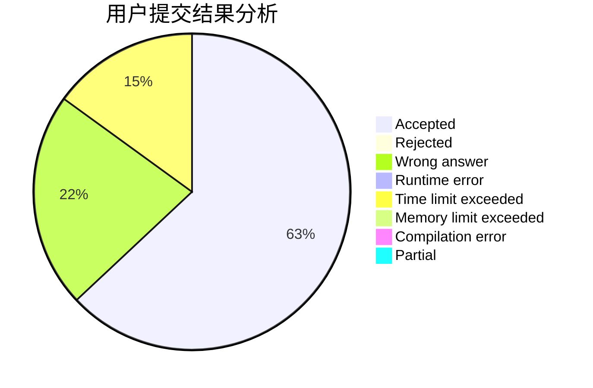
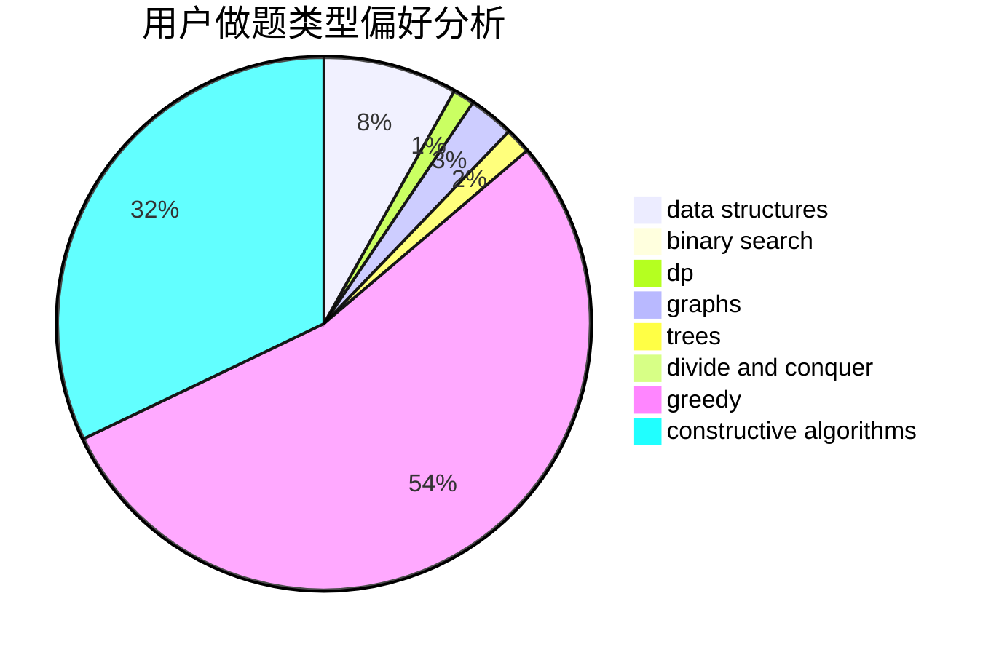
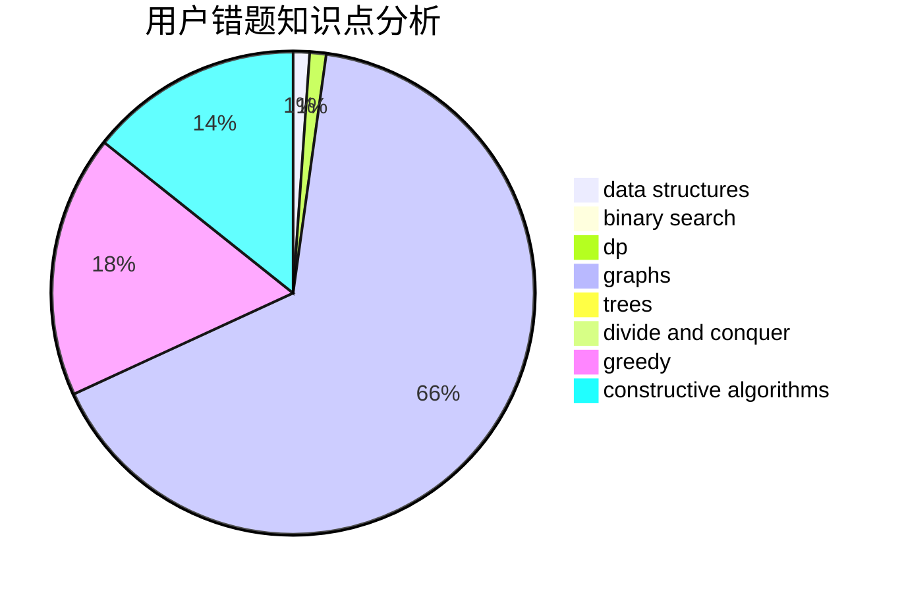

# shenmadongdong

<!-- tabs:start -->

#### **用户提交结果分析**

#### **用户做题类型偏好分析**

#### **用户错题知识点分析**

<!-- tabs:end -->
# 推荐题目
[1148B](https://codeforces.com/contest/1148/problem/B)		binary search,
                        brute force,
                        two pointers		  
[12821](https://codeforces.com/contest/1282/problem/1)		dsu,graphs,sortings,trees		  
[776D](https://codeforces.com/contest/776/problem/D)		2-sat,
                        dfs and similar,
                        dsu,
                        graphs		  
[218B](https://codeforces.com/contest/218/problem/B)		implementation		  
[516C](https://codeforces.com/contest/516/problem/C)		dsu,graphs,sortings,trees		  
[426B](https://codeforces.com/contest/426/problem/B)		implementation		  
[29A](https://codeforces.com/contest/29/problem/A)		brute force		  
[232E](https://codeforces.com/contest/232/problem/E)		bitmasks,
                        divide and conquer,
                        dp		  
[464C](https://codeforces.com/contest/464/problem/C)		dp		  
[1246D](https://codeforces.com/contest/1246/problem/D)		dsu,graphs,sortings,trees		  
