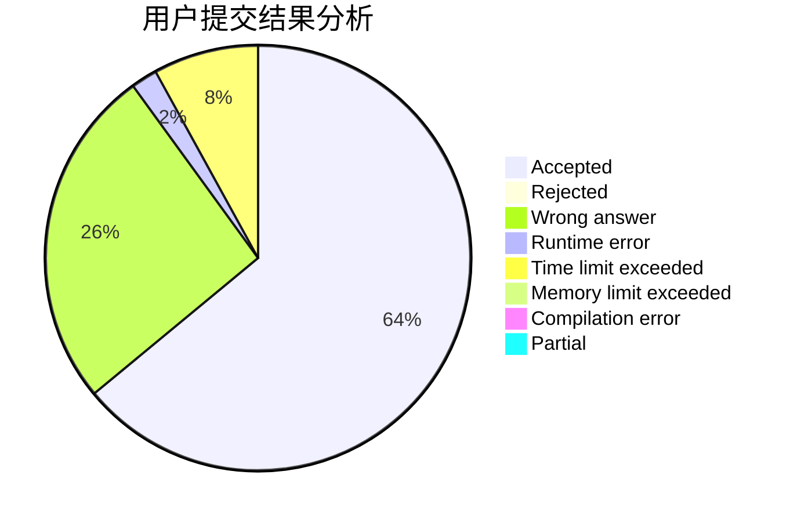
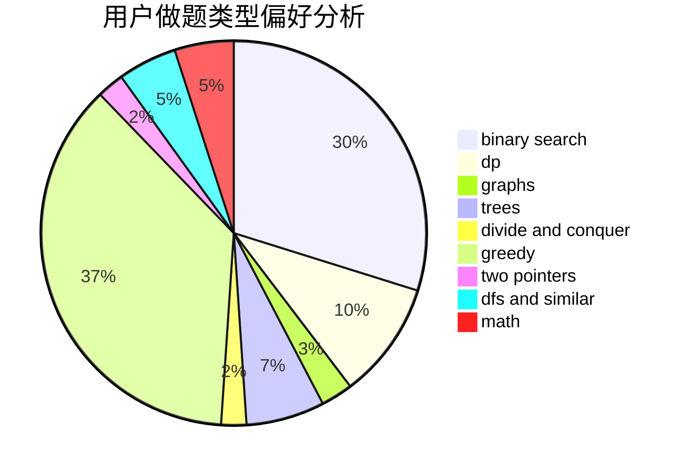

# shenmadongdong.qwq

<!-- tabs:start -->

#### **用户提交结果分析**

#### **用户做题类型偏好分析**

<!-- tabs:end -->
# 推荐题目
[1388C](https://codeforces.com/contest/1388/problem/C)
[1186D](https://codeforces.com/contest/1186/problem/D)
[1278A](https://codeforces.com/contest/1278/problem/A)
[1037C](https://codeforces.com/contest/1037/problem/C)
[70A](https://codeforces.com/contest/70/problem/A)
[518B](https://codeforces.com/contest/518/problem/B)
[771D](https://codeforces.com/contest/771/problem/D)
[1437F](https://codeforces.com/contest/1437/problem/F)
[1031C](https://codeforces.com/contest/1031/problem/C)
[784G](https://codeforces.com/contest/784/problem/G)
