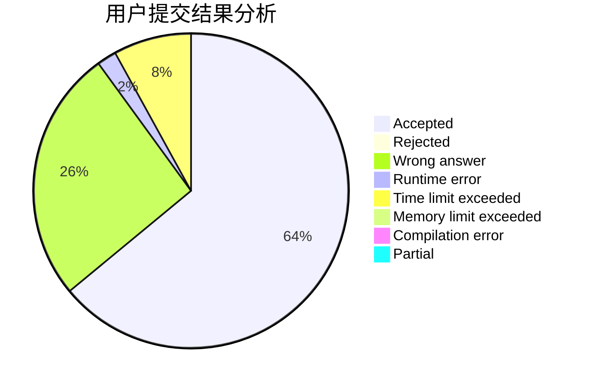
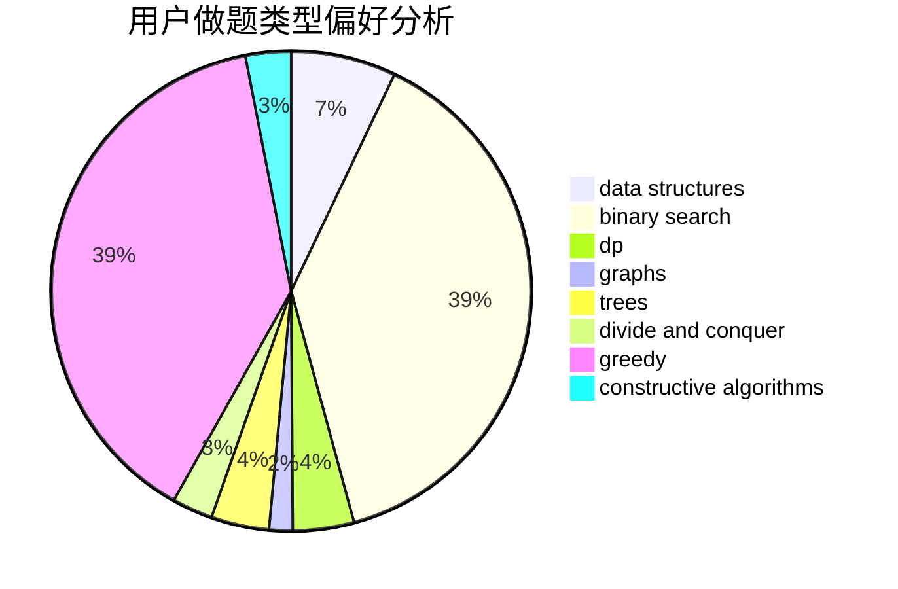
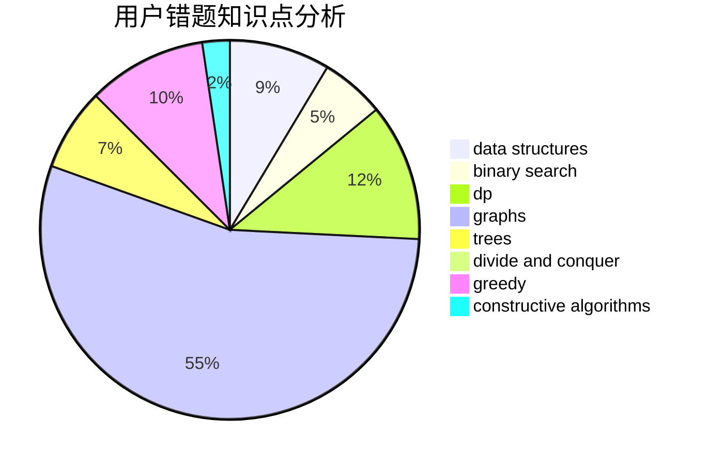

# shenmadongdong.qwq

<!-- tabs:start -->

#### **用户提交结果分析**

#### **用户做题类型偏好分析**

#### **用户错题知识点分析**

<!-- tabs:end -->
# 推荐题目
[1388C](https://codeforces.com/contest/1388/problem/C)		dfs and similar,
                        greedy,
                        math,
                        trees		  
[1186D](https://codeforces.com/contest/1186/problem/D)		constructive algorithms,
                        greedy,
                        math		  
[1278A](https://codeforces.com/contest/1278/problem/A)		brute force,
                        implementation,
                        strings		  
[1037C](https://codeforces.com/contest/1037/problem/C)		dp,
                        greedy,
                        strings		  
[70A](https://codeforces.com/contest/70/problem/A)		math		  
[518B](https://codeforces.com/contest/518/problem/B)		greedy,
                        implementation,
                        strings		  
[771D](https://codeforces.com/contest/771/problem/D)		dp		  
[1437F](https://codeforces.com/contest/1437/problem/F)		combinatorics,
                        dp,
                        math,
                        two pointers		  
[1031C](https://codeforces.com/contest/1031/problem/C)		greedy		  
[784G](https://codeforces.com/contest/784/problem/G)		*special problem		  
