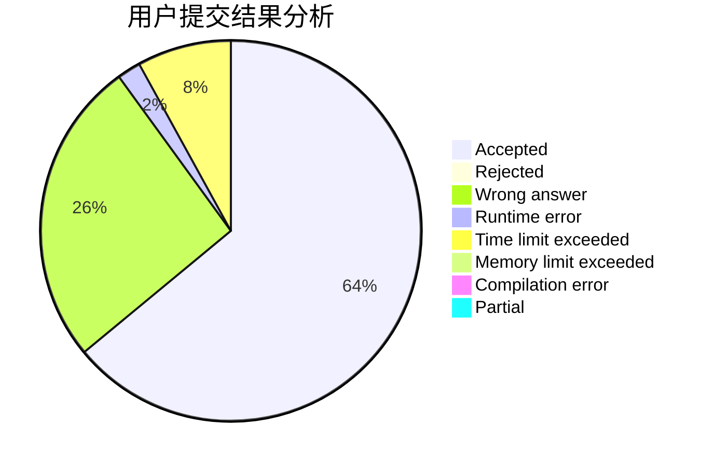
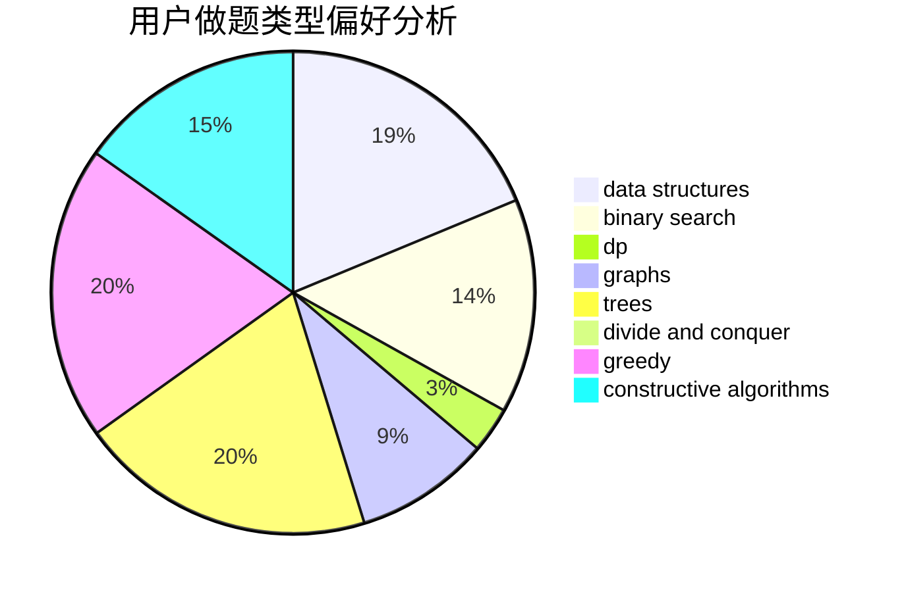
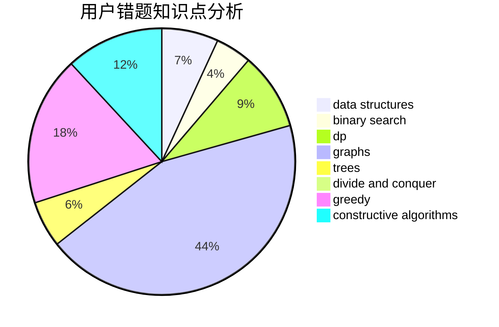

# shenmadongdong.qwq

<!-- tabs:start -->

#### **用户提交结果分析**

#### **用户做题类型偏好分析**

#### **用户错题知识点分析**

<!-- tabs:end -->
# 推荐题目
[1379C](https://codeforces.com/contest/1379/problem/C)		binary search,
                        brute force,
                        data structures,
                        dfs and similar,
                        dp,
                        greedy,
                        sortings,
                        two pointers		  
[1183F](https://codeforces.com/contest/1183/problem/F)		brute force,
                        math,
                        sortings		  
[1269A](https://codeforces.com/contest/1269/problem/A)		brute force,
                        math		  
[1036F](https://codeforces.com/contest/1036/problem/F)		combinatorics,
                        math,
                        number theory		  
[689B](https://codeforces.com/contest/689/problem/B)		dfs and similar,
                        graphs,
                        greedy,
                        shortest paths		  
[497E](https://codeforces.com/contest/497/problem/E)		dp,
                        matrices		  
[750H](https://codeforces.com/contest/750/problem/H)		dfs and similar,
                        dsu,
                        graphs,
                        interactive		  
[1428F](https://codeforces.com/contest/1428/problem/F)		binary search,
                        data structures,
                        divide and conquer,
                        dp,
                        two pointers		  
[1030G](https://codeforces.com/contest/1030/problem/G)		number theory		  
[765D](https://codeforces.com/contest/765/problem/D)		constructive algorithms,
                        dsu,
                        math		  
