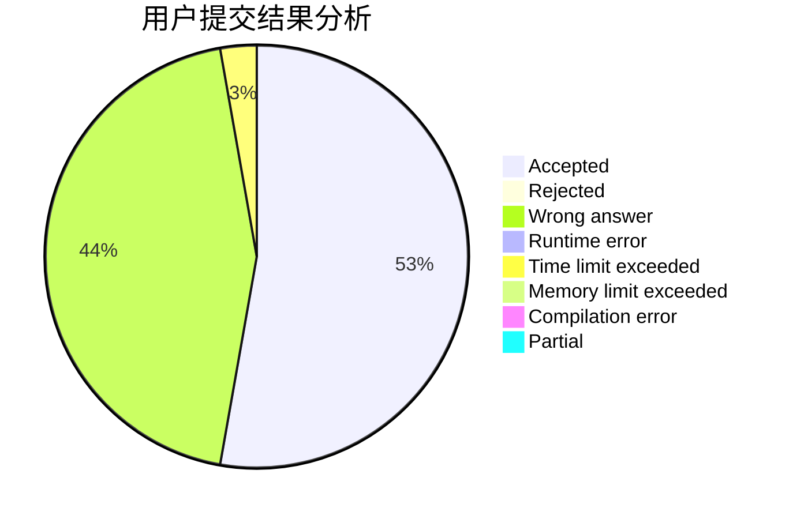
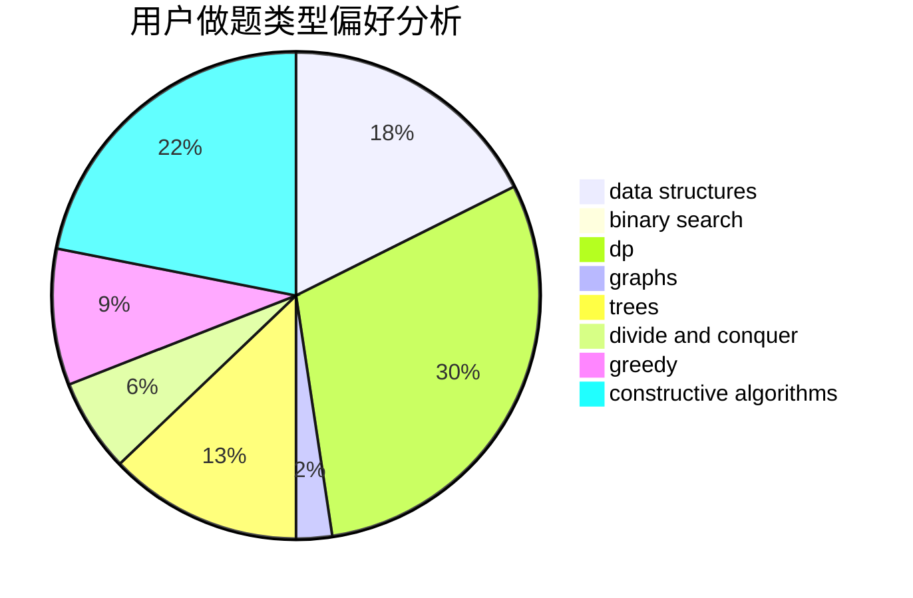

# shennong

<!-- tabs:start -->

#### **用户提交结果分析**

#### **用户做题类型偏好分析**

#### **用户错题知识点分析**

<!-- tabs:end -->
# 推荐题目
[1321C](https://codeforces.com/contest/1321/problem/C)		brute force,
                        constructive algorithms,
                        greedy,
                        strings		  
[1296F](https://codeforces.com/contest/1296/problem/F)		constructive algorithms,
                        dfs and similar,
                        greedy,
                        sortings,
                        trees		  
[914A](https://codeforces.com/contest/914/problem/A)		brute force,
                        implementation,
                        math		  
[3912](https://codeforces.com/contest/391/problem/2)		dsu,graphs,sortings,trees		  
[12871](https://codeforces.com/contest/1287/problem/1)		dsu,graphs,sortings,trees		  
[592B](https://codeforces.com/contest/592/problem/B)		math		  
[369A](https://codeforces.com/contest/369/problem/A)		greedy,
                        implementation		  
[689D](https://codeforces.com/contest/689/problem/D)		binary search,
                        data structures		  
[1185D](https://codeforces.com/contest/1185/problem/D)		implementation,
                        math		  
[543B](https://codeforces.com/contest/543/problem/B)		constructive algorithms,
                        graphs,
                        shortest paths		  
