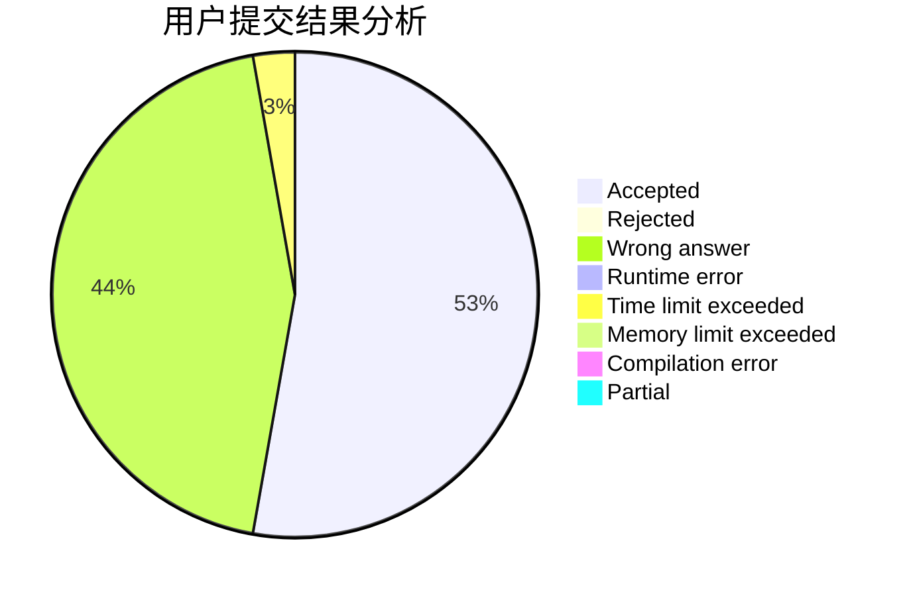
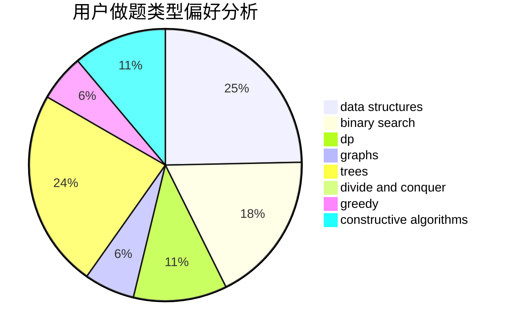

# shennong

<!-- tabs:start -->

#### **用户提交结果分析**

#### **用户做题类型偏好分析**

#### **用户错题知识点分析**

<!-- tabs:end -->
# 推荐题目
[1312A](https://codeforces.com/contest/1312/problem/A)		geometry,
                        greedy,
                        math,
                        number theory		  
[1290C](https://codeforces.com/contest/1290/problem/C)		dfs and similar,
                        dsu,
                        graphs		  
[897B](https://codeforces.com/contest/897/problem/B)		brute force		  
[364C](https://codeforces.com/contest/364/problem/C)		brute force,
                        number theory		  
[1280F](https://codeforces.com/contest/1280/problem/F)		combinatorics,
                        constructive algorithms,
                        math		  
[571E](https://codeforces.com/contest/571/problem/E)		math		  
[341D](https://codeforces.com/contest/341/problem/D)		data structures		  
[667C](https://codeforces.com/contest/667/problem/C)		dsu,graphs,sortings,trees		  
[1183A](https://codeforces.com/contest/1183/problem/A)		implementation		  
[516B](https://codeforces.com/contest/516/problem/B)		dsu,graphs,sortings,trees		  
