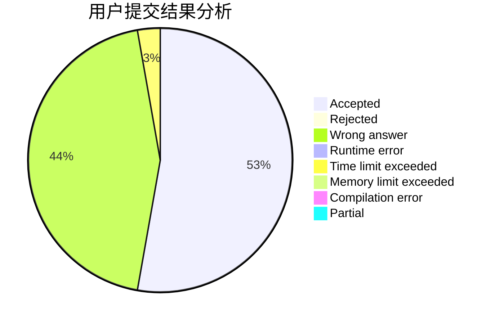
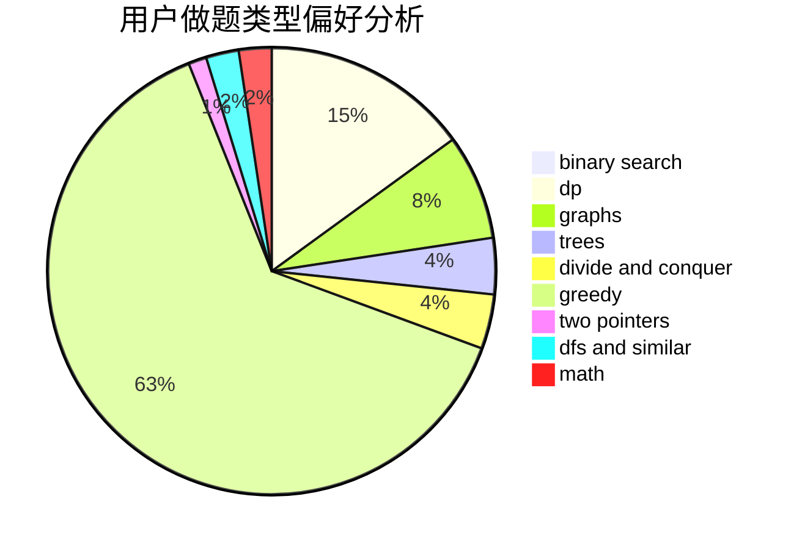

# shennong

<!-- tabs:start -->

#### **用户提交结果分析**

#### **用户做题类型偏好分析**

<!-- tabs:end -->
# 推荐题目
[1321C](https://codeforces.com/contest/1321/problem/C)
[1296F](https://codeforces.com/contest/1296/problem/F)
[914A](https://codeforces.com/contest/914/problem/A)
[3912](https://codeforces.com/contest/391/problem/2)
[12871](https://codeforces.com/contest/1287/problem/1)
[592B](https://codeforces.com/contest/592/problem/B)
[369A](https://codeforces.com/contest/369/problem/A)
[689D](https://codeforces.com/contest/689/problem/D)
[1185D](https://codeforces.com/contest/1185/problem/D)
[543B](https://codeforces.com/contest/543/problem/B)
