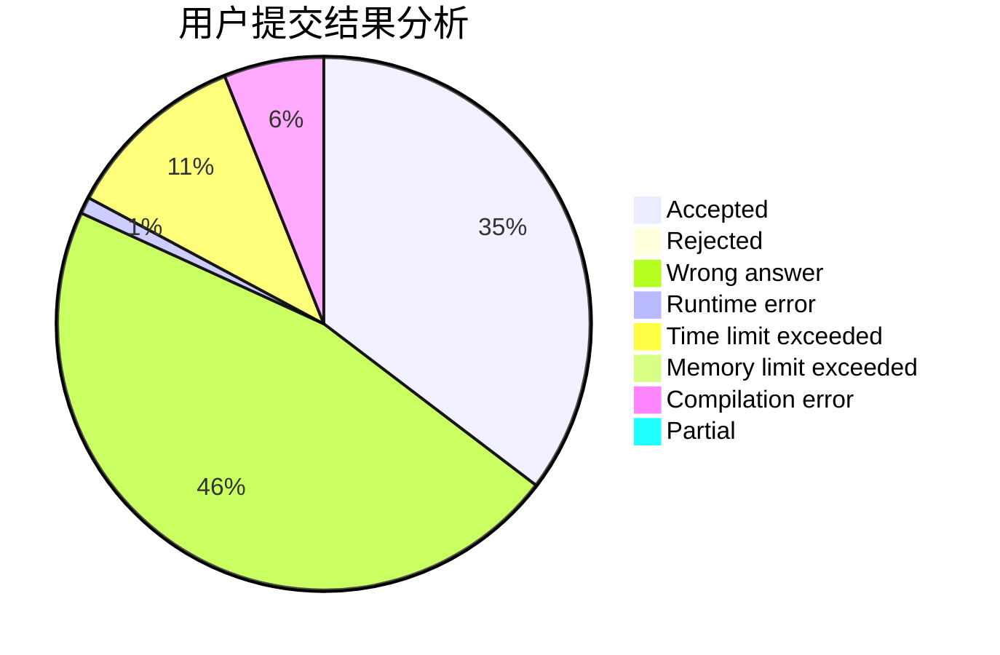
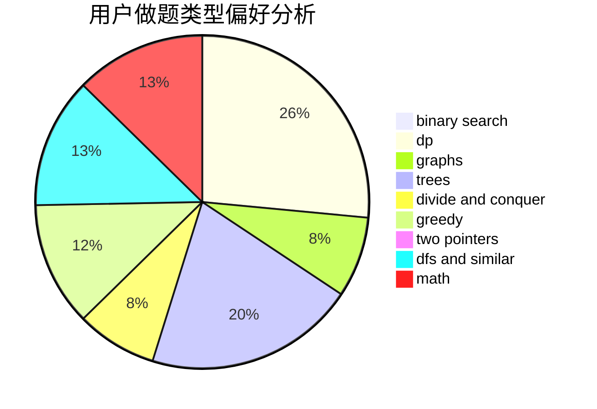

# sherrlock

<!-- tabs:start -->

#### **用户提交结果分析**

#### **用户做题类型偏好分析**

<!-- tabs:end -->
# 推荐题目
[706E](https://codeforces.com/contest/706/problem/E)
[780F](https://codeforces.com/contest/780/problem/F)
[1147B](https://codeforces.com/contest/1147/problem/B)
[864D](https://codeforces.com/contest/864/problem/D)
[418C](https://codeforces.com/contest/418/problem/C)
[1162D](https://codeforces.com/contest/1162/problem/D)
[409D](https://codeforces.com/contest/409/problem/D)
[552E](https://codeforces.com/contest/552/problem/E)
[749C](https://codeforces.com/contest/749/problem/C)
[568B](https://codeforces.com/contest/568/problem/B)
