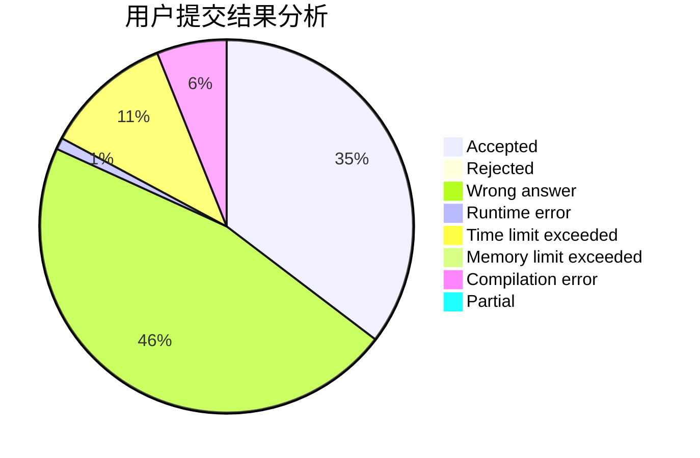
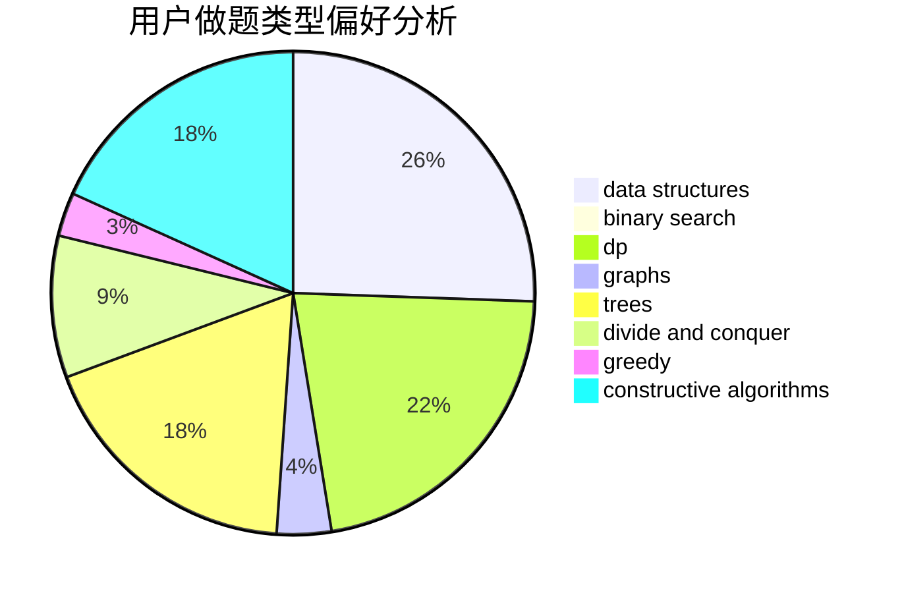

# sherrlock

<!-- tabs:start -->

#### **用户提交结果分析**

#### **用户做题类型偏好分析**

#### **用户错题知识点分析**

<!-- tabs:end -->
# 推荐题目
[706E](https://codeforces.com/contest/706/problem/E)		data structures,
                        implementation		  
[780F](https://codeforces.com/contest/780/problem/F)		bitmasks,
                        dp,
                        graphs,
                        matrices		  
[1147B](https://codeforces.com/contest/1147/problem/B)		brute force,
                        strings		  
[864D](https://codeforces.com/contest/864/problem/D)		greedy,
                        implementation,
                        math		  
[418C](https://codeforces.com/contest/418/problem/C)		dsu,graphs,sortings,trees		  
[1162D](https://codeforces.com/contest/1162/problem/D)		dsu,graphs,sortings,trees		  
[409D](https://codeforces.com/contest/409/problem/D)		*special problem		  
[552E](https://codeforces.com/contest/552/problem/E)		brute force,
                        dp,
                        expression parsing,
                        greedy,
                        implementation,
                        strings		  
[749C](https://codeforces.com/contest/749/problem/C)		greedy,
                        implementation,
                        two pointers		  
[568B](https://codeforces.com/contest/568/problem/B)		combinatorics,
                        dp,
                        math		  
