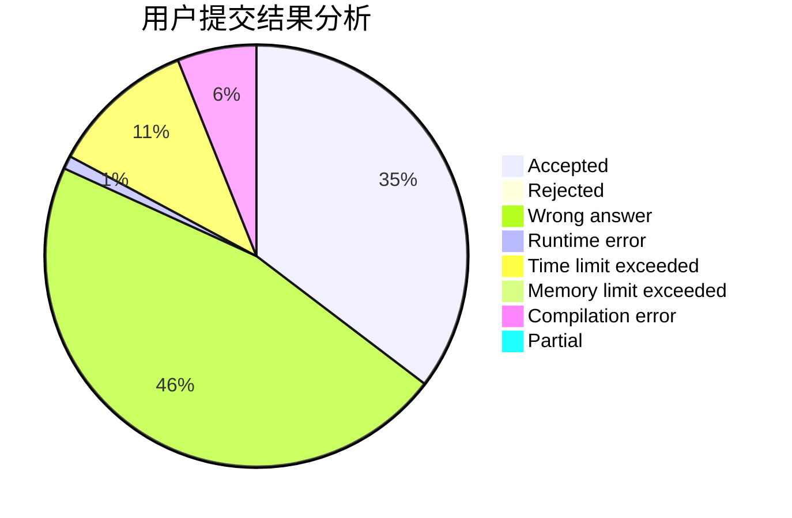
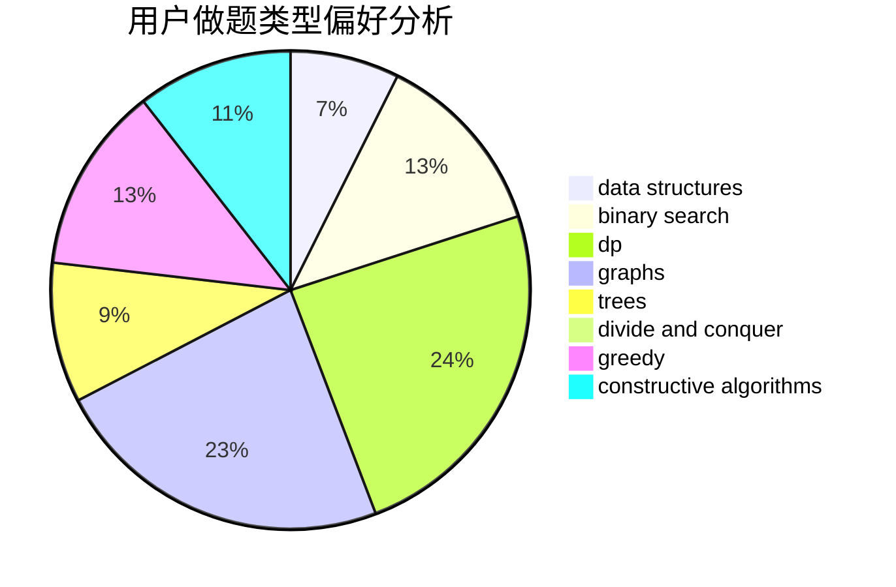

# sherrlock

<!-- tabs:start -->

#### **用户提交结果分析**

#### **用户做题类型偏好分析**

#### **用户错题知识点分析**

<!-- tabs:end -->
# 推荐题目
[682D](https://codeforces.com/contest/682/problem/D)		dp,
                        strings		  
[762B](https://codeforces.com/contest/762/problem/B)		greedy,
                        implementation,
                        sortings,
                        two pointers		  
[1145A](https://codeforces.com/contest/1145/problem/A)		implementation		  
[846B](https://codeforces.com/contest/846/problem/B)		brute force,
                        greedy		  
[389A](https://codeforces.com/contest/389/problem/A)		greedy,
                        math		  
[1159F](https://codeforces.com/contest/1159/problem/F)		dsu,graphs,sortings,trees		  
[379F](https://codeforces.com/contest/379/problem/F)		data structures,
                        divide and conquer,
                        trees		  
[528D](https://codeforces.com/contest/528/problem/D)		bitmasks,
                        brute force,
                        fft		  
[731B](https://codeforces.com/contest/731/problem/B)		constructive algorithms,
                        greedy		  
[544A](https://codeforces.com/contest/544/problem/A)		implementation,
                        strings		  
