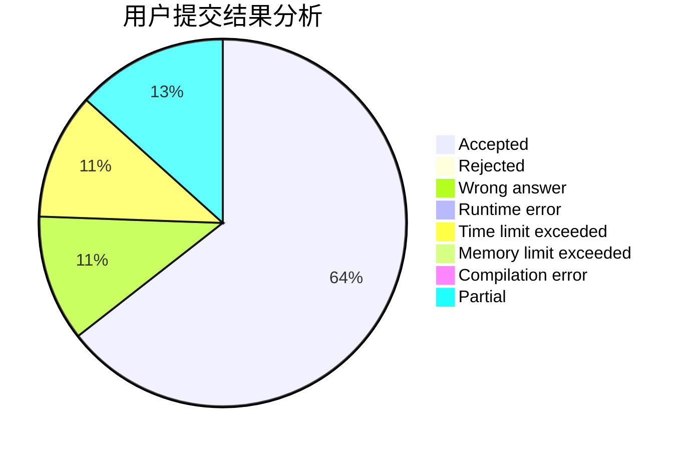
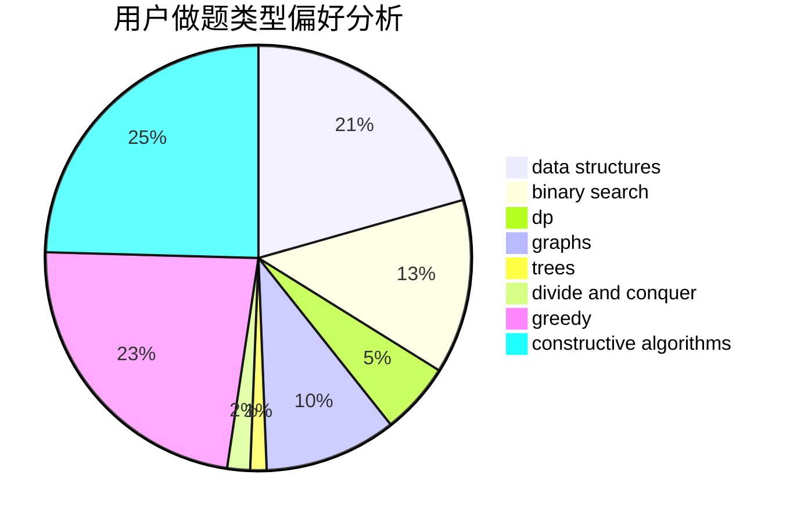
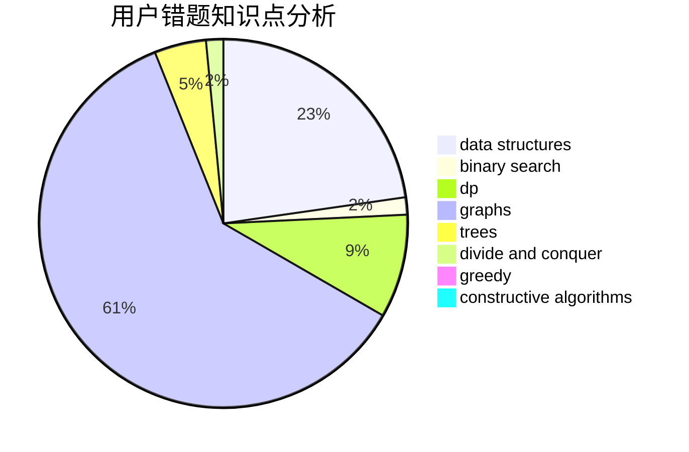

# 142857

<!-- tabs:start -->

#### **用户提交结果分析**

#### **用户做题类型偏好分析**

#### **用户错题知识点分析**

<!-- tabs:end -->
# 推荐题目
[1155F](https://codeforces.com/contest/1155/problem/F)		brute force,
                        dp,
                        graphs		  
[1155C](https://codeforces.com/contest/1155/problem/C)		math,
                        number theory		  
[1154D](https://codeforces.com/contest/1154/problem/D)		greedy		  
[1154A](https://codeforces.com/contest/1154/problem/A)		math		  
[1152D](https://codeforces.com/contest/1152/problem/D)		dp,
                        greedy,
                        trees		  
[1156B](https://codeforces.com/contest/1156/problem/B)		dfs and similar,
                        greedy,
                        implementation,
                        sortings,
                        strings		  
[1154C](https://codeforces.com/contest/1154/problem/C)		implementation,
                        math		  
[1152F2](https://codeforces.com/contest/1152F/problem/2)		bitmasks,
                        dp,
                        matrices		  
[1136E](https://codeforces.com/contest/1136/problem/E)		binary search,
                        data structures		  
[1154G](https://codeforces.com/contest/1154/problem/G)		brute force,
                        greedy,
                        math,
                        number theory		  
