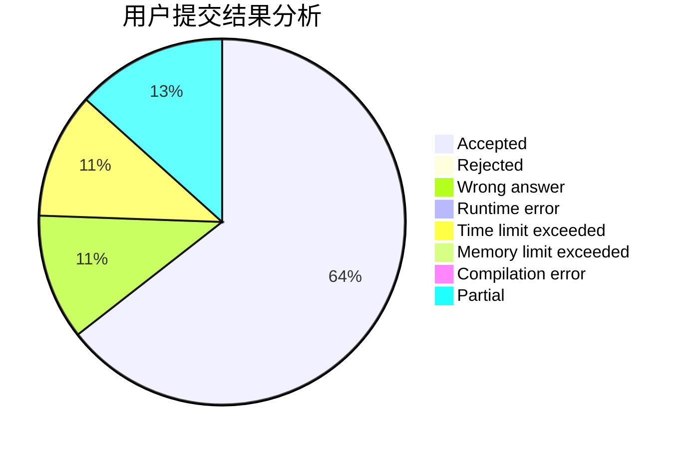
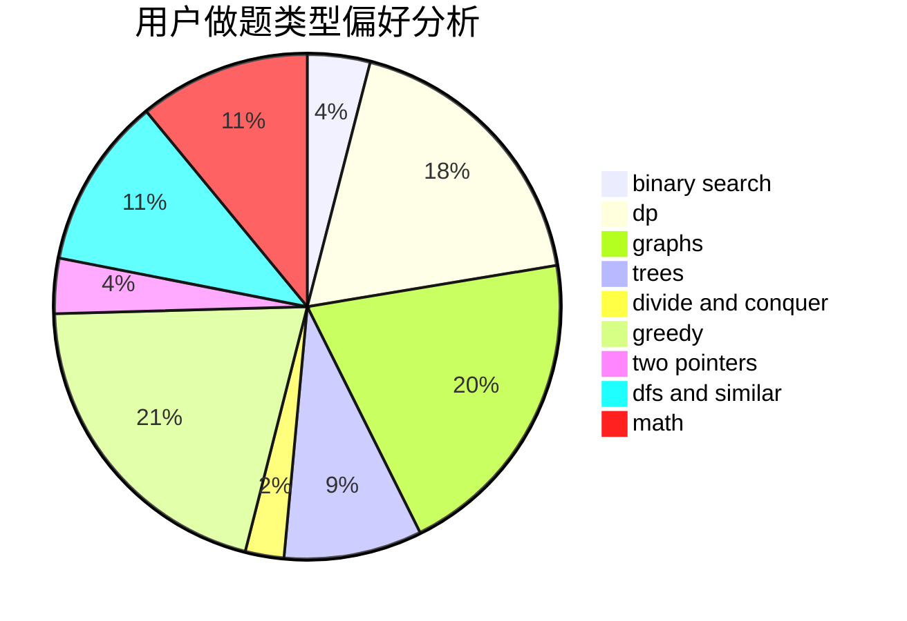

# 142857

<!-- tabs:start -->

#### **用户提交结果分析**

#### **用户做题类型偏好分析**

<!-- tabs:end -->
# 推荐题目
[1157E](https://codeforces.com/contest/1157/problem/E)
[1157A](https://codeforces.com/contest/1157/problem/A)
[1156D](https://codeforces.com/contest/1156/problem/D)
[1156A](https://codeforces.com/contest/1156/problem/A)
[1154D](https://codeforces.com/contest/1154/problem/D)
[1157G](https://codeforces.com/contest/1157/problem/G)
[1156C](https://codeforces.com/contest/1156/problem/C)
[1154G](https://codeforces.com/contest/1154/problem/G)
[1139A](https://codeforces.com/contest/1139/problem/A)
[1156G](https://codeforces.com/contest/1156/problem/G)
