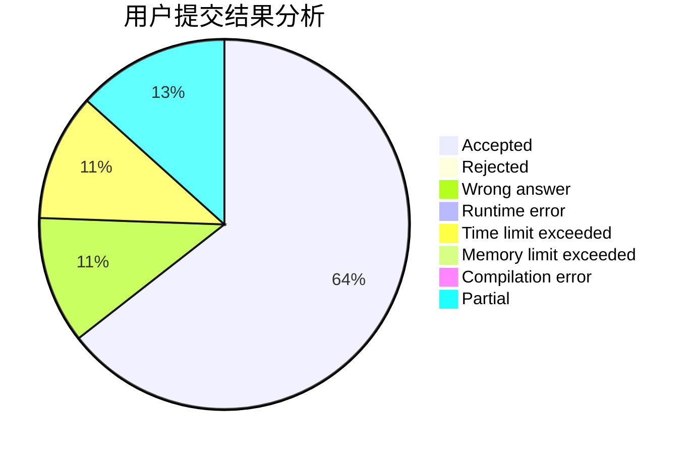
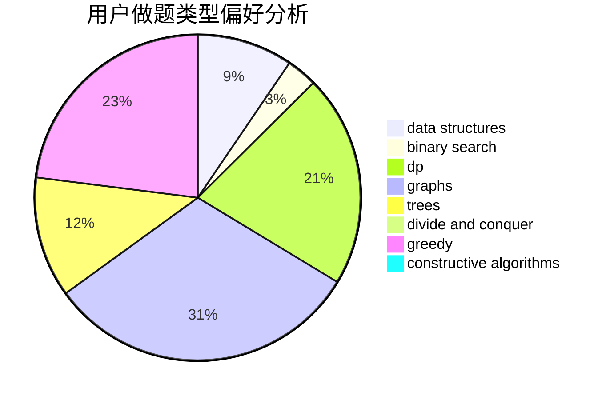
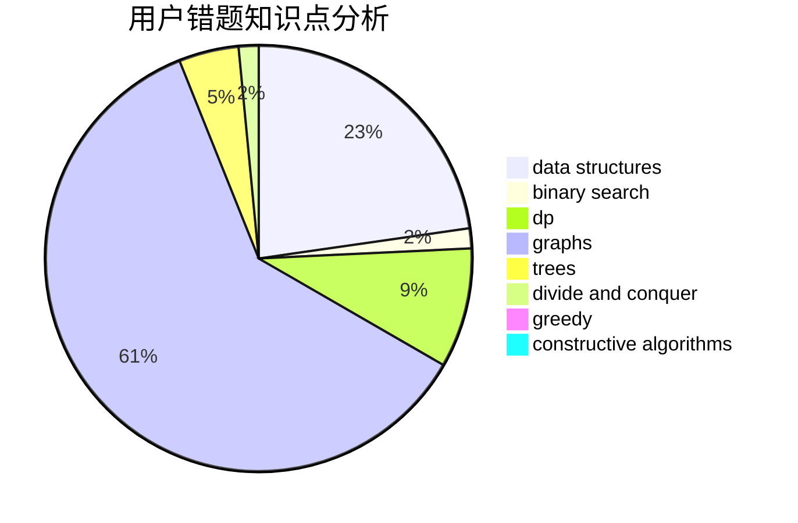

# 142857

<!-- tabs:start -->

#### **用户提交结果分析**

#### **用户做题类型偏好分析**

#### **用户错题知识点分析**

<!-- tabs:end -->
# 推荐题目
[1157E](https://codeforces.com/contest/1157/problem/E)		binary search,
                        data structures,
                        greedy		  
[1157A](https://codeforces.com/contest/1157/problem/A)		implementation		  
[1156D](https://codeforces.com/contest/1156/problem/D)		dfs and similar,
                        divide and conquer,
                        dp,
                        dsu,
                        trees		  
[1156A](https://codeforces.com/contest/1156/problem/A)		geometry		  
[1154D](https://codeforces.com/contest/1154/problem/D)		greedy		  
[1157G](https://codeforces.com/contest/1157/problem/G)		brute force,
                        constructive algorithms		  
[1156C](https://codeforces.com/contest/1156/problem/C)		binary search,
                        greedy,
                        sortings,
                        ternary search,
                        two pointers		  
[1154G](https://codeforces.com/contest/1154/problem/G)		brute force,
                        greedy,
                        math,
                        number theory		  
[1139A](https://codeforces.com/contest/1139/problem/A)		implementation,
                        strings		  
[1156G](https://codeforces.com/contest/1156/problem/G)		graphs,
                        greedy,
                        hashing,
                        implementation		  
