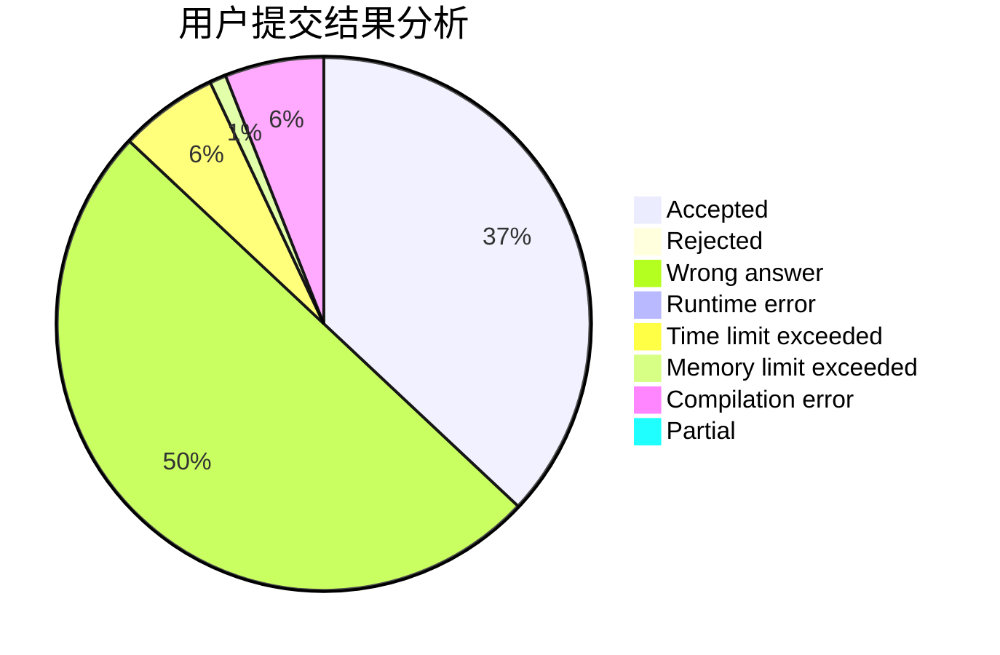
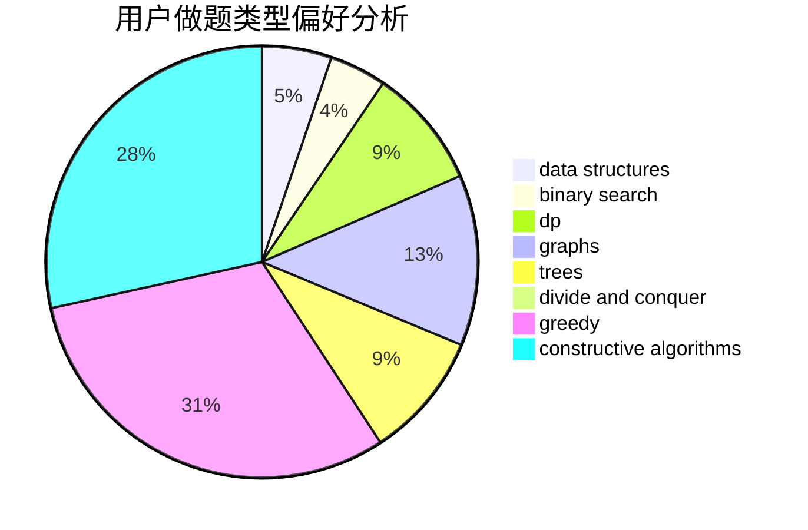
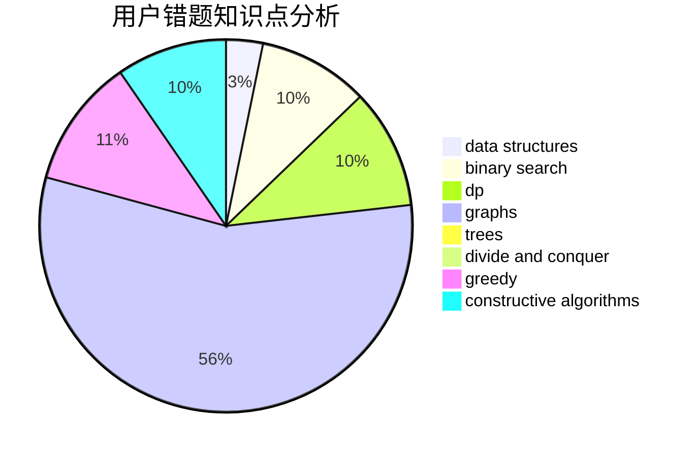

# CCoolGuang

<!-- tabs:start -->

#### **用户提交结果分析**

#### **用户做题类型偏好分析**

#### **用户错题知识点分析**

<!-- tabs:end -->
# 推荐题目
[1A](https://codeforces.com/contest/1/problem/A)		math		  
[1434D](https://codeforces.com/contest/1434/problem/D)		dsu,graphs,sortings,trees		  
[615D](https://codeforces.com/contest/615/problem/D)		math,
                        number theory		  
[616D](https://codeforces.com/contest/616/problem/D)		binary search,
                        data structures,
                        two pointers		  
[616F](https://codeforces.com/contest/616/problem/F)		string suffix structures,
                        strings		  
[616A](https://codeforces.com/contest/616/problem/A)		implementation,
                        strings		  
[1060D](https://codeforces.com/contest/1060/problem/D)		greedy,
                        math		  
[616B](https://codeforces.com/contest/616/problem/B)		games,
                        greedy		  
[546D](https://codeforces.com/contest/546/problem/D)		constructive algorithms,
                        dp,
                        math,
                        number theory		  
[1133D](https://codeforces.com/contest/1133/problem/D)		hashing,
                        math,
                        number theory		  
