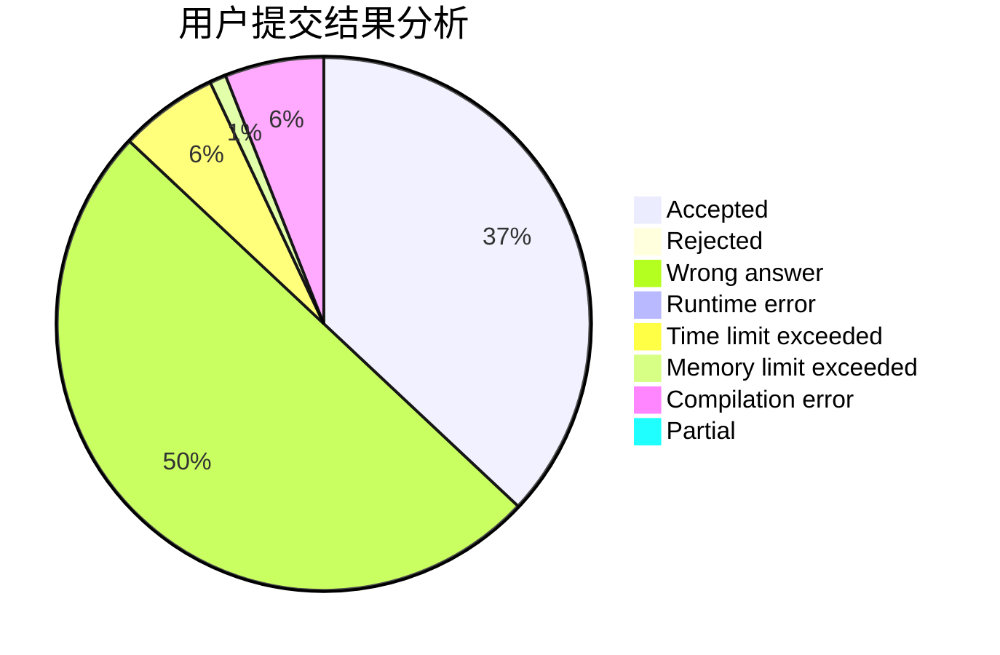
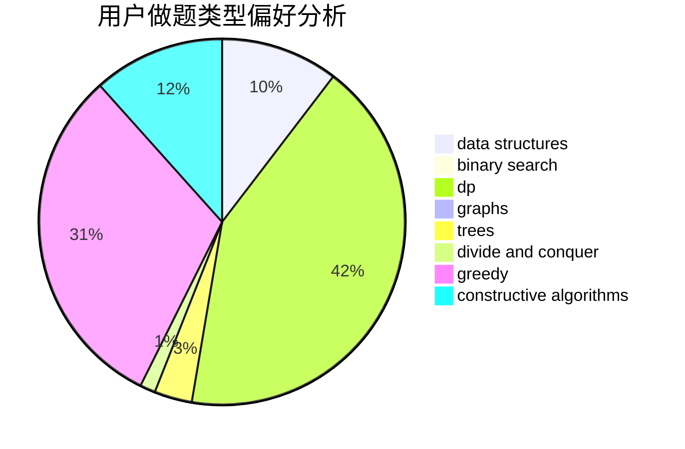
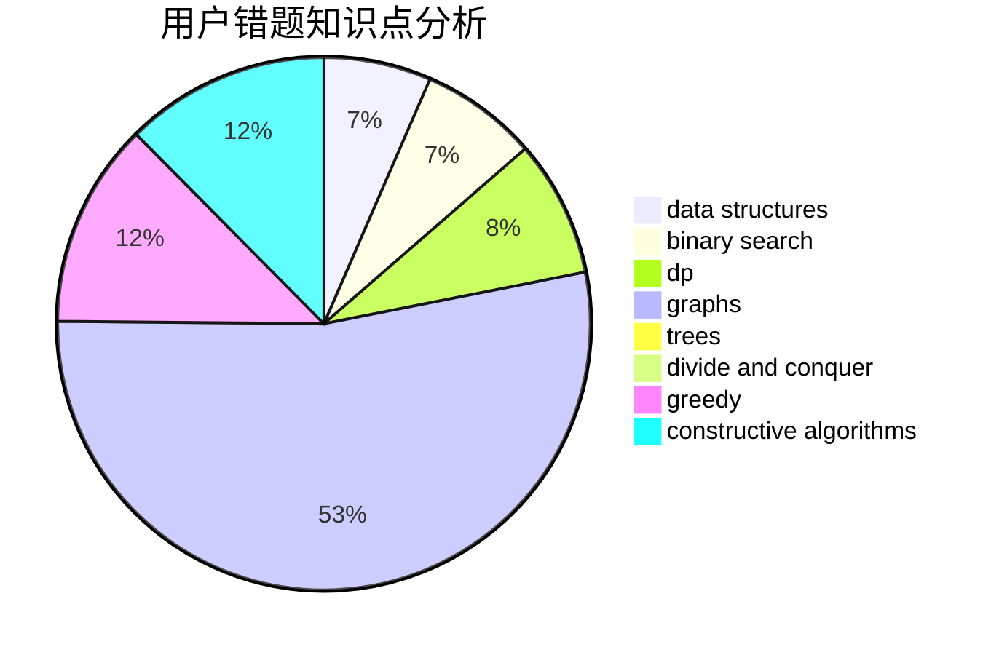

# CCoolGuang

<!-- tabs:start -->

#### **用户提交结果分析**

#### **用户做题类型偏好分析**

#### **用户错题知识点分析**

<!-- tabs:end -->
# 推荐题目
[173E](https://codeforces.com/contest/173/problem/E)		data structures,
                        sortings		  
[1426B](https://codeforces.com/contest/1426/problem/B)		implementation		  
[598A](https://codeforces.com/contest/598/problem/A)		math		  
[598E](https://codeforces.com/contest/598/problem/E)		brute force,
                        dp		  
[599A](https://codeforces.com/contest/599/problem/A)		implementation		  
[598B](https://codeforces.com/contest/598/problem/B)		implementation,
                        strings		  
[1060A](https://codeforces.com/contest/1060/problem/A)		brute force		  
[598C](https://codeforces.com/contest/598/problem/C)		geometry,
                        sortings		  
[520E](https://codeforces.com/contest/520/problem/E)		combinatorics,
                        dp,
                        math,
                        number theory		  
[1131G](https://codeforces.com/contest/1131/problem/G)		data structures,
                        dp,
                        two pointers		  
