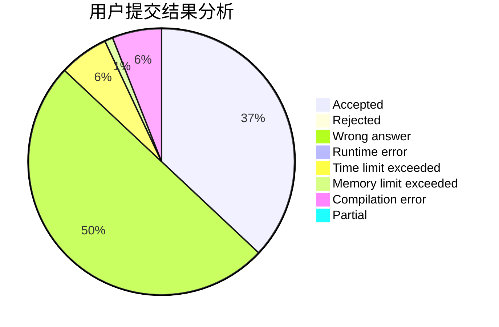
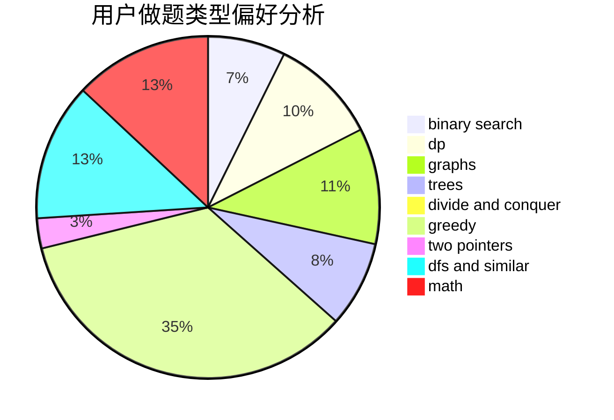

# CCoolGuang

<!-- tabs:start -->

#### **用户提交结果分析**

#### **用户做题类型偏好分析**

<!-- tabs:end -->
# 推荐题目
[1A](https://codeforces.com/contest/1/problem/A)
[1434D](https://codeforces.com/contest/1434/problem/D)
[615D](https://codeforces.com/contest/615/problem/D)
[616D](https://codeforces.com/contest/616/problem/D)
[616F](https://codeforces.com/contest/616/problem/F)
[616A](https://codeforces.com/contest/616/problem/A)
[1060D](https://codeforces.com/contest/1060/problem/D)
[616B](https://codeforces.com/contest/616/problem/B)
[546D](https://codeforces.com/contest/546/problem/D)
[1133D](https://codeforces.com/contest/1133/problem/D)
