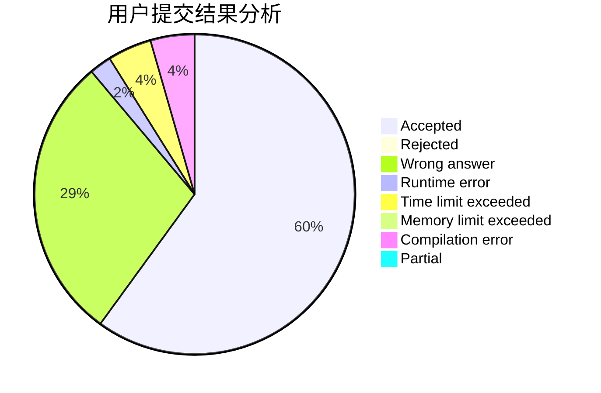
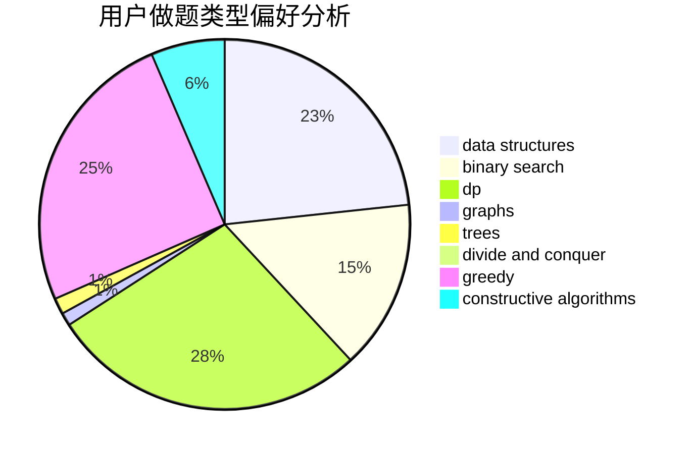

# shinoda_shx

<!-- tabs:start -->

#### **用户提交结果分析**

#### **用户做题类型偏好分析**

#### **用户错题知识点分析**

<!-- tabs:end -->
# 推荐题目
[1490F](https://codeforces.com/contest/1490/problem/F)		binary search,
                        data structures,
                        greedy,
                        math,
                        sortings		  
[343A](https://codeforces.com/contest/343/problem/A)		math,
                        number theory		  
[13764](https://codeforces.com/contest/1376/problem/4)		dsu,graphs,sortings,trees		  
[383D](https://codeforces.com/contest/383/problem/D)		dp		  
[549C](https://codeforces.com/contest/549/problem/C)		games		  
[856E](https://codeforces.com/contest/856/problem/E)		nan		  
[414E](https://codeforces.com/contest/414/problem/E)		data structures		  
[1019A](https://codeforces.com/contest/1019/problem/A)		brute force,
                        greedy		  
[436F](https://codeforces.com/contest/436/problem/F)		brute force,
                        data structures,
                        dp		  
[656E](https://codeforces.com/contest/656/problem/E)		*special problem		  
