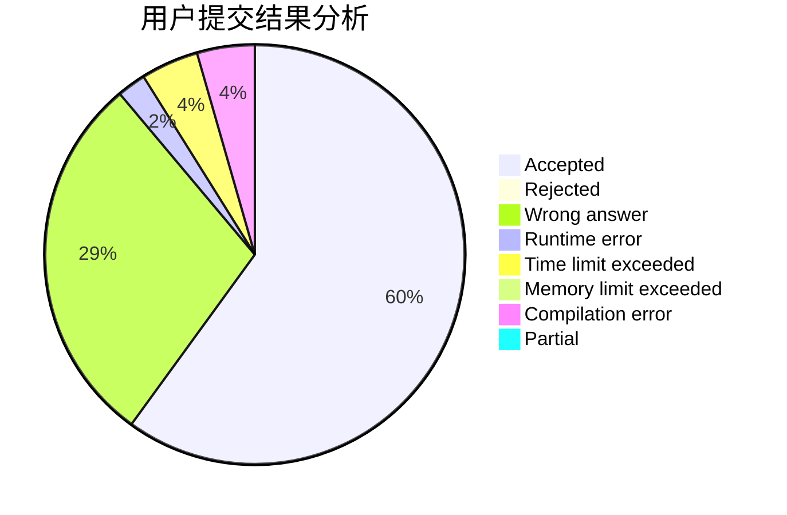
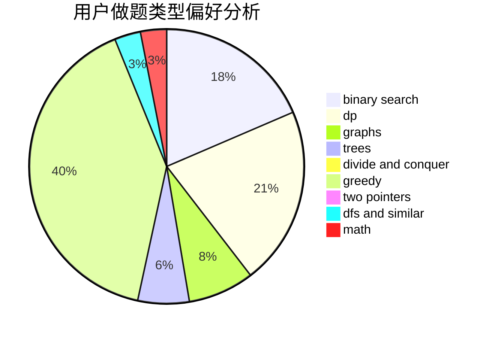

# shinoda_shx

<!-- tabs:start -->

#### **用户提交结果分析**

#### **用户做题类型偏好分析**

<!-- tabs:end -->
# 推荐题目
[1490F](https://codeforces.com/contest/1490/problem/F)
[343A](https://codeforces.com/contest/343/problem/A)
[13764](https://codeforces.com/contest/1376/problem/4)
[383D](https://codeforces.com/contest/383/problem/D)
[549C](https://codeforces.com/contest/549/problem/C)
[856E](https://codeforces.com/contest/856/problem/E)
[414E](https://codeforces.com/contest/414/problem/E)
[1019A](https://codeforces.com/contest/1019/problem/A)
[436F](https://codeforces.com/contest/436/problem/F)
[656E](https://codeforces.com/contest/656/problem/E)
