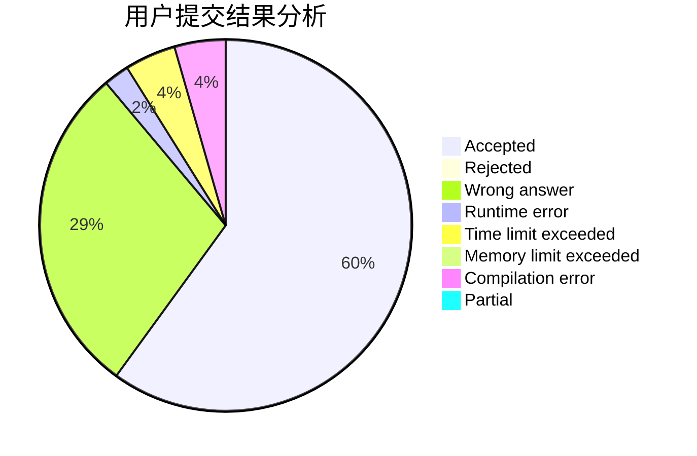
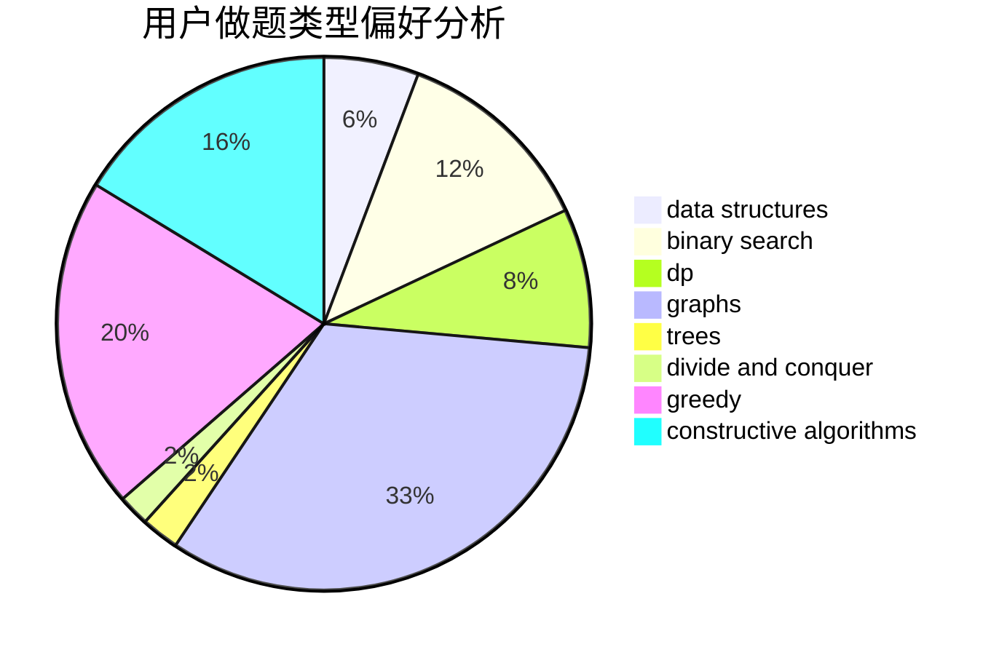

# shinoda_shx

<!-- tabs:start -->

#### **用户提交结果分析**

#### **用户做题类型偏好分析**

#### **用户错题知识点分析**

<!-- tabs:end -->
# 推荐题目
[1483A](https://codeforces.com/contest/1483/problem/A)		dsu,graphs,sortings,trees		  
[316E2](https://codeforces.com/contest/316E/problem/2)		data structures,
                        math		  
[1369E](https://codeforces.com/contest/1369/problem/E)		data structures,
                        dfs and similar,
                        greedy,
                        implementation,
                        sortings		  
[358B](https://codeforces.com/contest/358/problem/B)		brute force,
                        strings		  
[524F](https://codeforces.com/contest/524/problem/F)		data structures,
                        greedy,
                        hashing,
                        string suffix structures,
                        strings		  
[838E](https://codeforces.com/contest/838/problem/E)		dp		  
[383E](https://codeforces.com/contest/383/problem/E)		combinatorics,
                        divide and conquer,
                        dp		  
[1017E](https://codeforces.com/contest/1017/problem/E)		geometry,
                        hashing,
                        strings		  
[409F](https://codeforces.com/contest/409/problem/F)		*special problem		  
[628D](https://codeforces.com/contest/628/problem/D)		dp		  
