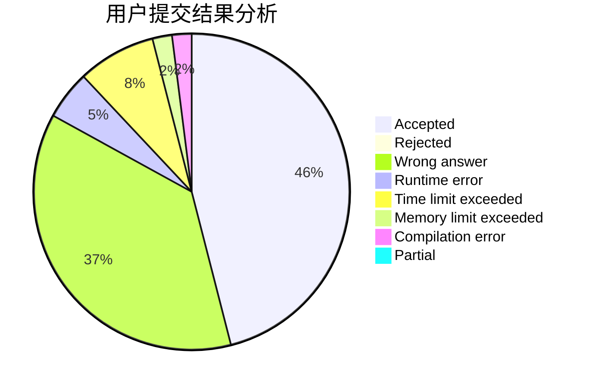
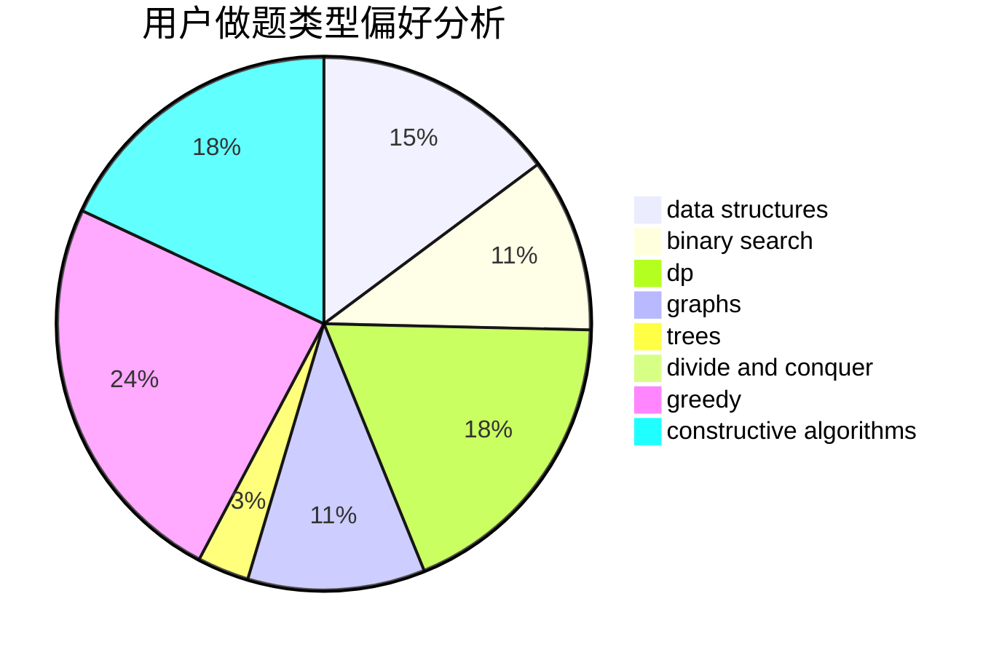
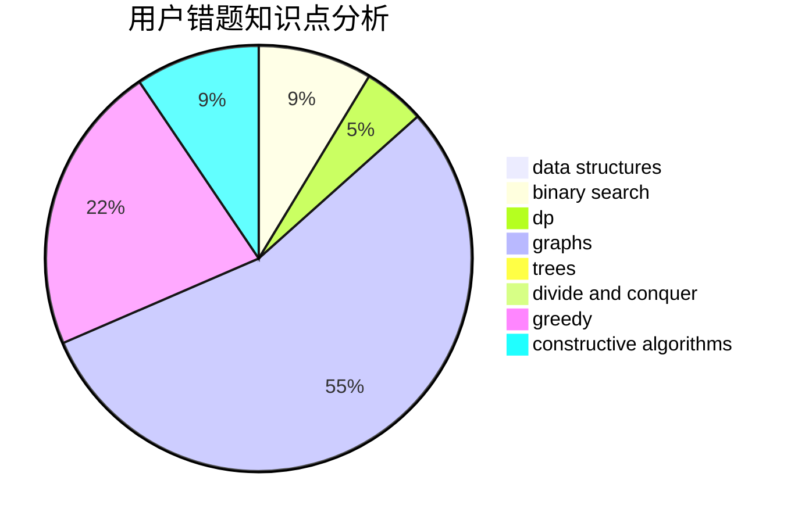

# shk001

<!-- tabs:start -->

#### **用户提交结果分析**

#### **用户做题类型偏好分析**

#### **用户错题知识点分析**

<!-- tabs:end -->
# 推荐题目
[1257E](https://codeforces.com/contest/1257/problem/E)		data structures,
                        dp,
                        greedy		  
[1444D](https://codeforces.com/contest/1444/problem/D)		constructive algorithms,
                        dp,
                        geometry		  
[1482D](https://codeforces.com/contest/1482/problem/D)		data structures,
                        dsu,
                        implementation,
                        shortest paths		  
[1366B](https://codeforces.com/contest/1366/problem/B)		math,
                        two pointers		  
[759D](https://codeforces.com/contest/759/problem/D)		dsu,graphs,sortings,trees		  
[27D](https://codeforces.com/contest/27/problem/D)		2-sat,
                        dfs and similar,
                        dsu,
                        graphs		  
[917A](https://codeforces.com/contest/917/problem/A)		dp,
                        greedy,
                        implementation,
                        math		  
[279A](https://codeforces.com/contest/279/problem/A)		brute force,
                        geometry,
                        implementation		  
[498B](https://codeforces.com/contest/498/problem/B)		dp,
                        probabilities,
                        two pointers		  
[383D](https://codeforces.com/contest/383/problem/D)		dp		  
