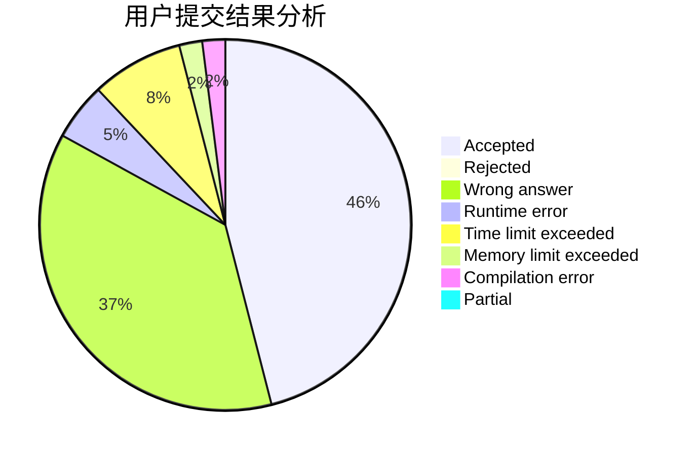
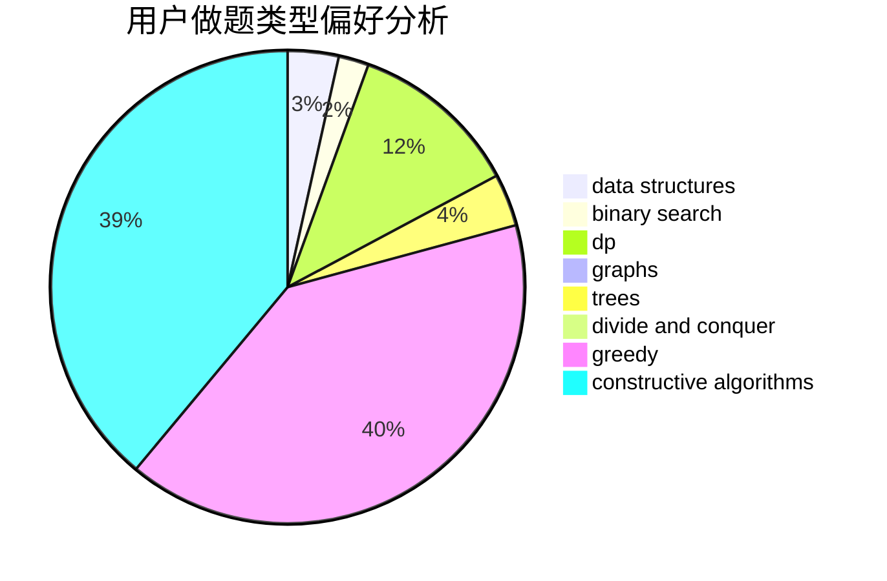
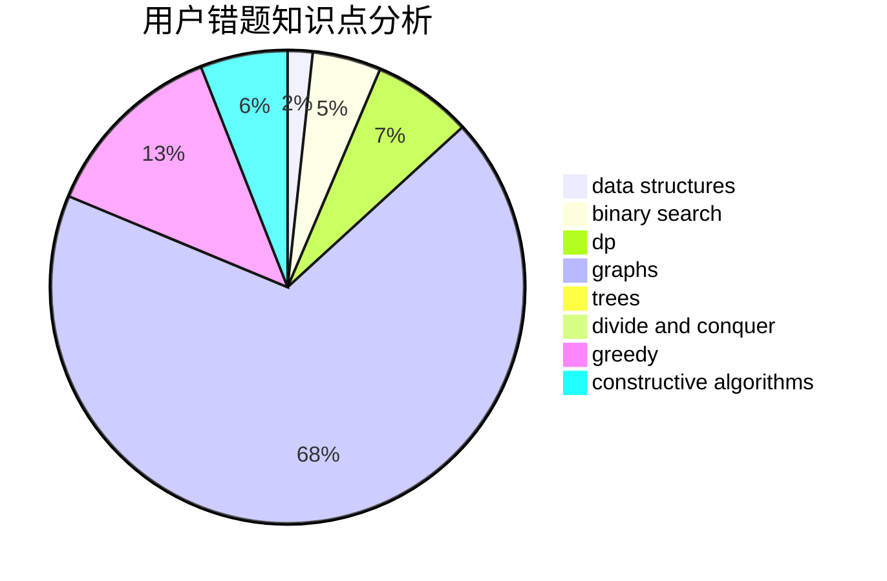

# shk001
<!-- tabs:start -->
#### **用户提交结果分析**

#### **用户做题类型偏好分析**

#### **用户错题知识点分析**

<!-- tabs:end -->
# 推荐题目
[Tiles](http://codeforces.com/problemset/problem/1473/G)		combinatorics,
                        dp,
                        fft,
                        math		  
[Song of the Sirens](http://codeforces.com/problemset/problem/1466/G)		combinatorics,
                        divide and conquer,
                        hashing,
                        math,
                        string suffix structures,
                        strings		  
[Marbles](http://codeforces.com/problemset/problem/1215/E)		bitmasks,
                        dp		  
[Find String in a Grid](http://codeforces.com/problemset/problem/1252/D)		data structures,
                        dp,
                        strings,
                        trees		  
[Three Paths on a Tree](http://codeforces.com/problemset/problem/1294/F)		dfs and similar,
                        dp,
                        greedy,
                        trees		  
[Root of quantum Fourier transform](http://codeforces.com/problemset/problem/1357/E2)		nan		  
[Remove Extra One](http://codeforces.com/problemset/problem/900/C)		brute force,
                        data structures,
                        math		  
[Dima and Text Messages](http://codeforces.com/problemset/problem/358/B)		brute force,
                        strings		  
[MUH and Sticks](http://codeforces.com/problemset/problem/471/A)		implementation		  
[Beautiful Matrix](http://codeforces.com/problemset/problem/263/A)		implementation		  
<!-- tabs:start -->
#### **data structures**
[Tiles](http://codeforces.com/problemset/problem/1252/D)		data structures,
                        dp,
                        strings,
                        trees		  
[Song of the Sirens](http://codeforces.com/problemset/problem/900/C)		brute force,
                        data structures,
                        math		  
[Marbles](http://codeforces.com/problemset/problem/1182/C)		data structures,
                        greedy,
                        strings		  
[Find String in a Grid](http://codeforces.com/problemset/problem/838/B)		data structures,
                        dfs and similar,
                        trees		  
[Three Paths on a Tree](http://codeforces.com/problemset/problem/1264/C)		data structures,
                        probabilities		  
[Root of quantum Fourier transform](http://codeforces.com/problemset/problem/750/E)		data structures,
                        divide and conquer,
                        dp,
                        matrices		  
[Remove Extra One](http://codeforces.com/problemset/problem/555/B)		data structures,
                        greedy,
                        sortings		  
[Dima and Text Messages](http://codeforces.com/problemset/problem/418/D)		data structures,
                        graphs,
                        trees		  
[MUH and Sticks](http://codeforces.com/problemset/problem/848/C)		data structures,
                        divide and conquer		  
[Beautiful Matrix](https://codeforces.com/contest/1434/problem/D)		data structures,
                        trees		  
#### **binary search**
[Tiles](http://codeforces.com/problemset/problem/1379/B)		binary search,
                        brute force,
                        math,
                        number theory		  
[Song of the Sirens](http://codeforces.com/problemset/problem/961/F)		binary search,
                        hashing,
                        string suffix structures		  
[Marbles](http://codeforces.com/problemset/problem/896/B)		binary search,
                        constructive algorithms,
                        games,
                        greedy,
                        interactive		  
[Find String in a Grid](http://codeforces.com/problemset/problem/1253/F)		binary search,
                        dsu,
                        graphs,
                        shortest paths,
                        trees		  
[Three Paths on a Tree](http://codeforces.com/problemset/problem/1492/C)		binary search,
                        data structures,
                        dp,
                        greedy,
                        two pointers		  
[Root of quantum Fourier transform](http://codeforces.com/problemset/problem/1463/D)		binary search,
                        constructive algorithms,
                        greedy,
                        two pointers		  
[Remove Extra One](http://codeforces.com/problemset/problem/1490/G)		binary search,
                        data structures,
                        math		  
[Dima and Text Messages](http://codeforces.com/problemset/problem/1479/D)		binary search,
                        bitmasks,
                        brute force,
                        data structures,
                        probabilities,
                        trees		  
[MUH and Sticks](http://codeforces.com/problemset/problem/1436/E)		binary search,
                        data structures,
                        two pointers		  
[Beautiful Matrix](http://codeforces.com/problemset/problem/1461/D)		binary search,
                        brute force,
                        data structures,
                        divide and conquer,
                        implementation,
                        sortings		  
#### **dp**
[Tiles](http://codeforces.com/problemset/problem/1473/G)		combinatorics,
                        dp,
                        fft,
                        math		  
[Song of the Sirens](http://codeforces.com/problemset/problem/1215/E)		bitmasks,
                        dp		  
[Marbles](http://codeforces.com/problemset/problem/1252/D)		data structures,
                        dp,
                        strings,
                        trees		  
[Find String in a Grid](http://codeforces.com/problemset/problem/1294/F)		dfs and similar,
                        dp,
                        greedy,
                        trees		  
[Three Paths on a Tree](http://codeforces.com/problemset/problem/1238/E)		bitmasks,
                        dp		  
[Root of quantum Fourier transform](http://codeforces.com/problemset/problem/23/E)		dp		  
[Remove Extra One](http://codeforces.com/problemset/problem/839/D)		combinatorics,
                        dp,
                        math,
                        number theory		  
[Dima and Text Messages](http://codeforces.com/problemset/problem/750/E)		data structures,
                        divide and conquer,
                        dp,
                        matrices		  
[MUH and Sticks](http://codeforces.com/problemset/problem/698/C)		bitmasks,
                        dp,
                        math,
                        probabilities		  
[Beautiful Matrix](http://codeforces.com/problemset/problem/303/E)		dp,
                        math,
                        probabilities		  
#### **graph**
[Tiles](http://codeforces.com/problemset/problem/1253/D)		constructive algorithms,
                        dfs and similar,
                        dsu,
                        graphs,
                        greedy,
                        sortings		  
[Song of the Sirens](http://codeforces.com/problemset/problem/29/E)		graphs,
                        shortest paths		  
[Marbles](http://codeforces.com/problemset/problem/574/B)		brute force,
                        dfs and similar,
                        graphs,
                        hashing		  
[Find String in a Grid](http://codeforces.com/problemset/problem/418/D)		data structures,
                        graphs,
                        trees		  
[Three Paths on a Tree](http://codeforces.com/problemset/problem/1477/D)		constructive algorithms,
                        dfs and similar,
                        graphs		  
[Root of quantum Fourier transform](http://codeforces.com/problemset/problem/875/C)		2-sat,
                        dfs and similar,
                        graphs,
                        implementation		  
[Remove Extra One](http://codeforces.com/problemset/problem/1388/D)		data structures,
                        dfs and similar,
                        graphs,
                        greedy,
                        implementation,
                        trees		  
[Dima and Text Messages](http://codeforces.com/problemset/problem/1253/F)		binary search,
                        dsu,
                        graphs,
                        shortest paths,
                        trees		  
[MUH and Sticks](http://codeforces.com/problemset/problem/1487/C)		brute force,
                        constructive algorithms,
                        dfs and similar,
                        graphs,
                        greedy,
                        implementation,
                        math		  
[Beautiful Matrix](http://codeforces.com/problemset/problem/1437/C)		dp,
                        flows,
                        graph matchings,
                        greedy,
                        math,
                        sortings		  
#### **trees**
[Tiles](http://codeforces.com/problemset/problem/1252/D)		data structures,
                        dp,
                        strings,
                        trees		  
[Song of the Sirens](http://codeforces.com/problemset/problem/1294/F)		dfs and similar,
                        dp,
                        greedy,
                        trees		  
[Marbles](http://codeforces.com/problemset/problem/838/B)		data structures,
                        dfs and similar,
                        trees		  
[Find String in a Grid](https://codeforces.com/contest/1074/problem/B)		dfs and similar,
                        interactive,
                        trees		  
[Three Paths on a Tree](http://codeforces.com/problemset/problem/418/D)		data structures,
                        graphs,
                        trees		  
[Root of quantum Fourier transform](http://codeforces.com/problemset/problem/573/C)		constructive algorithms,
                        dfs and similar,
                        trees		  
[Remove Extra One](https://codeforces.com/contest/1434/problem/D)		data structures,
                        trees		  
[Dima and Text Messages](http://codeforces.com/problemset/problem/1388/D)		data structures,
                        dfs and similar,
                        graphs,
                        greedy,
                        implementation,
                        trees		  
[MUH and Sticks](http://codeforces.com/problemset/problem/1253/F)		binary search,
                        dsu,
                        graphs,
                        shortest paths,
                        trees		  
[Beautiful Matrix](http://codeforces.com/problemset/problem/1479/D)		binary search,
                        bitmasks,
                        brute force,
                        data structures,
                        probabilities,
                        trees		  
#### **divide and conquer**
[Tiles](http://codeforces.com/problemset/problem/1466/G)		combinatorics,
                        divide and conquer,
                        hashing,
                        math,
                        string suffix structures,
                        strings		  
[Song of the Sirens](http://codeforces.com/problemset/problem/559/B)		divide and conquer,
                        hashing,
                        sortings,
                        strings		  
[Marbles](http://codeforces.com/problemset/problem/750/E)		data structures,
                        divide and conquer,
                        dp,
                        matrices		  
[Find String in a Grid](http://codeforces.com/problemset/problem/848/C)		data structures,
                        divide and conquer		  
[Three Paths on a Tree](https://codeforces.com/contest/1240/problem/D)		data structures,
                        divide and conquer,
                        dp,
                        hashing		  
[Root of quantum Fourier transform](http://codeforces.com/problemset/problem/1461/D)		binary search,
                        brute force,
                        data structures,
                        divide and conquer,
                        implementation,
                        sortings		  
[Remove Extra One](http://codeforces.com/problemset/problem/1466/G)		combinatorics,
                        divide and conquer,
                        hashing,
                        math,
                        string suffix structures,
                        strings		  
[Dima and Text Messages](http://codeforces.com/problemset/problem/1490/D)		dfs and similar,
                        divide and conquer,
                        implementation		  
[MUH and Sticks](https://codeforces.com/contest/1483/problem/C)		data structures,
                        divide and conquer,
                        dp		  
[Beautiful Matrix](http://codeforces.com/problemset/problem/1491/E)		brute force,
                        dfs and similar,
                        divide and conquer,
                        number theory,
                        trees		  
#### **greedy**
[Tiles](http://codeforces.com/problemset/problem/1294/F)		dfs and similar,
                        dp,
                        greedy,
                        trees		  
[Song of the Sirens](http://codeforces.com/problemset/problem/1253/D)		constructive algorithms,
                        dfs and similar,
                        dsu,
                        graphs,
                        greedy,
                        sortings		  
[Marbles](http://codeforces.com/problemset/problem/260/C)		constructive algorithms,
                        greedy,
                        implementation		  
[Find String in a Grid](http://codeforces.com/problemset/problem/478/B)		combinatorics,
                        constructive algorithms,
                        greedy,
                        math		  
[Three Paths on a Tree](http://codeforces.com/problemset/problem/1182/C)		data structures,
                        greedy,
                        strings		  
[Root of quantum Fourier transform](http://codeforces.com/problemset/problem/616/B)		games,
                        greedy		  
[Remove Extra One](http://codeforces.com/problemset/problem/282/B)		greedy,
                        math		  
[Dima and Text Messages](http://codeforces.com/problemset/problem/1076/A)		greedy,
                        strings		  
[MUH and Sticks](http://codeforces.com/problemset/problem/555/B)		data structures,
                        greedy,
                        sortings		  
[Beautiful Matrix](http://codeforces.com/problemset/problem/254/C)		greedy,
                        strings		  
#### **constructive algorithms**
[Tiles](http://codeforces.com/problemset/problem/877/C)		constructive algorithms		  
[Song of the Sirens](http://codeforces.com/problemset/problem/1253/D)		constructive algorithms,
                        dfs and similar,
                        dsu,
                        graphs,
                        greedy,
                        sortings		  
[Marbles](http://codeforces.com/problemset/problem/260/C)		constructive algorithms,
                        greedy,
                        implementation		  
[Find String in a Grid](http://codeforces.com/problemset/problem/478/B)		combinatorics,
                        constructive algorithms,
                        greedy,
                        math		  
[Three Paths on a Tree](http://codeforces.com/problemset/problem/275/B)		constructive algorithms,
                        implementation		  
[Root of quantum Fourier transform](http://codeforces.com/problemset/problem/1266/B)		constructive algorithms,
                        math		  
[Remove Extra One](http://codeforces.com/problemset/problem/573/C)		constructive algorithms,
                        dfs and similar,
                        trees		  
[Dima and Text Messages](http://codeforces.com/problemset/problem/1343/B)		constructive algorithms,
                        math		  
[MUH and Sticks](http://codeforces.com/problemset/problem/1477/D)		constructive algorithms,
                        dfs and similar,
                        graphs		  
[Beautiful Matrix](http://codeforces.com/problemset/problem/1283/C)		constructive algorithms,
                        data structures,
                        math		  
#### **sortings**
[Tiles](http://codeforces.com/problemset/problem/1253/D)		constructive algorithms,
                        dfs and similar,
                        dsu,
                        graphs,
                        greedy,
                        sortings		  
[Song of the Sirens](http://codeforces.com/problemset/problem/559/B)		divide and conquer,
                        hashing,
                        sortings,
                        strings		  
[Marbles](http://codeforces.com/problemset/problem/555/B)		data structures,
                        greedy,
                        sortings		  
[Find String in a Grid](https://codeforces.com/contest/1496/problem/C)		geometry,
                        greedy,
                        math,
                        sortings		  
[Three Paths on a Tree](http://codeforces.com/problemset/problem/1495/A)		geometry,
                        greedy,
                        math,
                        sortings		  
[Root of quantum Fourier transform](http://codeforces.com/problemset/problem/1497/A)		brute force,
                        data structures,
                        greedy,
                        sortings		  
[Remove Extra One](http://codeforces.com/problemset/problem/1427/A)		math,
                        sortings		  
[Dima and Text Messages](http://codeforces.com/problemset/problem/1461/D)		binary search,
                        brute force,
                        data structures,
                        divide and conquer,
                        implementation,
                        sortings		  
[MUH and Sticks](http://codeforces.com/problemset/problem/1437/C)		dp,
                        flows,
                        graph matchings,
                        greedy,
                        math,
                        sortings		  
[Beautiful Matrix](http://codeforces.com/problemset/problem/1473/A)		greedy,
                        implementation,
                        math,
                        sortings		  
<!-- tabs:end -->
