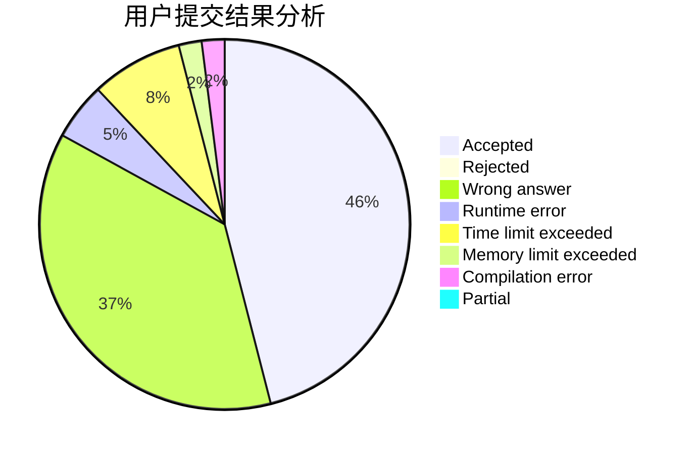
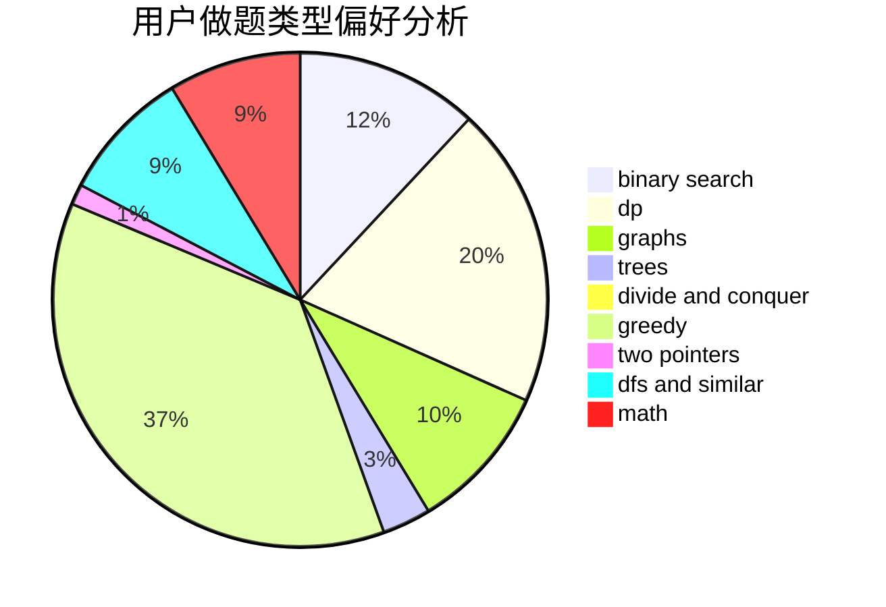

# shk001

<!-- tabs:start -->

#### **用户提交结果分析**

#### **用户做题类型偏好分析**

<!-- tabs:end -->
# 推荐题目
[1257E](https://codeforces.com/contest/1257/problem/E)
[1444D](https://codeforces.com/contest/1444/problem/D)
[1482D](https://codeforces.com/contest/1482/problem/D)
[1366B](https://codeforces.com/contest/1366/problem/B)
[759D](https://codeforces.com/contest/759/problem/D)
[27D](https://codeforces.com/contest/27/problem/D)
[917A](https://codeforces.com/contest/917/problem/A)
[279A](https://codeforces.com/contest/279/problem/A)
[498B](https://codeforces.com/contest/498/problem/B)
[383D](https://codeforces.com/contest/383/problem/D)
