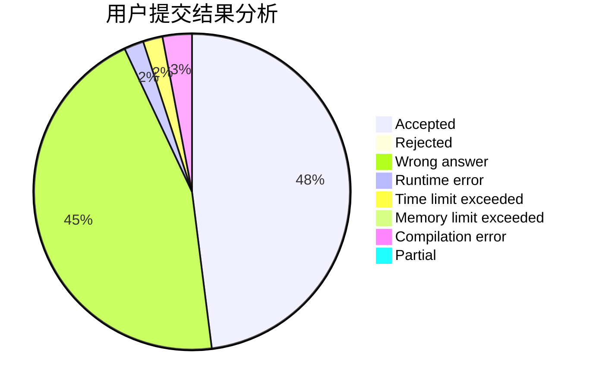
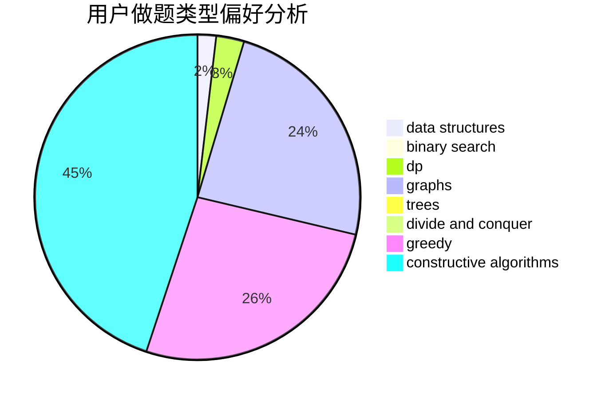
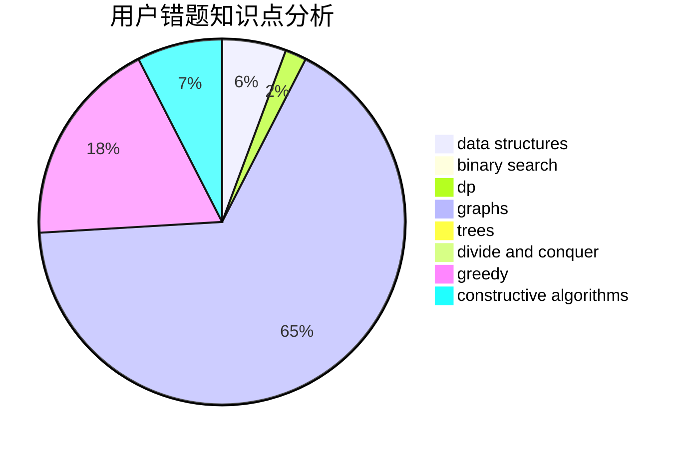

# shs_ryf

<!-- tabs:start -->

#### **用户提交结果分析**

#### **用户做题类型偏好分析**

#### **用户错题知识点分析**

<!-- tabs:end -->
# 推荐题目
[1476G](https://codeforces.com/contest/1476/problem/G)		data structures,
                        hashing,
                        sortings,
                        two pointers		  
[40A](https://codeforces.com/contest/40/problem/A)		constructive algorithms,
                        geometry,
                        implementation,
                        math		  
[1423H](https://codeforces.com/contest/1423/problem/H)		data structures,
                        divide and conquer,
                        dsu,
                        graphs		  
[521A](https://codeforces.com/contest/521/problem/A)		dsu,graphs,sortings,trees		  
[1139F](https://codeforces.com/contest/1139/problem/F)		data structures,
                        divide and conquer		  
[238C](https://codeforces.com/contest/238/problem/C)		dfs and similar,
                        dp,
                        greedy,
                        trees		  
[1178B](https://codeforces.com/contest/1178/problem/B)		dp,
                        strings		  
[1009C](https://codeforces.com/contest/1009/problem/C)		greedy,
                        math		  
[1089D](https://codeforces.com/contest/1089/problem/D)		graphs		  
[1359F](https://codeforces.com/contest/1359/problem/F)		binary search,
                        brute force,
                        data structures,
                        geometry,
                        math		  
