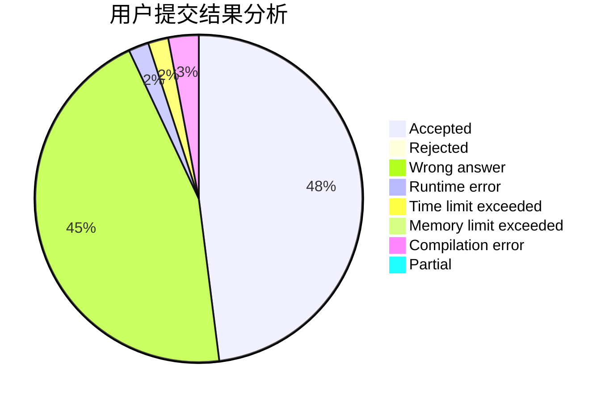
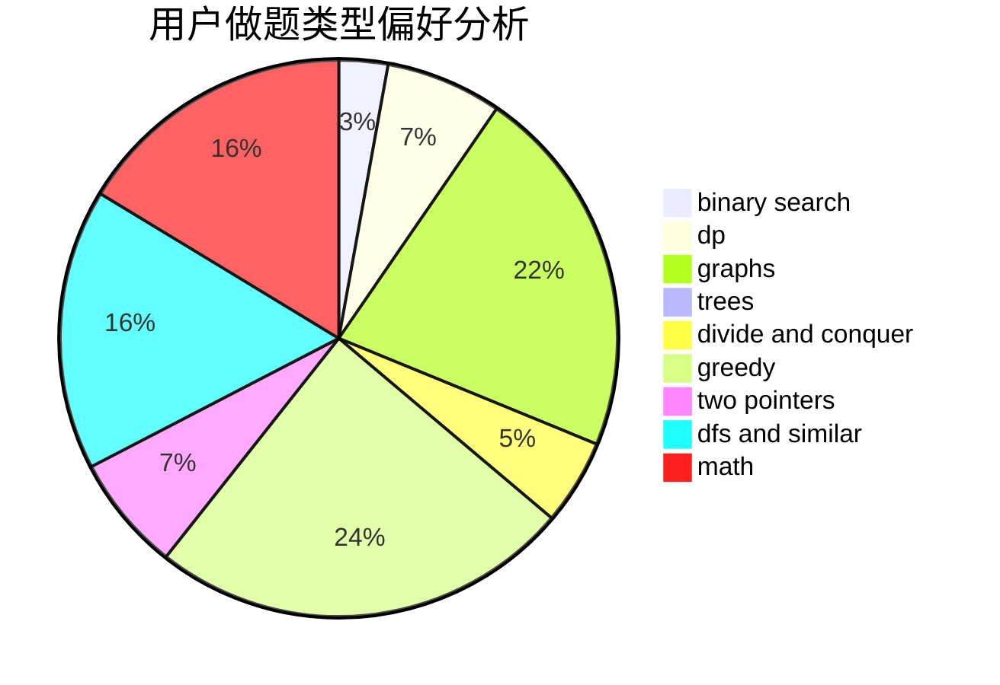

# shs_ryf

<!-- tabs:start -->

#### **用户提交结果分析**

#### **用户做题类型偏好分析**

<!-- tabs:end -->
# 推荐题目
[1476G](https://codeforces.com/contest/1476/problem/G)
[40A](https://codeforces.com/contest/40/problem/A)
[1423H](https://codeforces.com/contest/1423/problem/H)
[521A](https://codeforces.com/contest/521/problem/A)
[1139F](https://codeforces.com/contest/1139/problem/F)
[238C](https://codeforces.com/contest/238/problem/C)
[1178B](https://codeforces.com/contest/1178/problem/B)
[1009C](https://codeforces.com/contest/1009/problem/C)
[1089D](https://codeforces.com/contest/1089/problem/D)
[1359F](https://codeforces.com/contest/1359/problem/F)
