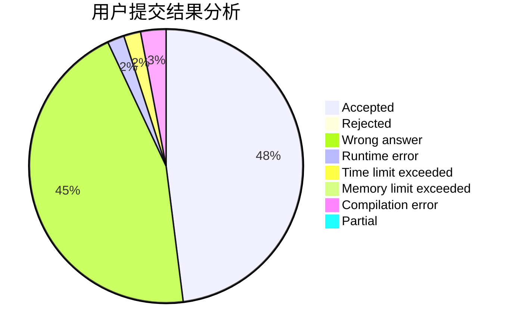
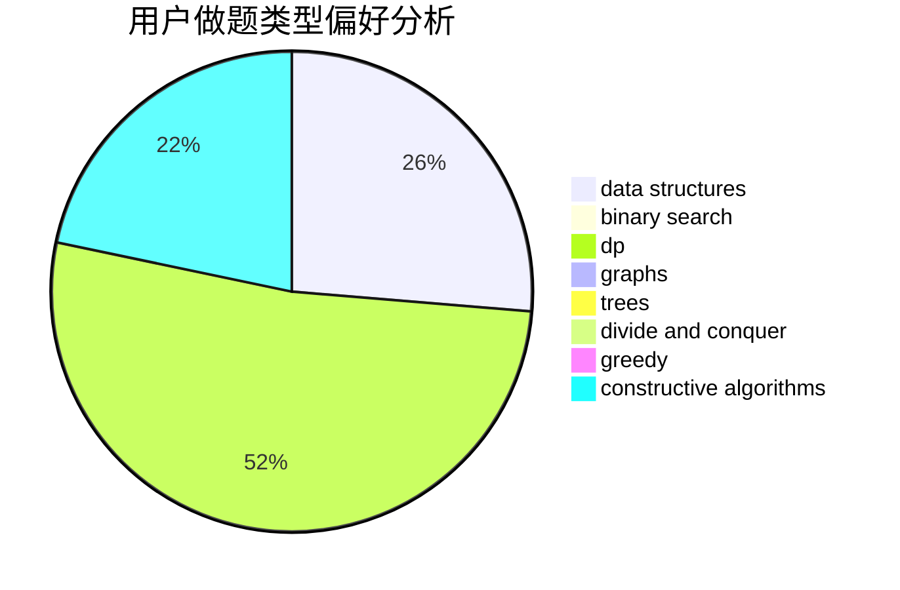
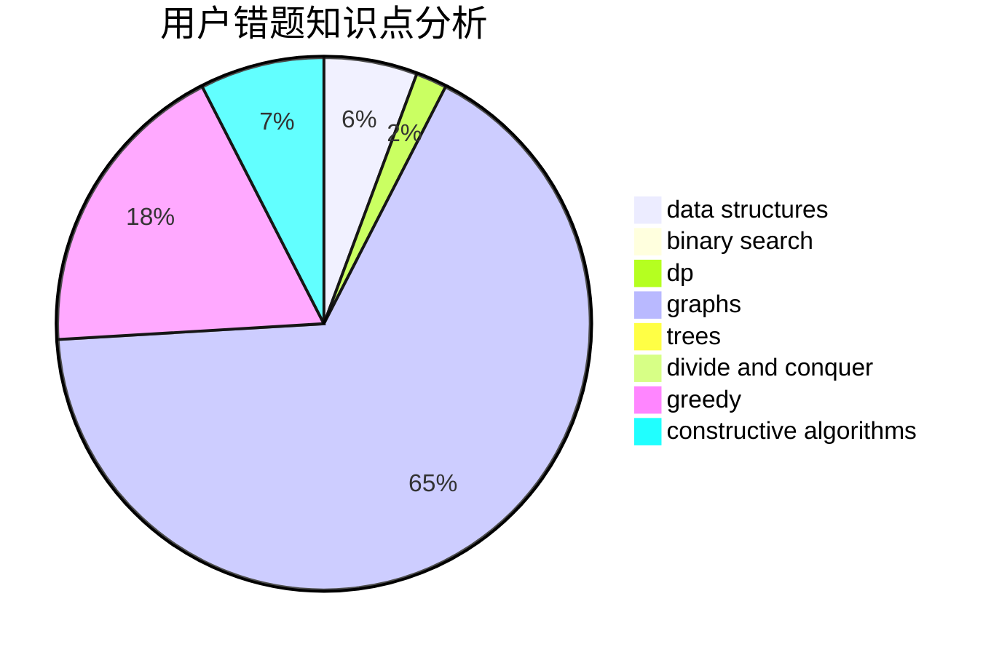

# shs_ryf

<!-- tabs:start -->

#### **用户提交结果分析**

#### **用户做题类型偏好分析**

#### **用户错题知识点分析**

<!-- tabs:end -->
# 推荐题目
[1468M](https://codeforces.com/contest/1468/problem/M)		data structures,
                        graphs,
                        implementation		  
[380A](https://codeforces.com/contest/380/problem/A)		binary search,
                        brute force		  
[1415D](https://codeforces.com/contest/1415/problem/D)		bitmasks,
                        brute force,
                        constructive algorithms		  
[500A](https://codeforces.com/contest/500/problem/A)		dfs and similar,
                        graphs,
                        implementation		  
[1137E](https://codeforces.com/contest/1137/problem/E)		data structures,
                        greedy		  
[219A](https://codeforces.com/contest/219/problem/A)		implementation,
                        strings		  
[1175B](https://codeforces.com/contest/1175/problem/B)		data structures,
                        expression parsing,
                        implementation		  
[1008E](https://codeforces.com/contest/1008/problem/E)		dsu,graphs,sortings,trees		  
[1088E](https://codeforces.com/contest/1088/problem/E)		dp,
                        greedy,
                        math,
                        trees		  
[1353A](https://codeforces.com/contest/1353/problem/A)		constructive algorithms,
                        greedy,
                        math		  
