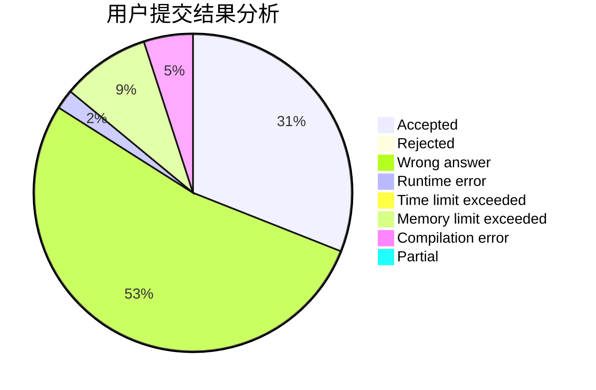
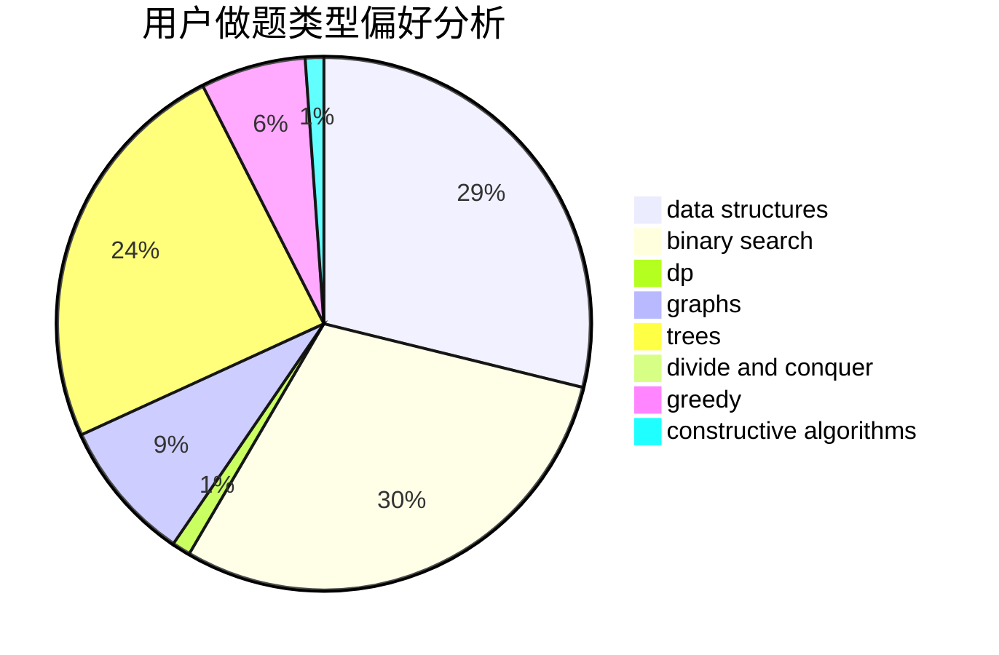
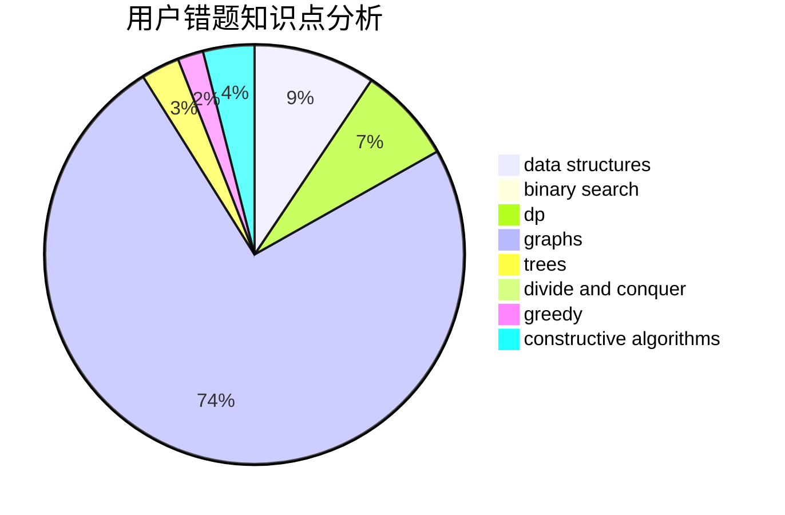

# shuitiangong

<!-- tabs:start -->

#### **用户提交结果分析**

#### **用户做题类型偏好分析**

#### **用户错题知识点分析**

<!-- tabs:end -->
# 推荐题目
[480B](https://codeforces.com/contest/480/problem/B)		dsu,graphs,sortings,trees		  
[924E](https://codeforces.com/contest/924/problem/E)		nan		  
[1295D](https://codeforces.com/contest/1295/problem/D)		math,
                        number theory		  
[529B](https://codeforces.com/contest/529/problem/B)		brute force,
                        greedy,
                        sortings		  
[759A](https://codeforces.com/contest/759/problem/A)		dsu,graphs,sortings,trees		  
[1357C2](https://codeforces.com/contest/1357C/problem/2)		nan		  
[755F](https://codeforces.com/contest/755/problem/F)		bitmasks,
                        dp,
                        greedy		  
[719E](https://codeforces.com/contest/719/problem/E)		dsu,graphs,sortings,trees		  
[288C](https://codeforces.com/contest/288/problem/C)		implementation,
                        math		  
[1189B](https://codeforces.com/contest/1189/problem/B)		greedy,
                        math,
                        sortings		  
