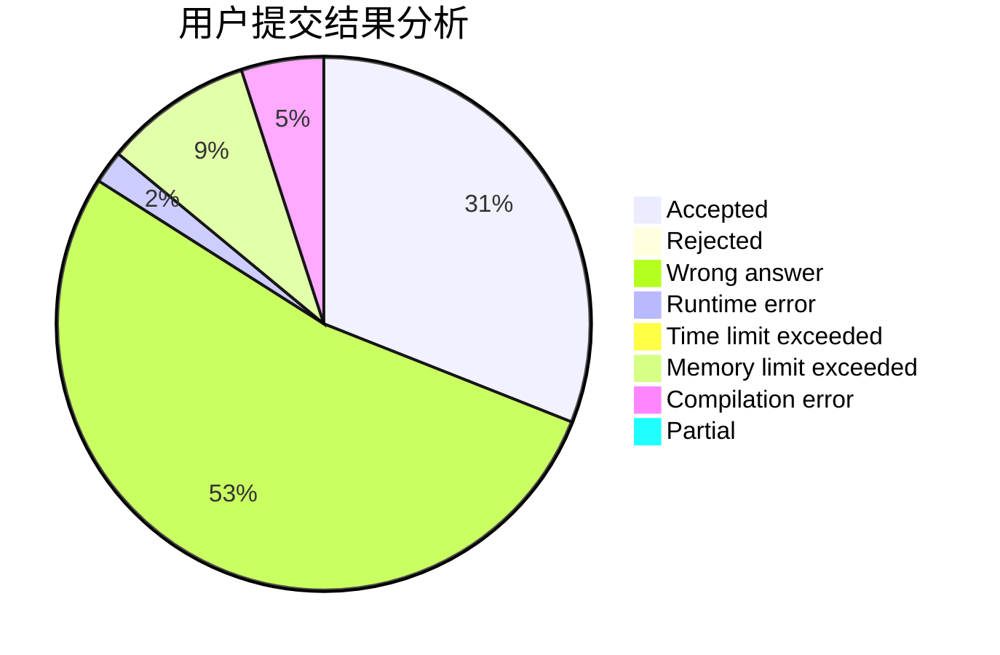
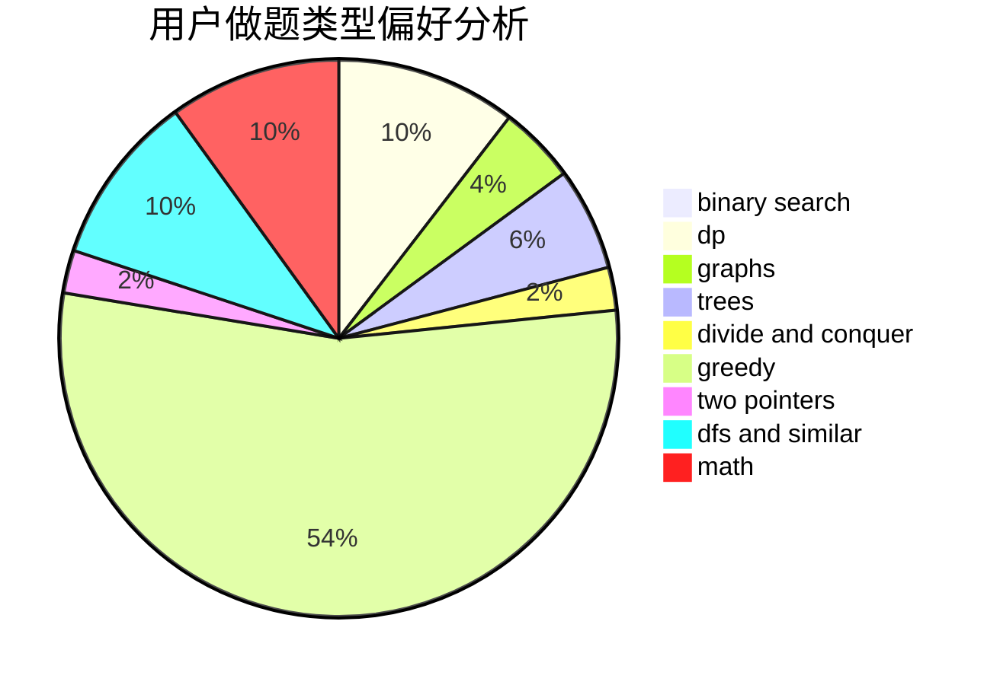

# shuitiangong

<!-- tabs:start -->

#### **用户提交结果分析**

#### **用户做题类型偏好分析**

<!-- tabs:end -->
# 推荐题目
[500B](https://codeforces.com/contest/500/problem/B)
[948C](https://codeforces.com/contest/948/problem/C)
[1302F](https://codeforces.com/contest/1302/problem/F)
[553A](https://codeforces.com/contest/553/problem/A)
[778C](https://codeforces.com/contest/778/problem/C)
[1365B](https://codeforces.com/contest/1365/problem/B)
[774C](https://codeforces.com/contest/774/problem/C)
[736E](https://codeforces.com/contest/736/problem/E)
[301D](https://codeforces.com/contest/301/problem/D)
[1194D](https://codeforces.com/contest/1194/problem/D)
