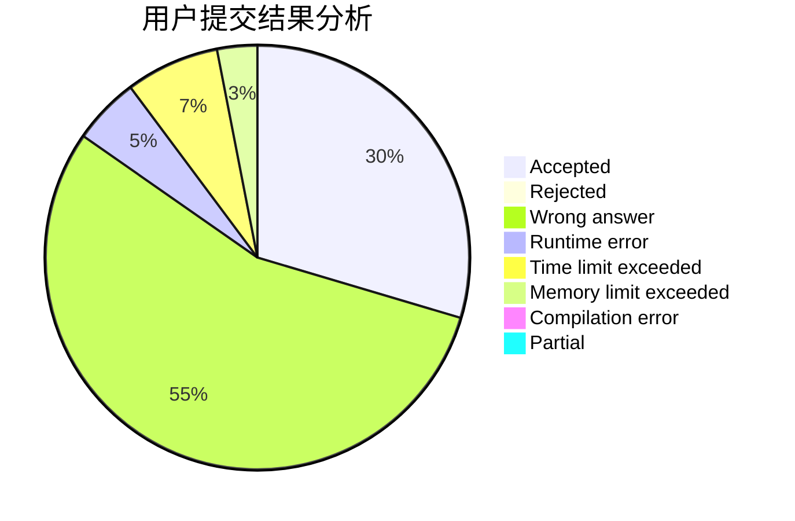
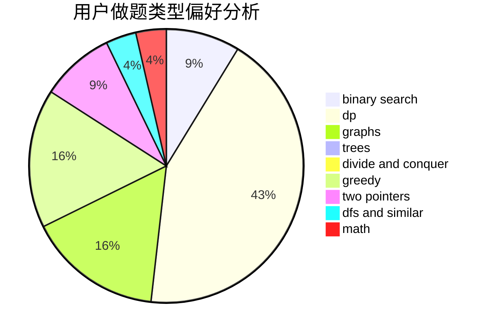

# shukun

<!-- tabs:start -->

#### **用户提交结果分析**

#### **用户做题类型偏好分析**

<!-- tabs:end -->
# 推荐题目
[1261A](https://codeforces.com/contest/1261/problem/A)
[155A](https://codeforces.com/contest/155/problem/A)
[445A](https://codeforces.com/contest/445/problem/A)
[1139D](https://codeforces.com/contest/1139/problem/D)
[780H](https://codeforces.com/contest/780/problem/H)
[389B](https://codeforces.com/contest/389/problem/B)
[947A](https://codeforces.com/contest/947/problem/A)
[20C](https://codeforces.com/contest/20/problem/C)
[1006F](https://codeforces.com/contest/1006/problem/F)
[1496C](https://codeforces.com/contest/1496/problem/C)
