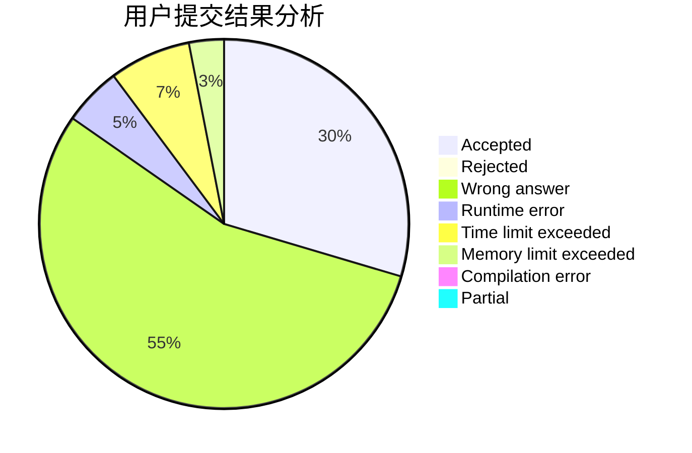
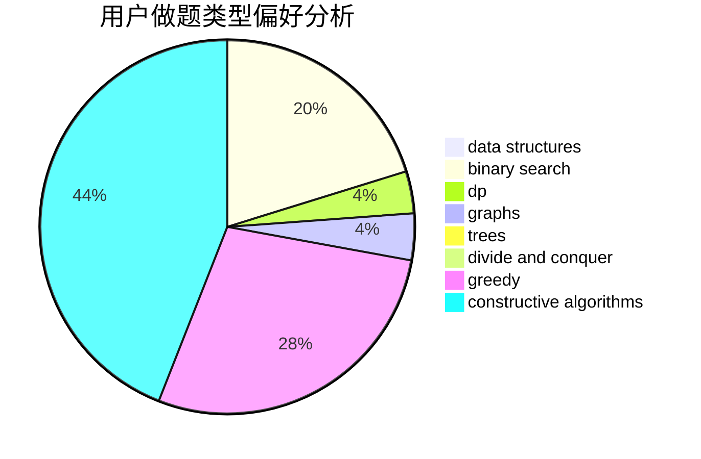

# shukun

<!-- tabs:start -->

#### **用户提交结果分析**

#### **用户做题类型偏好分析**

#### **用户错题知识点分析**

<!-- tabs:end -->
# 推荐题目
[1254A](https://codeforces.com/contest/1254/problem/A)		constructive algorithms,
                        greedy,
                        implementation		  
[1505F](https://codeforces.com/contest/1505/problem/F)		math		  
[41B](https://codeforces.com/contest/41/problem/B)		brute force		  
[1137C](https://codeforces.com/contest/1137/problem/C)		dp,
                        graphs,
                        implementation		  
[762D](https://codeforces.com/contest/762/problem/D)		dp,
                        greedy,
                        implementation		  
[362C](https://codeforces.com/contest/362/problem/C)		data structures,
                        dp,
                        implementation,
                        math		  
[923C](https://codeforces.com/contest/923/problem/C)		data structures,
                        greedy,
                        strings,
                        trees		  
[185E](https://codeforces.com/contest/185/problem/E)		binary search,
                        data structures		  
[1006C](https://codeforces.com/contest/1006/problem/C)		binary search,
                        data structures,
                        two pointers		  
[1488E](https://codeforces.com/contest/1488/problem/E)		*special problem,
                        data structures,
                        dp		  
