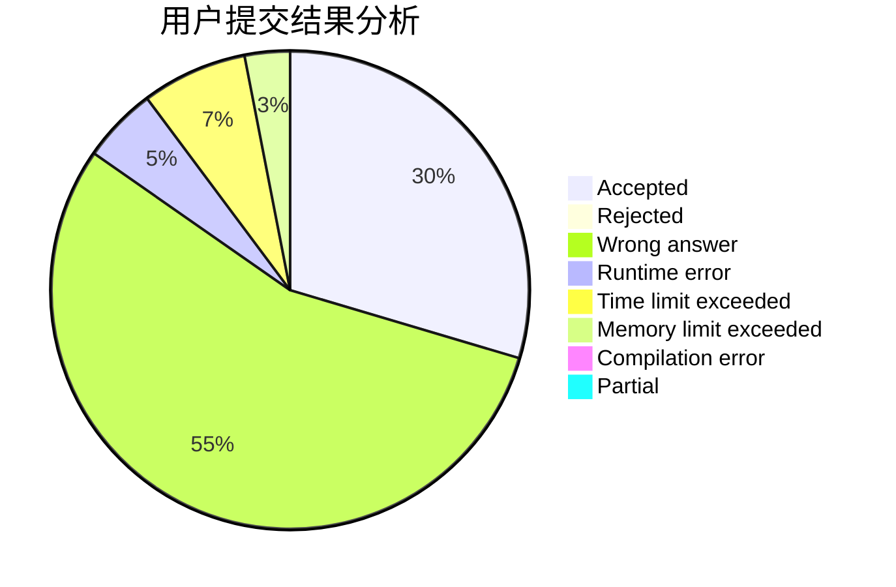
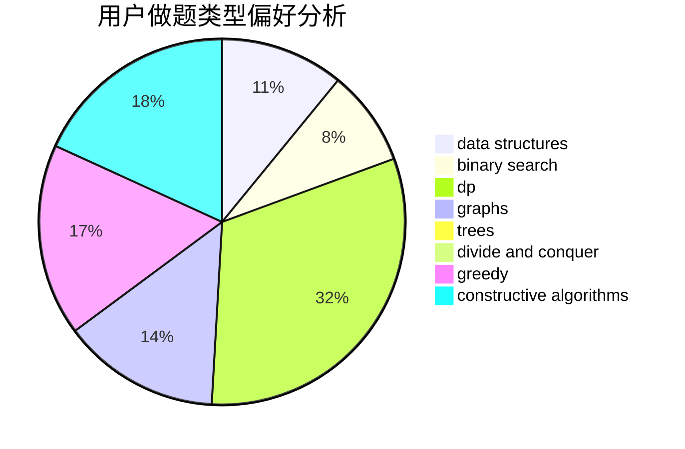

# shukun

<!-- tabs:start -->

#### **用户提交结果分析**

#### **用户做题类型偏好分析**

#### **用户错题知识点分析**

<!-- tabs:end -->
# 推荐题目
[1261A](https://codeforces.com/contest/1261/problem/A)		dsu,graphs,sortings,trees		  
[155A](https://codeforces.com/contest/155/problem/A)		brute force		  
[445A](https://codeforces.com/contest/445/problem/A)		dfs and similar,
                        implementation		  
[1139D](https://codeforces.com/contest/1139/problem/D)		dp,
                        math,
                        number theory,
                        probabilities		  
[780H](https://codeforces.com/contest/780/problem/H)		binary search,
                        geometry,
                        implementation,
                        two pointers		  
[389B](https://codeforces.com/contest/389/problem/B)		greedy,
                        implementation		  
[947A](https://codeforces.com/contest/947/problem/A)		dsu,graphs,sortings,trees		  
[20C](https://codeforces.com/contest/20/problem/C)		graphs,
                        shortest paths		  
[1006F](https://codeforces.com/contest/1006/problem/F)		bitmasks,
                        brute force,
                        dp,
                        meet-in-the-middle		  
[1496C](https://codeforces.com/contest/1496/problem/C)		dsu,graphs,sortings,trees		  
