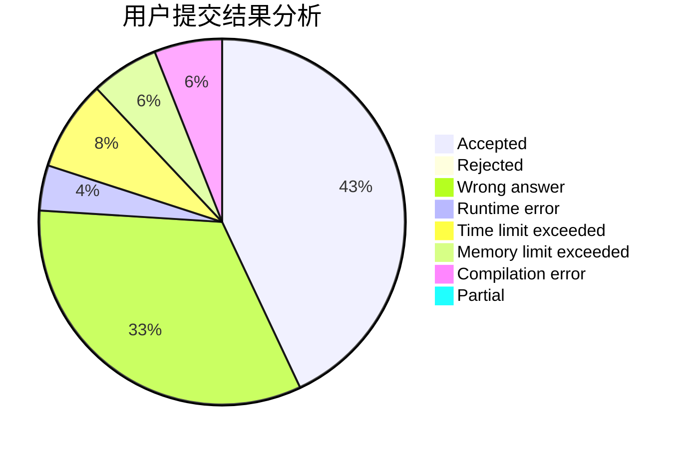
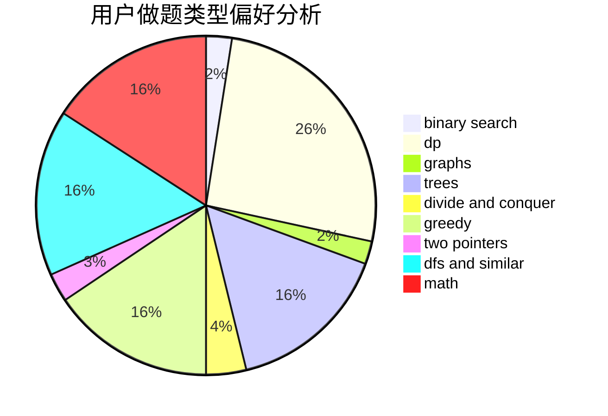

# shurongwang

<!-- tabs:start -->

#### **用户提交结果分析**

#### **用户做题类型偏好分析**

<!-- tabs:end -->
# 推荐题目
[991E](https://codeforces.com/contest/991/problem/E)
[13563](https://codeforces.com/contest/1356/problem/3)
[810A](https://codeforces.com/contest/810/problem/A)
[418E](https://codeforces.com/contest/418/problem/E)
[863A](https://codeforces.com/contest/863/problem/A)
[119A](https://codeforces.com/contest/119/problem/A)
[243B](https://codeforces.com/contest/243/problem/B)
[353E](https://codeforces.com/contest/353/problem/E)
[269B](https://codeforces.com/contest/269/problem/B)
[76C](https://codeforces.com/contest/76/problem/C)
