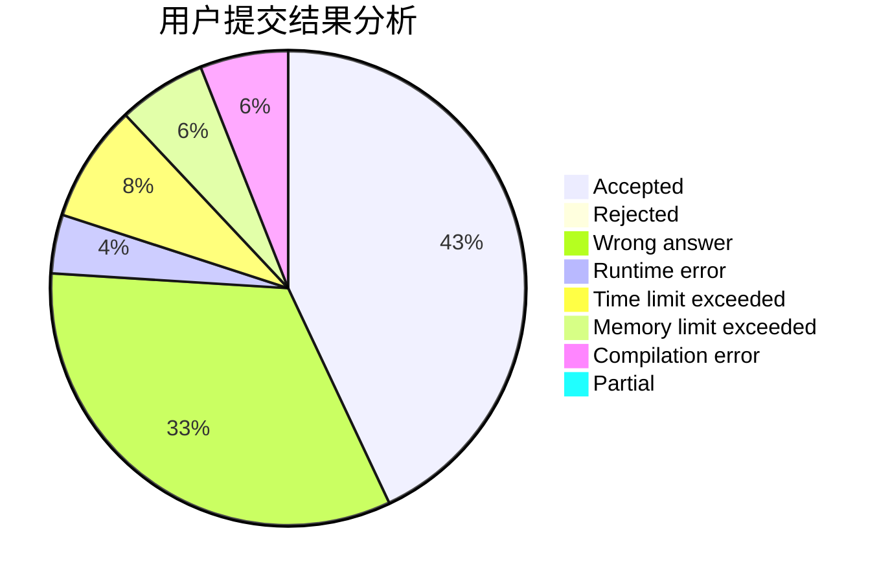
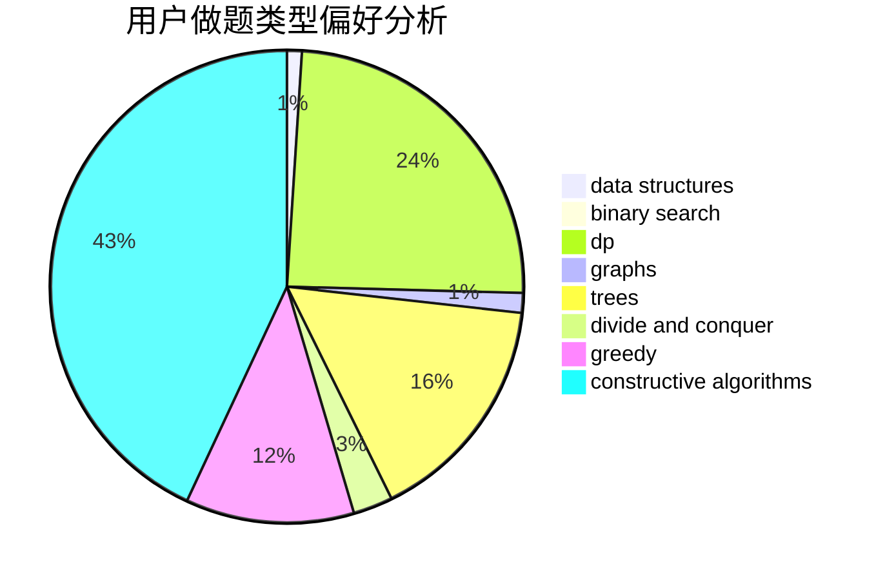
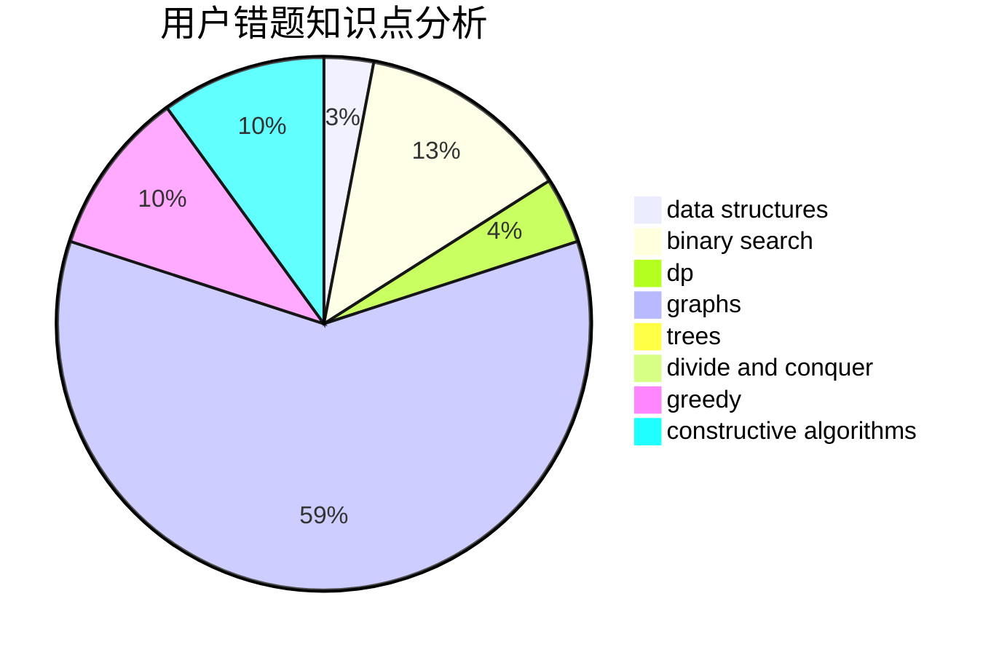

# shurongwang

<!-- tabs:start -->

#### **用户提交结果分析**

#### **用户做题类型偏好分析**

#### **用户错题知识点分析**

<!-- tabs:end -->
# 推荐题目
[991E](https://codeforces.com/contest/991/problem/E)		brute force,
                        combinatorics,
                        math		  
[13563](https://codeforces.com/contest/1356/problem/3)		dsu,graphs,sortings,trees		  
[810A](https://codeforces.com/contest/810/problem/A)		implementation,
                        math		  
[418E](https://codeforces.com/contest/418/problem/E)		data structures		  
[863A](https://codeforces.com/contest/863/problem/A)		brute force,
                        implementation		  
[119A](https://codeforces.com/contest/119/problem/A)		implementation		  
[243B](https://codeforces.com/contest/243/problem/B)		graphs,
                        sortings		  
[353E](https://codeforces.com/contest/353/problem/E)		dp,
                        graph matchings,
                        greedy		  
[269B](https://codeforces.com/contest/269/problem/B)		dp		  
[76C](https://codeforces.com/contest/76/problem/C)		bitmasks,
                        dp,
                        math		  
