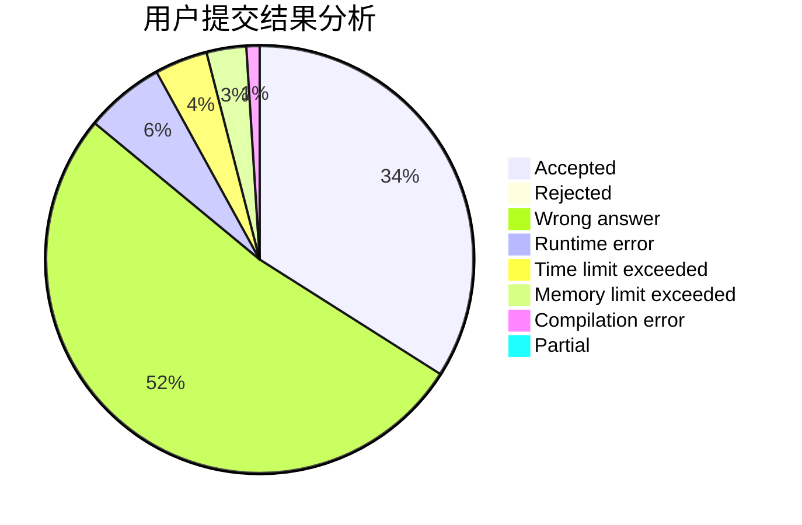
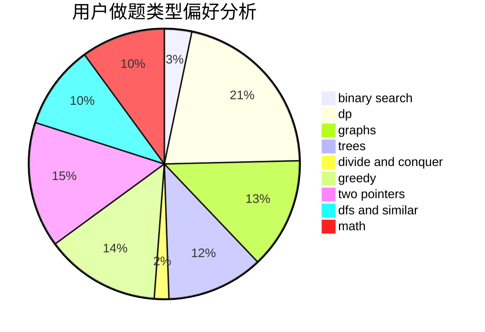

# sick_boyyyyy

<!-- tabs:start -->

#### **用户提交结果分析**

#### **用户做题类型偏好分析**

<!-- tabs:end -->
# 推荐题目
[429A](https://codeforces.com/contest/429/problem/A)
[49E](https://codeforces.com/contest/49/problem/E)
[924E](https://codeforces.com/contest/924/problem/E)
[11301](https://codeforces.com/contest/1130/problem/1)
[947C](https://codeforces.com/contest/947/problem/C)
[798A](https://codeforces.com/contest/798/problem/A)
[204D](https://codeforces.com/contest/204/problem/D)
[910B](https://codeforces.com/contest/910/problem/B)
[441C](https://codeforces.com/contest/441/problem/C)
[900A](https://codeforces.com/contest/900/problem/A)
