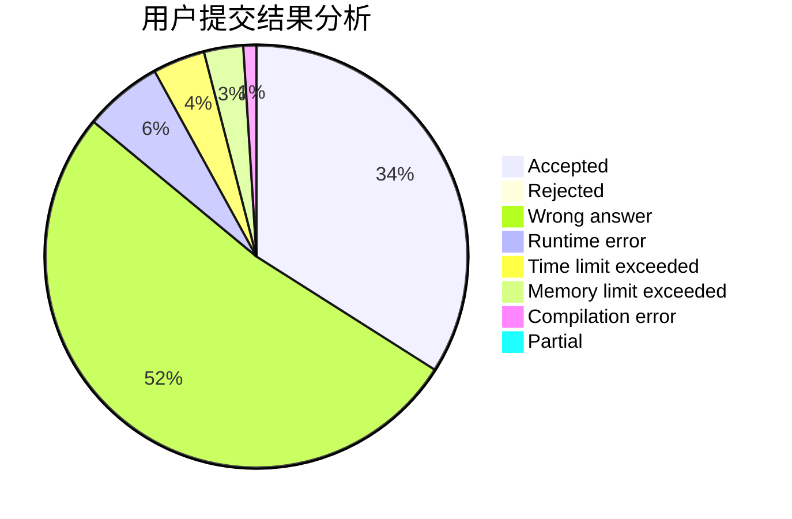
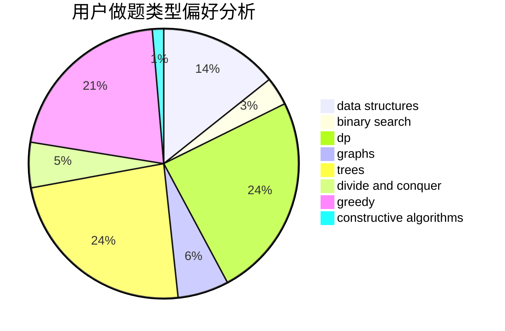
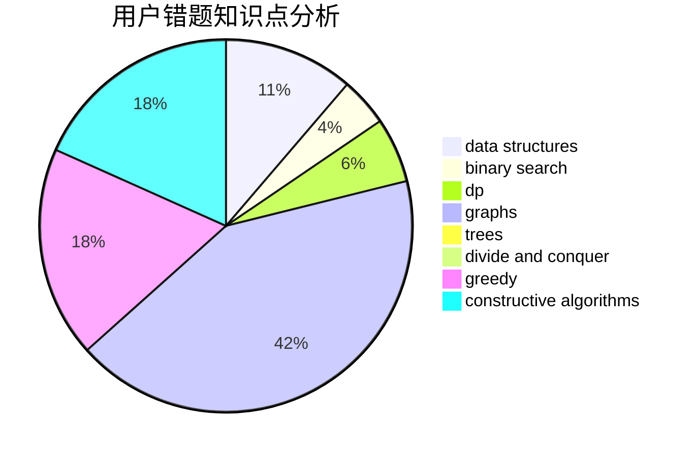

# sick_boyyyyy

<!-- tabs:start -->

#### **用户提交结果分析**

#### **用户做题类型偏好分析**

#### **用户错题知识点分析**

<!-- tabs:end -->
# 推荐题目
[429A](https://codeforces.com/contest/429/problem/A)		dfs and similar,
                        trees		  
[49E](https://codeforces.com/contest/49/problem/E)		dp		  
[924E](https://codeforces.com/contest/924/problem/E)		nan		  
[11301](https://codeforces.com/contest/1130/problem/1)		dsu,graphs,sortings,trees		  
[947C](https://codeforces.com/contest/947/problem/C)		dsu,graphs,sortings,trees		  
[798A](https://codeforces.com/contest/798/problem/A)		brute force,
                        constructive algorithms,
                        strings		  
[204D](https://codeforces.com/contest/204/problem/D)		dp		  
[910B](https://codeforces.com/contest/910/problem/B)		greedy,
                        implementation		  
[441C](https://codeforces.com/contest/441/problem/C)		constructive algorithms,
                        dfs and similar,
                        implementation		  
[900A](https://codeforces.com/contest/900/problem/A)		geometry,
                        implementation		  
