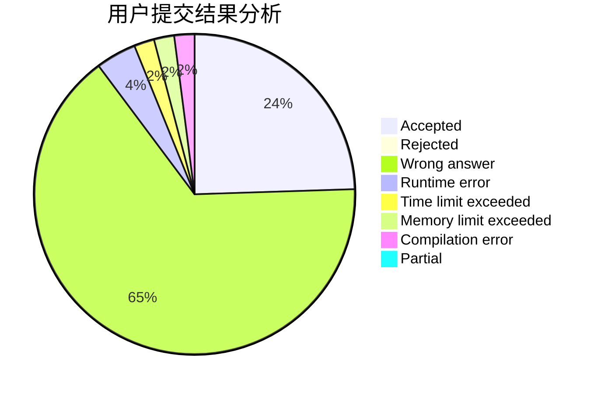
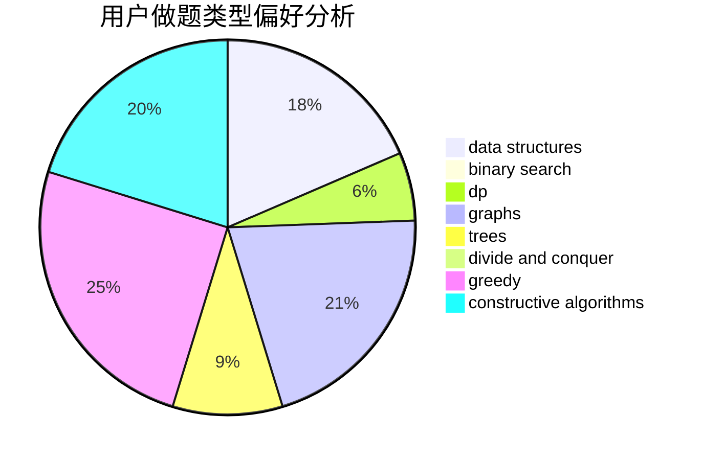

# silly-1-2-3

<!-- tabs:start -->

#### **用户提交结果分析**

#### **用户做题类型偏好分析**

#### **用户错题知识点分析**

<!-- tabs:end -->
# 推荐题目
[1188E](https://codeforces.com/contest/1188/problem/E)		combinatorics		  
[244C](https://codeforces.com/contest/244/problem/C)		dsu,graphs,sortings,trees		  
[107C](https://codeforces.com/contest/107/problem/C)		bitmasks,
                        dp		  
[268A](https://codeforces.com/contest/268/problem/A)		brute force		  
[998D](https://codeforces.com/contest/998/problem/D)		dsu,graphs,sortings,trees		  
[148E](https://codeforces.com/contest/148/problem/E)		dp		  
[1143A](https://codeforces.com/contest/1143/problem/A)		implementation		  
[175A](https://codeforces.com/contest/175/problem/A)		brute force,
                        implementation		  
[840E](https://codeforces.com/contest/840/problem/E)		trees		  
[1020D](https://codeforces.com/contest/1020/problem/D)		dsu,graphs,sortings,trees		  
