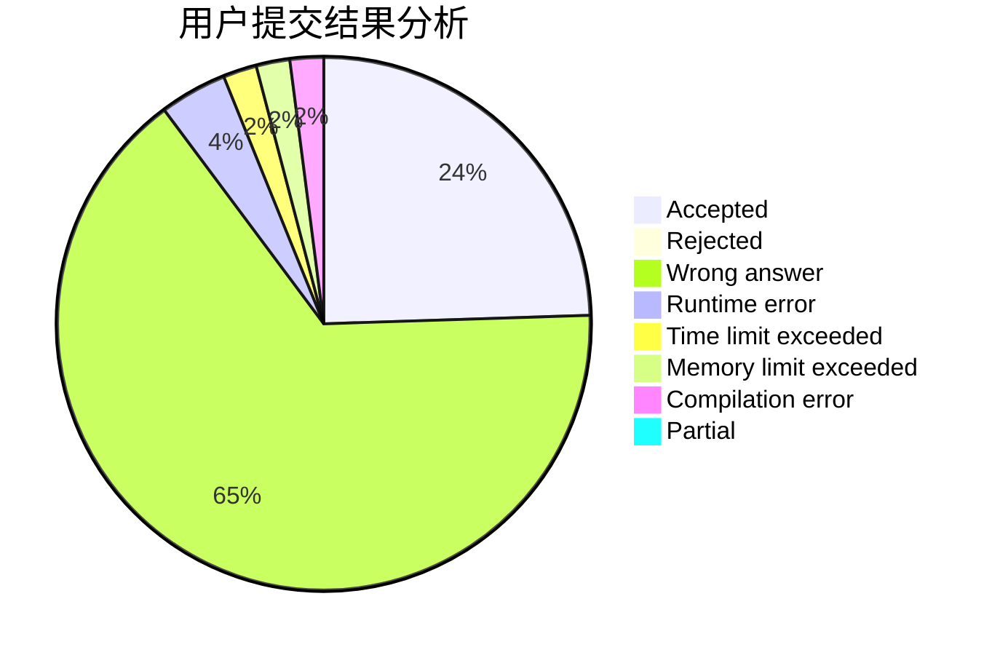
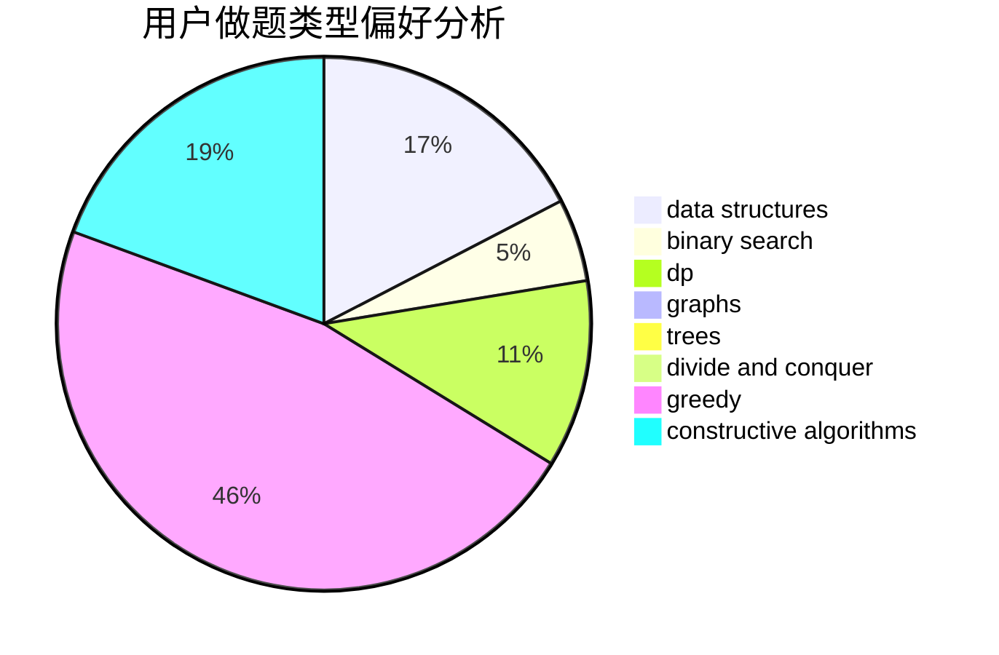

# silly-1-2-3

<!-- tabs:start -->

#### **用户提交结果分析**

#### **用户做题类型偏好分析**

#### **用户错题知识点分析**

<!-- tabs:end -->
# 推荐题目
[1184E3](https://codeforces.com/contest/1184E/problem/3)		data structures,
                        dsu,
                        graphs,
                        trees		  
[225E](https://codeforces.com/contest/225/problem/E)		math,
                        number theory		  
[1079D](https://codeforces.com/contest/1079/problem/D)		dsu,graphs,sortings,trees		  
[246E](https://codeforces.com/contest/246/problem/E)		binary search,
                        data structures,
                        dfs and similar,
                        dp,
                        sortings		  
[982F](https://codeforces.com/contest/982/problem/F)		dfs and similar,
                        graphs		  
[1482B](https://codeforces.com/contest/1482/problem/B)		implementation,
                        math		  
[1141A](https://codeforces.com/contest/1141/problem/A)		implementation,
                        math		  
[152D](https://codeforces.com/contest/152/problem/D)		brute force		  
[821A](https://codeforces.com/contest/821/problem/A)		implementation		  
[1020A](https://codeforces.com/contest/1020/problem/A)		math		  
