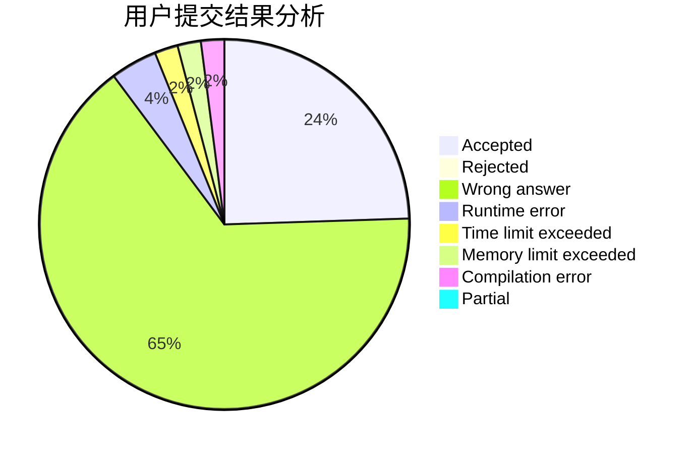
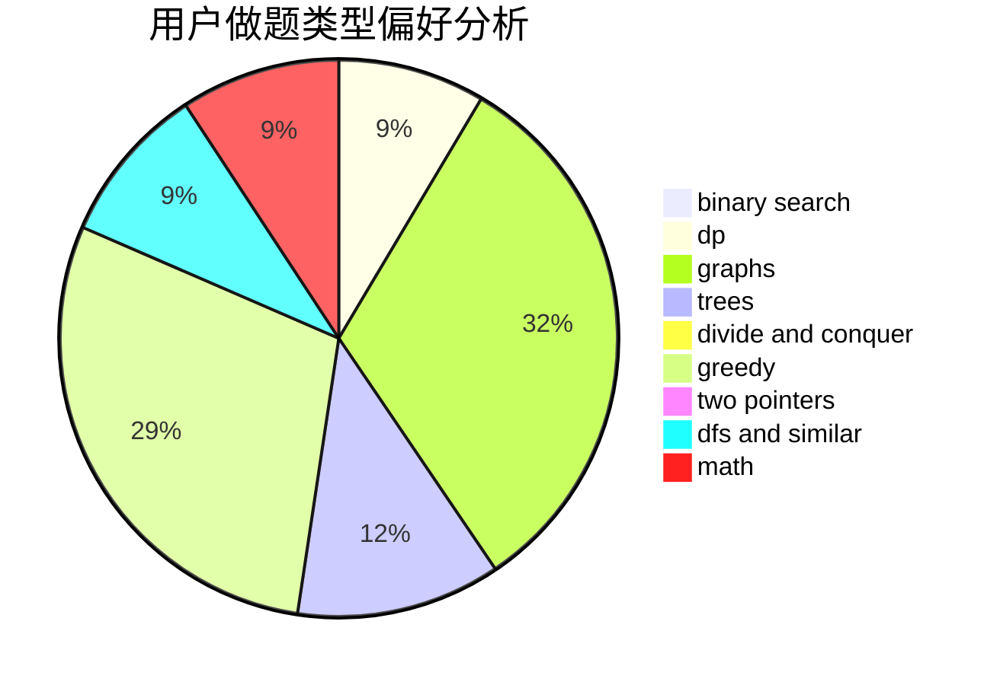

# silly-1-2-3

<!-- tabs:start -->

#### **用户提交结果分析**

#### **用户做题类型偏好分析**

<!-- tabs:end -->
# 推荐题目
[1188E](https://codeforces.com/contest/1188/problem/E)
[244C](https://codeforces.com/contest/244/problem/C)
[107C](https://codeforces.com/contest/107/problem/C)
[268A](https://codeforces.com/contest/268/problem/A)
[998D](https://codeforces.com/contest/998/problem/D)
[148E](https://codeforces.com/contest/148/problem/E)
[1143A](https://codeforces.com/contest/1143/problem/A)
[175A](https://codeforces.com/contest/175/problem/A)
[840E](https://codeforces.com/contest/840/problem/E)
[1020D](https://codeforces.com/contest/1020/problem/D)
