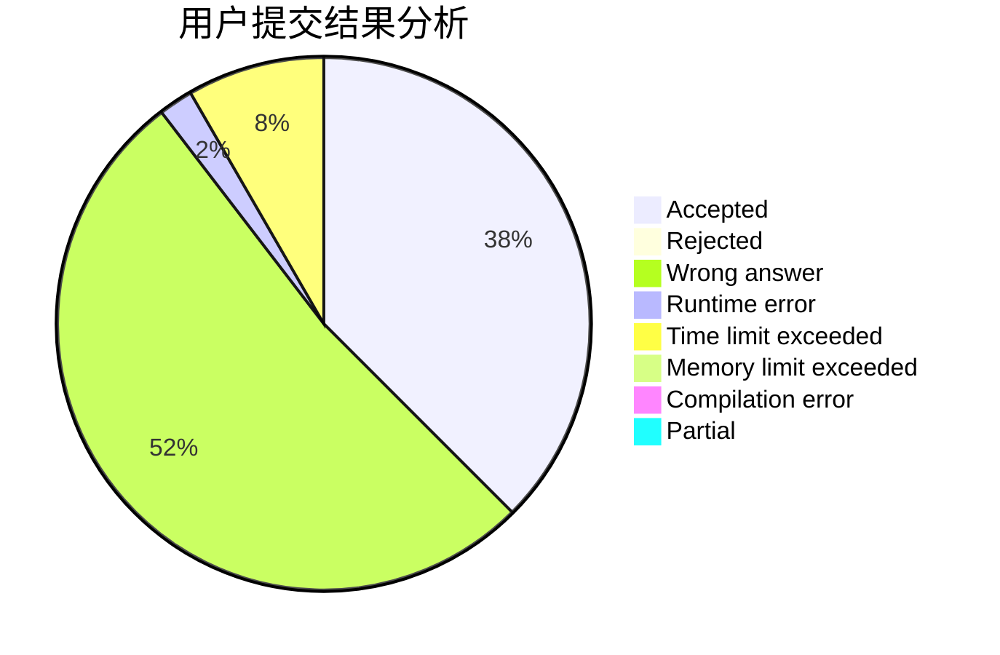
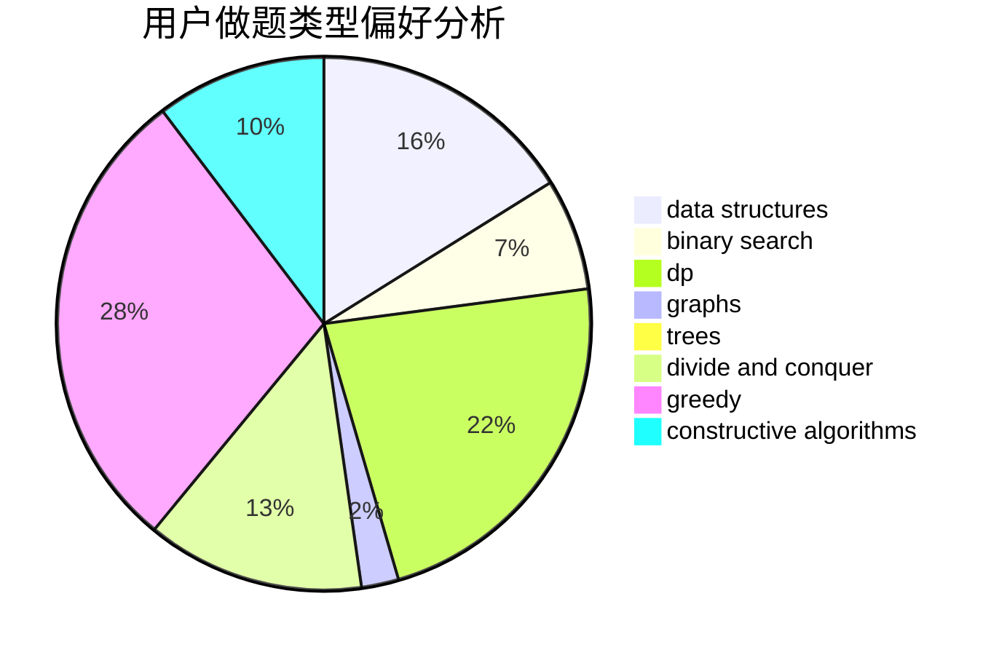

# sinfonia

<!-- tabs:start -->

#### **用户提交结果分析**

#### **用户做题类型偏好分析**

#### **用户错题知识点分析**

<!-- tabs:end -->
# 推荐题目
[674G](https://codeforces.com/contest/674/problem/G)		dsu,graphs,sortings,trees		  
[16E](https://codeforces.com/contest/16/problem/E)		bitmasks,
                        dp,
                        probabilities		  
[773F](https://codeforces.com/contest/773/problem/F)		combinatorics,
                        divide and conquer,
                        dp,
                        fft,
                        math,
                        number theory		  
[981E](https://codeforces.com/contest/981/problem/E)		bitmasks,
                        data structures,
                        divide and conquer,
                        dp		  
[847B](https://codeforces.com/contest/847/problem/B)		binary search,
                        data structures		  
[548B](https://codeforces.com/contest/548/problem/B)		brute force,
                        dp,
                        greedy,
                        implementation		  
[122C](https://codeforces.com/contest/122/problem/C)		dsu,graphs,sortings,trees		  
[699D](https://codeforces.com/contest/699/problem/D)		dsu,graphs,sortings,trees		  
[810E](https://codeforces.com/contest/810/problem/E)		dsu,graphs,sortings,trees		  
[12962](https://codeforces.com/contest/1296/problem/2)		dsu,graphs,sortings,trees		  
