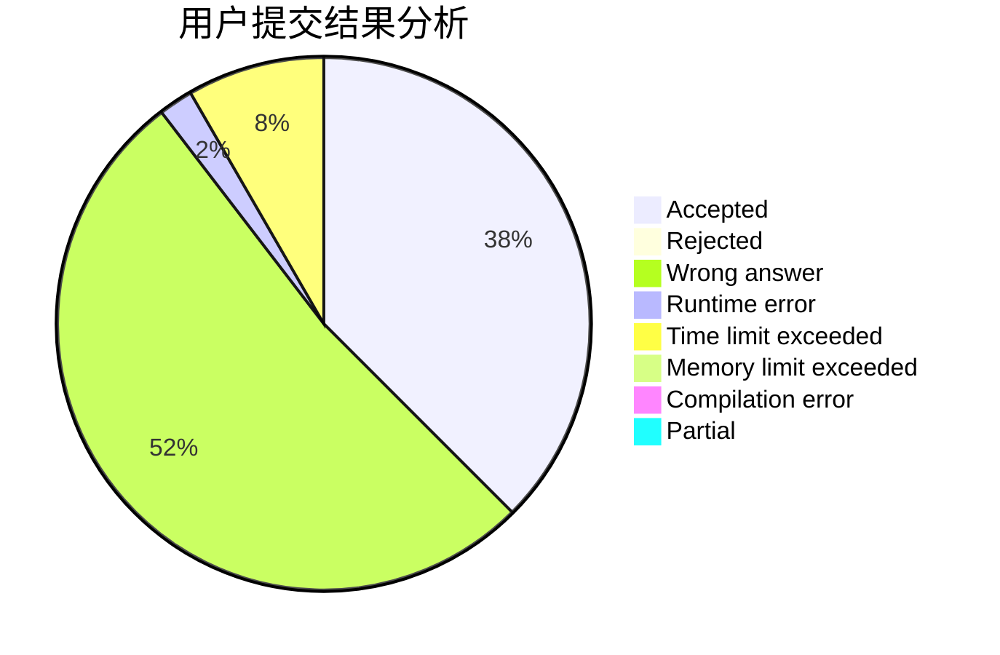
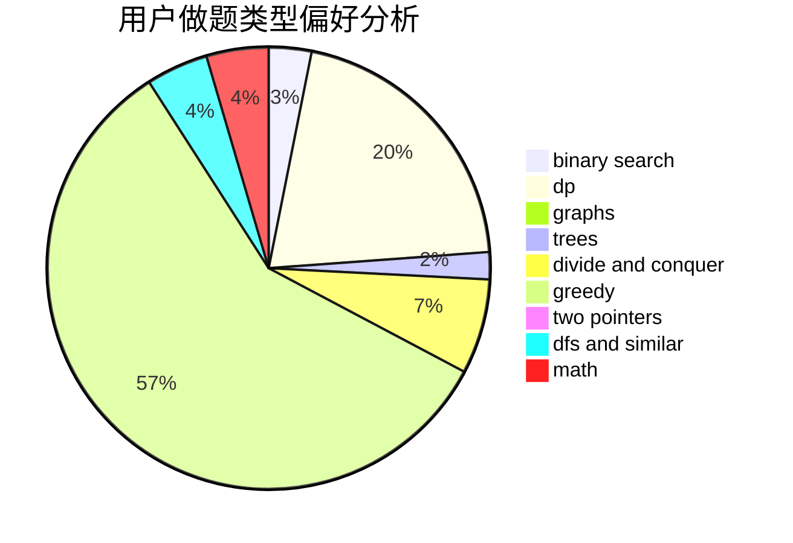

# sinfonia

<!-- tabs:start -->

#### **用户提交结果分析**

#### **用户做题类型偏好分析**

<!-- tabs:end -->
# 推荐题目
[674G](https://codeforces.com/contest/674/problem/G)
[16E](https://codeforces.com/contest/16/problem/E)
[773F](https://codeforces.com/contest/773/problem/F)
[981E](https://codeforces.com/contest/981/problem/E)
[847B](https://codeforces.com/contest/847/problem/B)
[548B](https://codeforces.com/contest/548/problem/B)
[122C](https://codeforces.com/contest/122/problem/C)
[699D](https://codeforces.com/contest/699/problem/D)
[810E](https://codeforces.com/contest/810/problem/E)
[12962](https://codeforces.com/contest/1296/problem/2)
