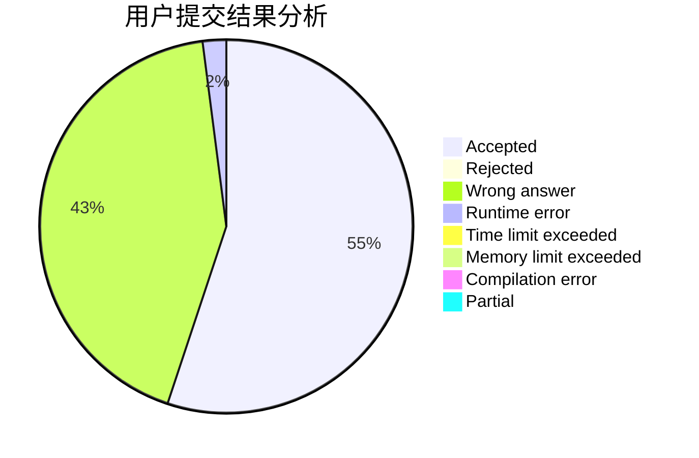
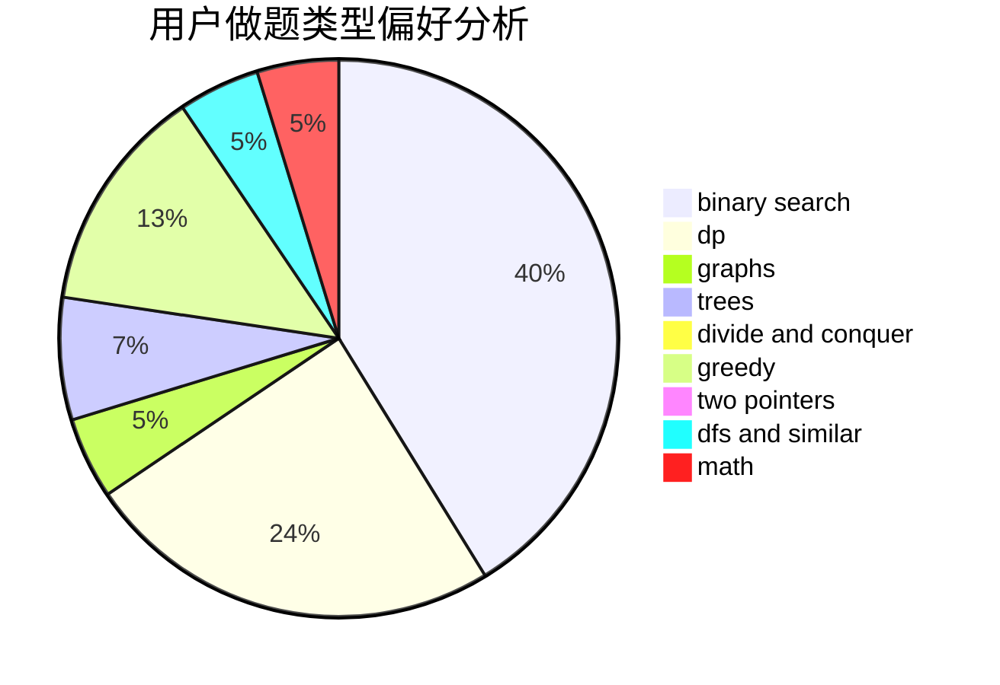

# sitdownbehumble

<!-- tabs:start -->

#### **用户提交结果分析**

#### **用户做题类型偏好分析**

<!-- tabs:end -->
# 推荐题目
[339B](https://codeforces.com/contest/339/problem/B)
[1257E](https://codeforces.com/contest/1257/problem/E)
[11412](https://codeforces.com/contest/1141/problem/2)
[592D](https://codeforces.com/contest/592/problem/D)
[486C](https://codeforces.com/contest/486/problem/C)
[787D](https://codeforces.com/contest/787/problem/D)
[742E](https://codeforces.com/contest/742/problem/E)
[1217B](https://codeforces.com/contest/1217/problem/B)
[103C](https://codeforces.com/contest/103/problem/C)
[1234F](https://codeforces.com/contest/1234/problem/F)
