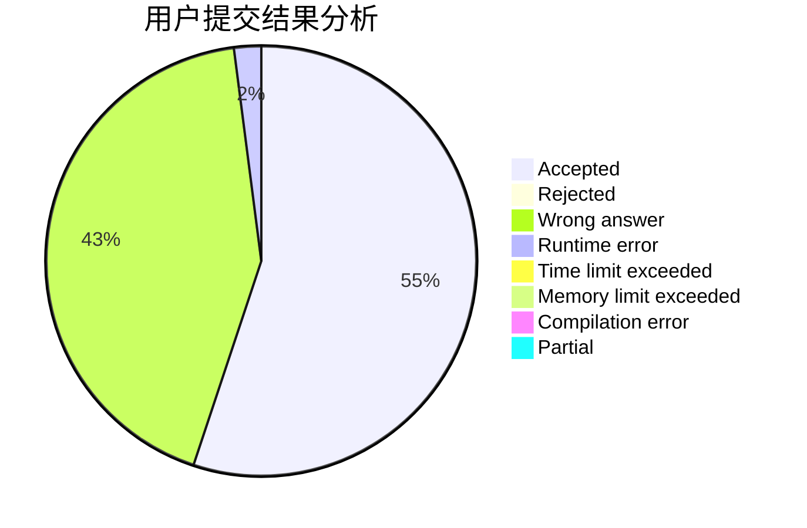
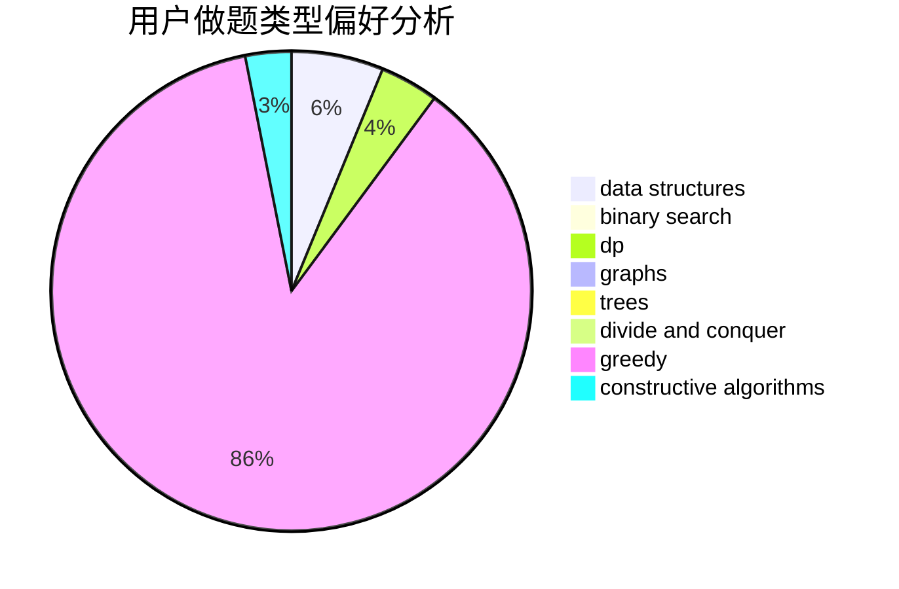
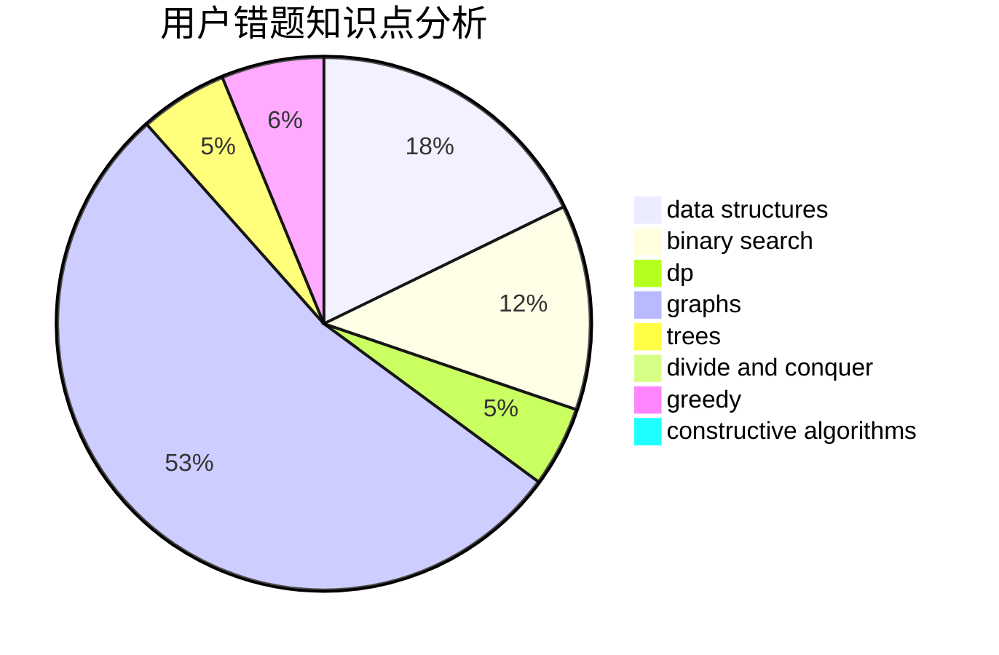

# sitdownbehumble

<!-- tabs:start -->

#### **用户提交结果分析**

#### **用户做题类型偏好分析**

#### **用户错题知识点分析**

<!-- tabs:end -->
# 推荐题目
[314C](https://codeforces.com/contest/314/problem/C)		data structures,
                        dp		  
[1252D](https://codeforces.com/contest/1252/problem/D)		data structures,
                        dp,
                        strings,
                        trees		  
[1139E](https://codeforces.com/contest/1139/problem/E)		flows,
                        graph matchings,
                        graphs		  
[573B](https://codeforces.com/contest/573/problem/B)		binary search,
                        data structures,
                        dp,
                        math		  
[466E](https://codeforces.com/contest/466/problem/E)		dfs and similar,
                        dsu,
                        graphs,
                        trees		  
[768A](https://codeforces.com/contest/768/problem/A)		constructive algorithms,
                        sortings		  
[725A](https://codeforces.com/contest/725/problem/A)		implementation		  
[1211B](https://codeforces.com/contest/1211/problem/B)		*special problem,
                        implementation		  
[1039E](https://codeforces.com/contest/1039/problem/E)		data structures		  
[1227B](https://codeforces.com/contest/1227/problem/B)		constructive algorithms		  
