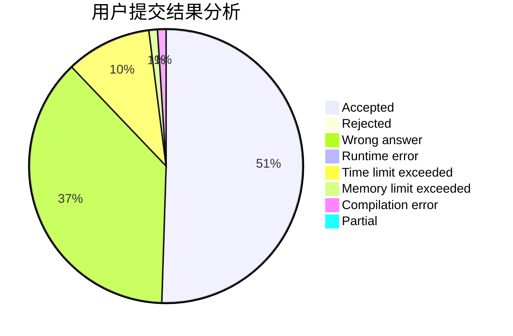
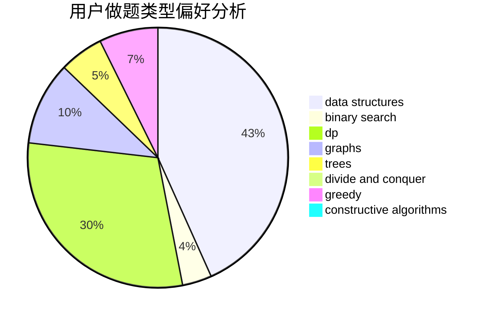

# CDEGA

<!-- tabs:start -->

#### **用户提交结果分析**

#### **用户做题类型偏好分析**

#### **用户错题知识点分析**

<!-- tabs:end -->
# 推荐题目
[1368D](https://codeforces.com/contest/1368/problem/D)		bitmasks,
                        greedy,
                        math		  
[599D](https://codeforces.com/contest/599/problem/D)		brute force,
                        math		  
[1165D](https://codeforces.com/contest/1165/problem/D)		math,
                        number theory		  
[1261E](https://codeforces.com/contest/1261/problem/E)		dsu,graphs,sortings,trees		  
[165D](https://codeforces.com/contest/165/problem/D)		data structures,
                        dsu,
                        trees		  
[1184B2](https://codeforces.com/contest/1184B/problem/2)		flows,
                        graph matchings,
                        graphs,
                        shortest paths,
                        sortings		  
[599E](https://codeforces.com/contest/599/problem/E)		bitmasks,
                        dp,
                        trees		  
[383A](https://codeforces.com/contest/383/problem/A)		data structures,
                        greedy		  
[599C](https://codeforces.com/contest/599/problem/C)		sortings		  
[342E](https://codeforces.com/contest/342/problem/E)		data structures,
                        divide and conquer,
                        trees		  
