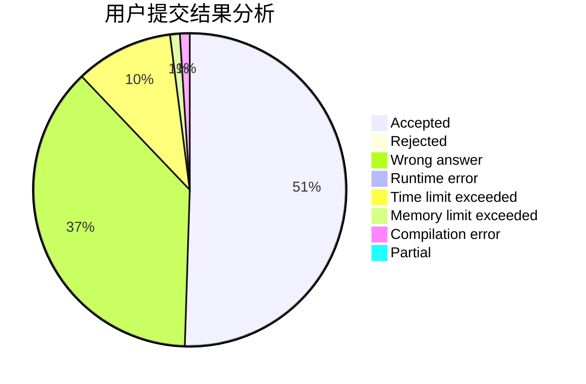
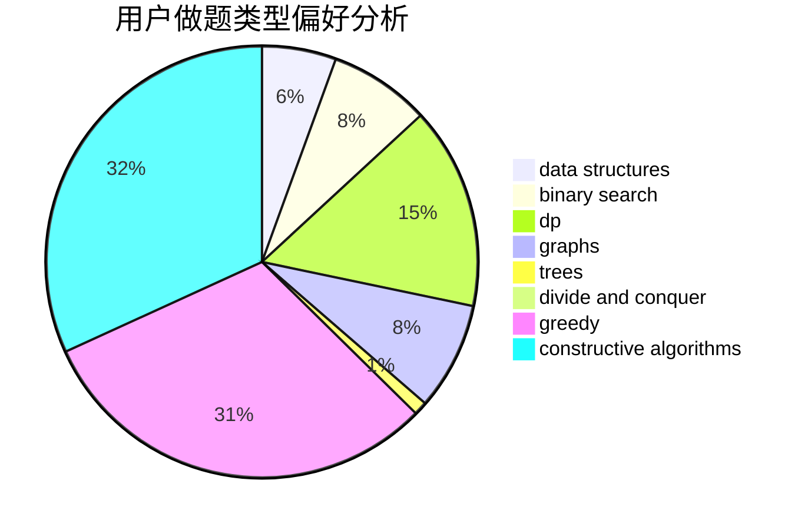
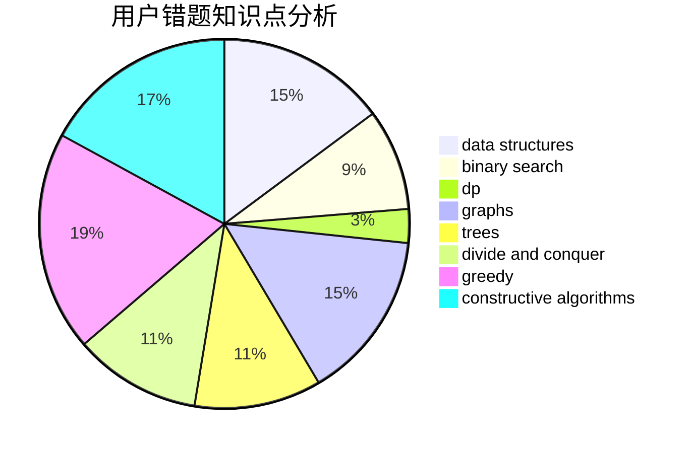

# CDEGA

<!-- tabs:start -->

#### **用户提交结果分析**

#### **用户做题类型偏好分析**

#### **用户错题知识点分析**

<!-- tabs:end -->
# 推荐题目
[1375C](https://codeforces.com/contest/1375/problem/C)		constructive algorithms,
                        data structures,
                        greedy		  
[617E](https://codeforces.com/contest/617/problem/E)		data structures		  
[1167F](https://codeforces.com/contest/1167/problem/F)		combinatorics,
                        data structures,
                        math,
                        sortings		  
[1267F](https://codeforces.com/contest/1267/problem/F)		graphs		  
[190C](https://codeforces.com/contest/190/problem/C)		dfs and similar		  
[1187E](https://codeforces.com/contest/1187/problem/E)		dfs and similar,
                        dp,
                        trees		  
[618A](https://codeforces.com/contest/618/problem/A)		implementation		  
[414B](https://codeforces.com/contest/414/problem/B)		combinatorics,
                        dp,
                        number theory		  
[617B](https://codeforces.com/contest/617/problem/B)		combinatorics		  
[36A](https://codeforces.com/contest/36/problem/A)		implementation		  
