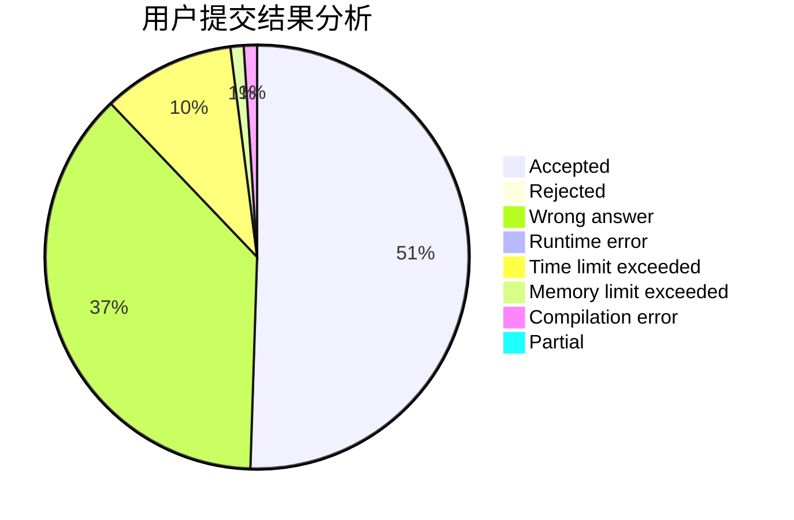
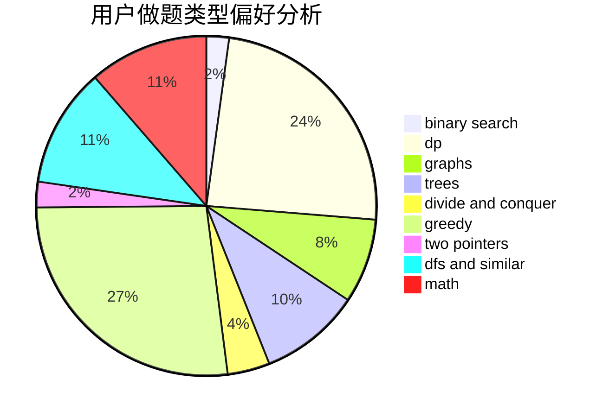

# CDEGA

<!-- tabs:start -->

#### **用户提交结果分析**

#### **用户做题类型偏好分析**

<!-- tabs:end -->
# 推荐题目
[1375C](https://codeforces.com/contest/1375/problem/C)
[617E](https://codeforces.com/contest/617/problem/E)
[1167F](https://codeforces.com/contest/1167/problem/F)
[1267F](https://codeforces.com/contest/1267/problem/F)
[190C](https://codeforces.com/contest/190/problem/C)
[1187E](https://codeforces.com/contest/1187/problem/E)
[618A](https://codeforces.com/contest/618/problem/A)
[414B](https://codeforces.com/contest/414/problem/B)
[617B](https://codeforces.com/contest/617/problem/B)
[36A](https://codeforces.com/contest/36/problem/A)
