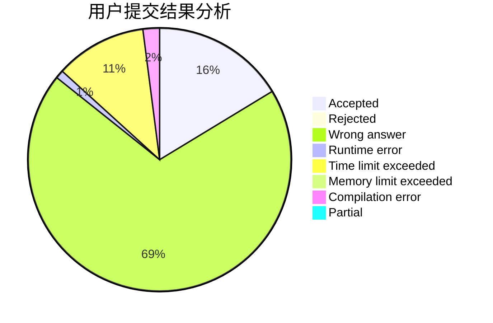
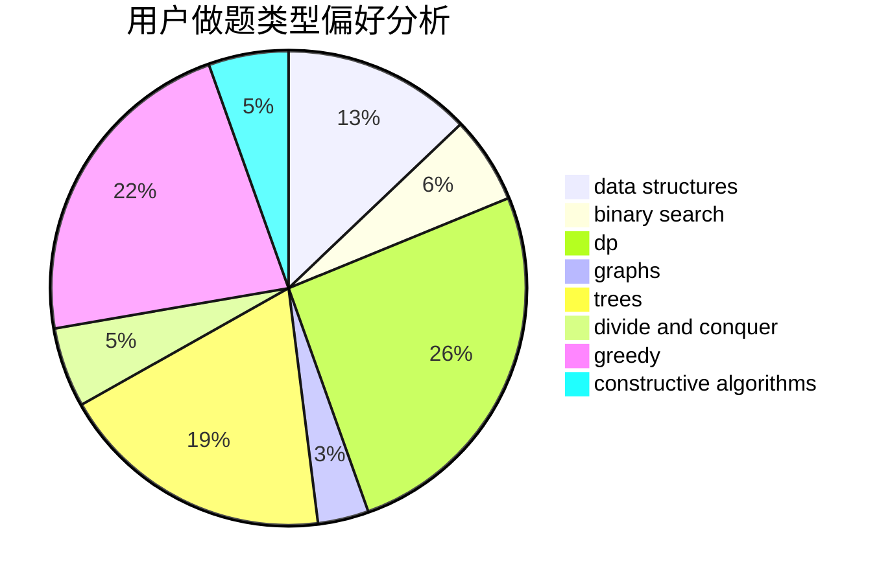
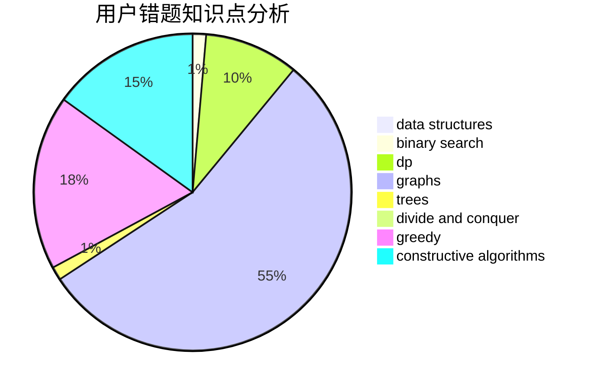

# siven

<!-- tabs:start -->

#### **用户提交结果分析**

#### **用户做题类型偏好分析**

#### **用户错题知识点分析**

<!-- tabs:end -->
# 推荐题目
[696B](https://codeforces.com/contest/696/problem/B)		dfs and similar,
                        math,
                        probabilities,
                        trees		  
[720D](https://codeforces.com/contest/720/problem/D)		data structures,
                        dp,
                        sortings		  
[15C](https://codeforces.com/contest/15/problem/C)		games		  
[26D](https://codeforces.com/contest/26/problem/D)		combinatorics,
                        math,
                        probabilities		  
[520B](https://codeforces.com/contest/520/problem/B)		dfs and similar,
                        graphs,
                        greedy,
                        implementation,
                        math,
                        shortest paths		  
[315A](https://codeforces.com/contest/315/problem/A)		brute force		  
[1145B](https://codeforces.com/contest/1145/problem/B)		brute force		  
[841A](https://codeforces.com/contest/841/problem/A)		brute force,
                        implementation		  
[459B](https://codeforces.com/contest/459/problem/B)		combinatorics,
                        implementation,
                        sortings		  
[764C](https://codeforces.com/contest/764/problem/C)		dsu,graphs,sortings,trees		  
