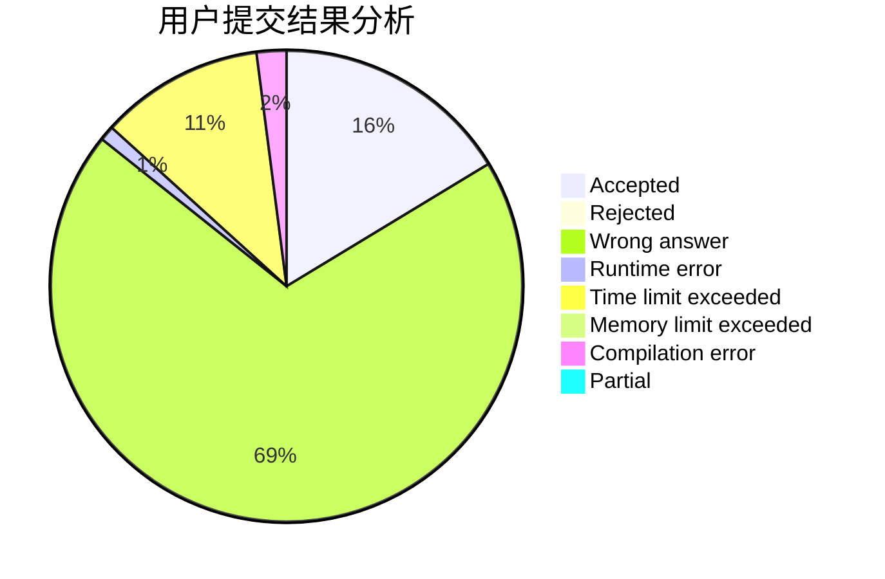
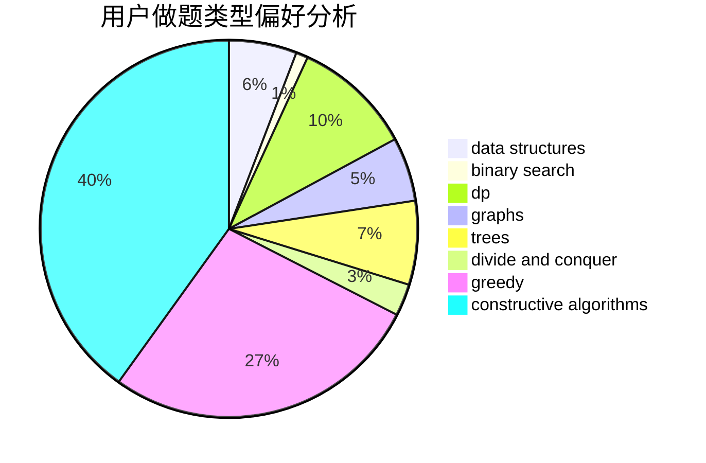
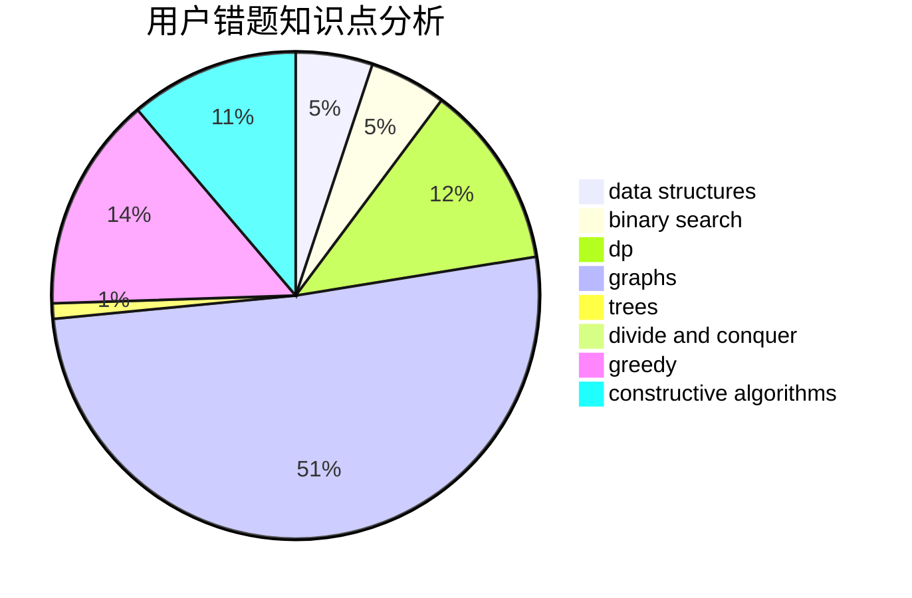

# siven

<!-- tabs:start -->

#### **用户提交结果分析**

#### **用户做题类型偏好分析**

#### **用户错题知识点分析**

<!-- tabs:end -->
# 推荐题目
[670D1](https://codeforces.com/contest/670D/problem/1)		binary search,
                        brute force,
                        implementation		  
[702A](https://codeforces.com/contest/702/problem/A)		dp,
                        greedy,
                        implementation		  
[1509A](https://codeforces.com/contest/1509/problem/A)		constructive algorithms		  
[253A](https://codeforces.com/contest/253/problem/A)		greedy		  
[4B](https://codeforces.com/contest/4/problem/B)		constructive algorithms,
                        greedy		  
[297E](https://codeforces.com/contest/297/problem/E)		data structures		  
[1143B](https://codeforces.com/contest/1143/problem/B)		brute force,
                        math,
                        number theory		  
[821B](https://codeforces.com/contest/821/problem/B)		brute force,
                        math		  
[436F](https://codeforces.com/contest/436/problem/F)		brute force,
                        data structures,
                        dp		  
[744B](https://codeforces.com/contest/744/problem/B)		bitmasks,
                        divide and conquer,
                        interactive		  
