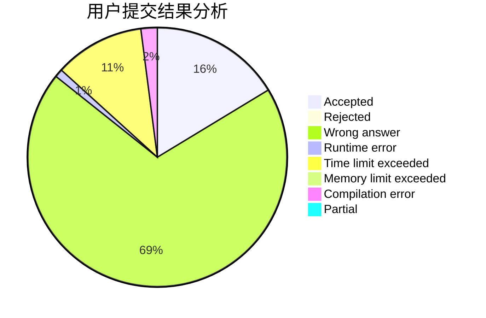
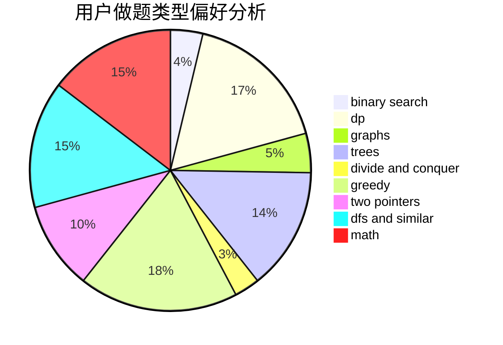

# siven

<!-- tabs:start -->

#### **用户提交结果分析**

#### **用户做题类型偏好分析**

<!-- tabs:end -->
# 推荐题目
[696B](https://codeforces.com/contest/696/problem/B)
[720D](https://codeforces.com/contest/720/problem/D)
[15C](https://codeforces.com/contest/15/problem/C)
[26D](https://codeforces.com/contest/26/problem/D)
[520B](https://codeforces.com/contest/520/problem/B)
[315A](https://codeforces.com/contest/315/problem/A)
[1145B](https://codeforces.com/contest/1145/problem/B)
[841A](https://codeforces.com/contest/841/problem/A)
[459B](https://codeforces.com/contest/459/problem/B)
[764C](https://codeforces.com/contest/764/problem/C)
