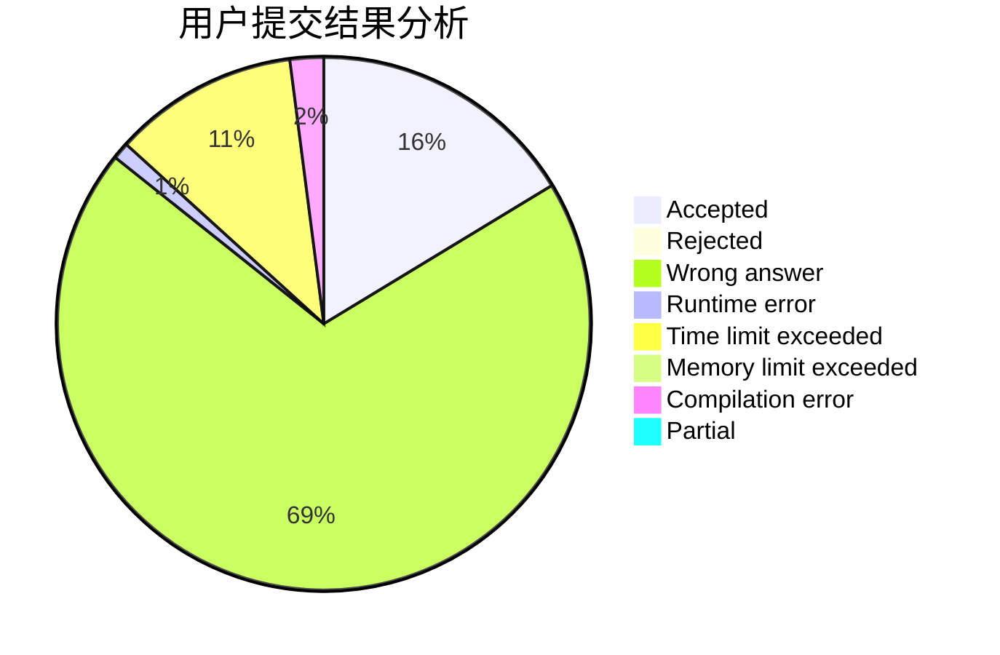
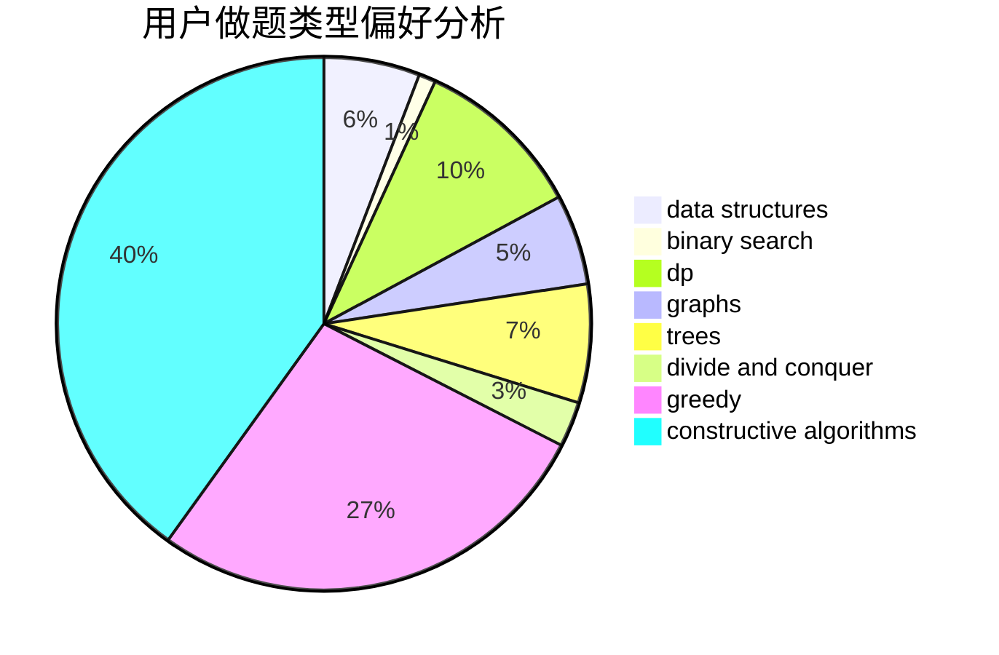
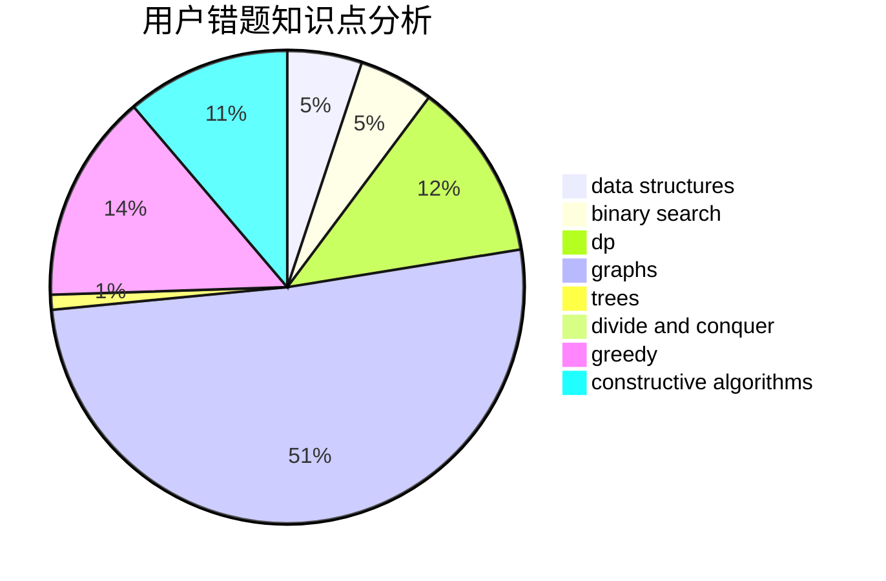

# siven
<!-- tabs:start -->
#### **用户提交结果分析**

#### **用户做题类型偏好分析**

#### **用户错题知识点分析**

<!-- tabs:end -->
# 推荐题目
[Average Height](http://codeforces.com/problemset/problem/1509/A)		constructive algorithms		  
[Maximum Increase](http://codeforces.com/problemset/problem/702/A)		dp,
                        greedy,
                        implementation		  
[Mystic Carvings](http://codeforces.com/problemset/problem/297/E)		data structures		  
[Nirvana](http://codeforces.com/problemset/problem/1143/B)		brute force,
                        math,
                        number theory		  
[Magic Powder - 1](http://codeforces.com/problemset/problem/670/D1)		binary search,
                        brute force,
                        implementation		  
[Hongcow's Game](http://codeforces.com/problemset/problem/744/B)		bitmasks,
                        divide and conquer,
                        interactive		  
[Before an Exam](http://codeforces.com/problemset/problem/4/B)		constructive algorithms,
                        greedy		  
[Connect](http://codeforces.com/problemset/problem/1130/C)		brute force,
                        dfs and similar,
                        dsu		  
[Banners](http://codeforces.com/problemset/problem/436/F)		brute force,
                        data structures,
                        dp		  
[Arson In Berland Forest](https://codeforces.com/contest/1261/problem/C)		binary search,
                        graphs,
                        graphs,
                        shortest paths		  
<!-- tabs:start -->
#### **data structures**
[Average Height](http://codeforces.com/problemset/problem/297/E)		data structures		  
[Maximum Increase](http://codeforces.com/problemset/problem/436/F)		brute force,
                        data structures,
                        dp		  
[Mystic Carvings](https://codeforces.com/contest/1447/problem/E)		binary search,
                        bitmasks,
                        data structures,
                        divide and conquer,
                        dp,
                        trees		  
[Nirvana](https://codeforces.com/contest/966/problem/E)		data structures,
                        trees		  
[Magic Powder - 1](http://codeforces.com/problemset/problem/1492/C)		binary search,
                        data structures,
                        dp,
                        greedy,
                        two pointers		  
[Hongcow's Game](http://codeforces.com/problemset/problem/1490/G)		binary search,
                        data structures,
                        math		  
[Before an Exam](http://codeforces.com/problemset/problem/1479/D)		binary search,
                        bitmasks,
                        brute force,
                        data structures,
                        probabilities,
                        trees		  
[Connect](http://codeforces.com/problemset/problem/1497/A)		brute force,
                        data structures,
                        greedy,
                        sortings		  
[Banners](http://codeforces.com/problemset/problem/1491/C)		brute force,
                        data structures,
                        dp,
                        greedy,
                        implementation		  
[Arson In Berland Forest](http://codeforces.com/problemset/problem/1492/B)		data structures,
                        greedy,
                        math		  
#### **binary search**
[Average Height](http://codeforces.com/problemset/problem/670/D1)		binary search,
                        brute force,
                        implementation		  
[Maximum Increase](https://codeforces.com/contest/1261/problem/C)		binary search,
                        graphs,
                        graphs,
                        shortest paths		  
[Mystic Carvings](http://codeforces.com/problemset/problem/889/E)		binary search,
                        dp,
                        math		  
[Nirvana](http://codeforces.com/problemset/problem/887/E)		binary search,
                        geometry,
                        sortings		  
[Magic Powder - 1](http://codeforces.com/problemset/problem/1387/A)		*special problem,
                        binary search,
                        dfs and similar,
                        dp,
                        math,
                        ternary search		  
[Hongcow's Game](https://codeforces.com/contest/1447/problem/E)		binary search,
                        bitmasks,
                        data structures,
                        divide and conquer,
                        dp,
                        trees		  
[Before an Exam](http://codeforces.com/problemset/problem/1492/C)		binary search,
                        data structures,
                        dp,
                        greedy,
                        two pointers		  
[Connect](http://codeforces.com/problemset/problem/1463/D)		binary search,
                        constructive algorithms,
                        greedy,
                        two pointers		  
[Banners](http://codeforces.com/problemset/problem/1490/G)		binary search,
                        data structures,
                        math		  
[Arson In Berland Forest](http://codeforces.com/problemset/problem/1479/D)		binary search,
                        bitmasks,
                        brute force,
                        data structures,
                        probabilities,
                        trees		  
#### **dp**
[Average Height](http://codeforces.com/problemset/problem/702/A)		dp,
                        greedy,
                        implementation		  
[Maximum Increase](http://codeforces.com/problemset/problem/436/F)		brute force,
                        data structures,
                        dp		  
[Mystic Carvings](http://codeforces.com/problemset/problem/1221/D)		dp		  
[Nirvana](http://codeforces.com/problemset/problem/889/E)		binary search,
                        dp,
                        math		  
[Magic Powder - 1](http://codeforces.com/problemset/problem/1387/A)		*special problem,
                        binary search,
                        dfs and similar,
                        dp,
                        math,
                        ternary search		  
[Hongcow's Game](http://codeforces.com/problemset/problem/1286/A)		dp,
                        greedy,
                        sortings		  
[Before an Exam](https://codeforces.com/contest/1447/problem/E)		binary search,
                        bitmasks,
                        data structures,
                        divide and conquer,
                        dp,
                        trees		  
[Connect](http://codeforces.com/problemset/problem/894/E)		dp,
                        graphs		  
[Banners](http://codeforces.com/problemset/problem/908/G)		dp,
                        math		  
[Arson In Berland Forest](http://codeforces.com/problemset/problem/763/A)		dfs and similar,
                        dp,
                        dsu,
                        graphs,
                        implementation,
                        trees		  
#### **graph**
[Average Height](https://codeforces.com/contest/1261/problem/C)		binary search,
                        graphs,
                        graphs,
                        shortest paths		  
[Maximum Increase](http://codeforces.com/problemset/problem/571/C)		constructive algorithms,
                        dfs and similar,
                        graphs,
                        greedy		  
[Mystic Carvings](http://codeforces.com/problemset/problem/894/E)		dp,
                        graphs		  
[Nirvana](http://codeforces.com/problemset/problem/763/A)		dfs and similar,
                        dp,
                        dsu,
                        graphs,
                        implementation,
                        trees		  
[Magic Powder - 1](http://codeforces.com/problemset/problem/986/A)		graphs,
                        greedy,
                        number theory,
                        shortest paths		  
[Hongcow's Game](http://codeforces.com/problemset/problem/1487/C)		brute force,
                        constructive algorithms,
                        dfs and similar,
                        graphs,
                        greedy,
                        implementation,
                        math		  
[Before an Exam](http://codeforces.com/problemset/problem/1437/C)		dp,
                        flows,
                        graph matchings,
                        greedy,
                        math,
                        sortings		  
[Connect](http://codeforces.com/problemset/problem/1470/D)		constructive algorithms,
                        dfs and similar,
                        graph matchings,
                        graphs,
                        greedy		  
[Banners](http://codeforces.com/problemset/problem/1476/C)		dp,
                        graphs,
                        greedy		  
[Arson In Berland Forest](http://codeforces.com/problemset/problem/1304/D)		constructive algorithms,
                        graphs,
                        greedy,
                        two pointers		  
#### **trees**
[Average Height](https://codeforces.com/contest/1447/problem/E)		binary search,
                        bitmasks,
                        data structures,
                        divide and conquer,
                        dp,
                        trees		  
[Maximum Increase](https://codeforces.com/contest/966/problem/E)		data structures,
                        trees		  
[Mystic Carvings](http://codeforces.com/problemset/problem/763/A)		dfs and similar,
                        dp,
                        dsu,
                        graphs,
                        implementation,
                        trees		  
[Nirvana](http://codeforces.com/problemset/problem/1479/D)		binary search,
                        bitmasks,
                        brute force,
                        data structures,
                        probabilities,
                        trees		  
[Magic Powder - 1](http://codeforces.com/problemset/problem/1511/C)		brute force,
                        data structures,
                        implementation,
                        trees		  
[Hongcow's Game](http://codeforces.com/problemset/problem/1499/F)		combinatorics,
                        dfs and similar,
                        dp,
                        trees		  
[Before an Exam](http://codeforces.com/problemset/problem/1491/E)		brute force,
                        dfs and similar,
                        divide and conquer,
                        number theory,
                        trees		  
[Connect](http://codeforces.com/problemset/problem/1466/D)		data structures,
                        greedy,
                        sortings,
                        trees		  
[Banners](http://codeforces.com/problemset/problem/1495/D)		combinatorics,
                        dfs and similar,
                        graphs,
                        math,
                        shortest paths,
                        trees		  
[Arson In Berland Forest](http://codeforces.com/problemset/problem/1303/G)		data structures,
                        divide and conquer,
                        geometry,
                        trees		  
#### **divide and conquer**
[Average Height](http://codeforces.com/problemset/problem/744/B)		bitmasks,
                        divide and conquer,
                        interactive		  
[Maximum Increase](https://codeforces.com/contest/1447/problem/E)		binary search,
                        bitmasks,
                        data structures,
                        divide and conquer,
                        dp,
                        trees		  
[Mystic Carvings](http://codeforces.com/problemset/problem/1461/D)		binary search,
                        brute force,
                        data structures,
                        divide and conquer,
                        implementation,
                        sortings		  
[Nirvana](http://codeforces.com/problemset/problem/1466/G)		combinatorics,
                        divide and conquer,
                        hashing,
                        math,
                        string suffix structures,
                        strings		  
[Magic Powder - 1](http://codeforces.com/problemset/problem/1490/D)		dfs and similar,
                        divide and conquer,
                        implementation		  
[Hongcow's Game](https://codeforces.com/contest/1483/problem/C)		data structures,
                        divide and conquer,
                        dp		  
[Before an Exam](http://codeforces.com/problemset/problem/1491/E)		brute force,
                        dfs and similar,
                        divide and conquer,
                        number theory,
                        trees		  
[Connect](http://codeforces.com/problemset/problem/1303/G)		data structures,
                        divide and conquer,
                        geometry,
                        trees		  
[Banners](http://codeforces.com/problemset/problem/1494/D)		constructive algorithms,
                        data structures,
                        dfs and similar,
                        divide and conquer,
                        dsu,
                        greedy,
                        sortings,
                        trees		  
[Arson In Berland Forest](http://codeforces.com/problemset/problem/1482/E)		data structures,
                        divide and conquer,
                        dp		  
#### **greedy**
[Average Height](http://codeforces.com/problemset/problem/702/A)		dp,
                        greedy,
                        implementation		  
[Maximum Increase](http://codeforces.com/problemset/problem/4/B)		constructive algorithms,
                        greedy		  
[Mystic Carvings](http://codeforces.com/problemset/problem/1157/C2)		greedy		  
[Nirvana](http://codeforces.com/problemset/problem/253/A)		greedy		  
[Magic Powder - 1](http://codeforces.com/problemset/problem/731/B)		constructive algorithms,
                        greedy		  
[Hongcow's Game](http://codeforces.com/problemset/problem/1286/A)		dp,
                        greedy,
                        sortings		  
[Before an Exam](http://codeforces.com/problemset/problem/571/C)		constructive algorithms,
                        dfs and similar,
                        graphs,
                        greedy		  
[Connect](http://codeforces.com/problemset/problem/986/A)		graphs,
                        greedy,
                        number theory,
                        shortest paths		  
[Banners](http://codeforces.com/problemset/problem/1392/A)		greedy,
                        math		  
[Arson In Berland Forest](http://codeforces.com/problemset/problem/1492/C)		binary search,
                        data structures,
                        dp,
                        greedy,
                        two pointers		  
#### **constructive algorithms**
[Average Height](http://codeforces.com/problemset/problem/1509/A)		constructive algorithms		  
[Maximum Increase](http://codeforces.com/problemset/problem/4/B)		constructive algorithms,
                        greedy		  
[Mystic Carvings](http://codeforces.com/problemset/problem/731/B)		constructive algorithms,
                        greedy		  
[Nirvana](http://codeforces.com/problemset/problem/571/C)		constructive algorithms,
                        dfs and similar,
                        graphs,
                        greedy		  
[Magic Powder - 1](http://codeforces.com/problemset/problem/1493/A)		constructive algorithms,
                        greedy		  
[Hongcow's Game](http://codeforces.com/problemset/problem/1463/D)		binary search,
                        constructive algorithms,
                        greedy,
                        two pointers		  
[Before an Exam](https://codeforces.com/contest/1456/problem/B)		bitmasks,
                        brute force,
                        constructive algorithms		  
[Connect](http://codeforces.com/problemset/problem/1492/D)		bitmasks,
                        constructive algorithms,
                        greedy,
                        math		  
[Banners](https://codeforces.com/contest/1504/problem/D)		constructive algorithms,
                        games,
                        interactive		  
[Arson In Berland Forest](https://codeforces.com/contest/1483/problem/A)		brute force,
                        constructive algorithms,
                        greedy,
                        implementation		  
#### **sortings**
[Average Height](http://codeforces.com/problemset/problem/887/E)		binary search,
                        geometry,
                        sortings		  
[Maximum Increase](http://codeforces.com/problemset/problem/1286/A)		dp,
                        greedy,
                        sortings		  
[Mystic Carvings](https://codeforces.com/contest/1496/problem/C)		geometry,
                        greedy,
                        math,
                        sortings		  
[Nirvana](http://codeforces.com/problemset/problem/1495/A)		geometry,
                        greedy,
                        math,
                        sortings		  
[Magic Powder - 1](http://codeforces.com/problemset/problem/1497/A)		brute force,
                        data structures,
                        greedy,
                        sortings		  
[Hongcow's Game](http://codeforces.com/problemset/problem/1427/A)		math,
                        sortings		  
[Before an Exam](http://codeforces.com/problemset/problem/1461/D)		binary search,
                        brute force,
                        data structures,
                        divide and conquer,
                        implementation,
                        sortings		  
[Connect](http://codeforces.com/problemset/problem/1437/C)		dp,
                        flows,
                        graph matchings,
                        greedy,
                        math,
                        sortings		  
[Banners](http://codeforces.com/problemset/problem/1473/A)		greedy,
                        implementation,
                        math,
                        sortings		  
[Arson In Berland Forest](http://codeforces.com/problemset/problem/1486/B)		binary search,
                        geometry,
                        shortest paths,
                        sortings		  
<!-- tabs:end -->
